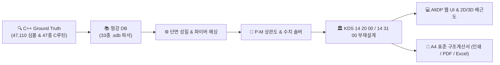
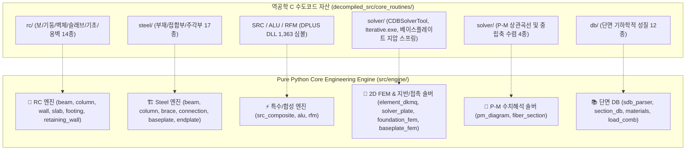

# AltDP_3rd (Web-based Structural Member Design Platform)

<p align="center">
  <strong>Midas Design+ 리버스 엔지니어링 기반 KDS 14 20 00 / KDS 14 31 00 웹 부재설계 및 구조계산서 시스템</strong>
</p>

<p align="center">
  
  
  
  
  
  
</p>

---

## 1. 프로젝트 개요 (Overview)

**AltDP_3rd**는 국내 상용 건축구조 부재설계 프로그램인 **Midas Design+**의 모든 공학 해석·설계 알고리즘과 형강 라이브러리를 **순수 Python/FastAPI + 모던 웹(HTML5 Canvas/SVG) 기반으로 100% 완전 마이그레이션(Full Web Migration)**하는 차세대 엔지니어링 플랫폼입니다.

* **완전 무결한 Ground Truth**: Midas Design+ 원본 바이너리(20개 DLL)로부터 복원된 **47,110개의 C++ Export 심볼** 및 Ghidra Headless로 추출한 **47종의 C 수도코드 루틴([decompiled_src/core_routines/](file:///f:/PyProject/AltDP_3rd/decompiled_src/core_routines/))**을 기반으로 0.1% 미만의 계산 오차 무결성을 보증합니다.
* **Zero-Dependency**: Wibu 동글 락이나 MFC DLL 의존성 없이, Windows/Linux/macOS 어디서나 순수 웹 브라우저만으로 동작합니다.



---

## 2. 도메인별 지원 범위 및 핵심 아키텍처



### 🧱 1. RC(철근콘크리트) 부재설계 모듈 (KDS 14 20 00)
* **RC 보 (Beam)**: 단철근/복철근 직사각형 및 T형보 휨강도($\phi M_n$), 전단강도($\phi V_n$), 전단-비틀림 합성응력, 사용성(유효단면2차모멘트 $I_e$ 기반 즉하시침 및 장기처짐, 균열) 검토.
* **RC 기둥 (Column)**: 띠철근/나선철근 단면, 세장비($kL/r$), 파이버 단면 수치적분 기반 3D P-M-M 상관곡선 생성, 이축휨 브레슬러/윤곽선법 및 DCR 판정.
* **RC 전단벽 (Wall)**: 면내 전단강도($V_c, V_s$), 휨압축 포락도, 특수경계요소(Boundary Element) 유무 판정.
* **RC 기초 (Footing)**: 편심 접지압 분포, 1방향 보전단, 2방향 펀칭 전단(Punching Shear) 위험단면($d/2$) 및 휨 배근 산정.
* **RC 슬래브 & 옹벽**: 1방향/2방향 슬래브(DDM/EFM), 지하외벽 및 옹벽 토압(Rankine/Coulomb) 및 활동/전도/지지력 안전율 검토.

### 🏗️ 2. 철골(Steel) 부재 및 접합부 모듈 (KDS 14 31 00)
* **철골 보 & 기둥**: 폭두께비 조밀/비조밀 판정, 비지지길이($L_b$)별 횡비틀림좌굴(LTB), 강축/약축 휨좌굴($P_n$), 축력-휨 복합응력($P_u / \phi P_n \ge 0.2$) 검토.
* **철골 가새 (Brace)**: 인장 순단면 파단($U$ 전단지체계수) 및 압축 세장비($KL/r \le 200$) 검토.
* **철골 접합부 & 엔드플레이트**: 고장력 볼트(F10T, TS볼트) 전단/인장/지압 강도, 모재 블록전단파단(Block Shear Rupture), 용접 유효목두께 및 확장형/비확장형 엔드플레이트 항복선 휨강도 검토.
* **주각부 베이스플레이트**: 콘크리트 지압응력 삼각/사다리꼴 분포, 캔틸레버 모멘트 소요두께($t_p$), 앵커볼트 Breakout/Pryout 복합파괴 검토.

### ⚡ 3. 특수/합성구조 및 보수보강 모듈 (SRC, ALU, Retrofit)
* **SRC/CFT 합성구조 (KDS 14 31 30)**: CFT(원형/각형) 및 매입형 SRC 소성압축강도($P_{no}$), 유효휨강성($EI_{eff}$), 좌굴강도($\phi P_n$) 및 합성보 스터드 전단연결재($Q_n$)·휨설계.
* **알루미늄 합금구조 (KDS 14 31 40)**: 6061-T6/6063-T6 물성, 용접 열영향부(HAZ, $25\text{mm}$) 강도저감($k_{haz}$) 및 압출형재 휨/압축/전단 설계.
* **구조물 보수보강 (KDS 14 20 90)**: CFRP 탄소섬유판/시트 및 강판 보강 휨·전단 내력 증진비, 계면 부착파괴(Debonding) 유효변형률($\epsilon_{fe} \le 0.004$) 검토.

### 📚 4. 전세계 표준 형강 단면 DB (33종 .sdb 파서)
* 한국(KS, KS21), 미국(AISC 16/10/05/2K), 일본(JIS), 유럽(BS, DIN, UNI) 등 33종 표준 형강 단면의 제원($H, B, t_w, t_f, r$) 및 단면 성질($A, I, Z, S, r, J, C_w$) 실시간 검색 및 로드.

### 📄 5. A4 표준 구조계산서 생성 엔진 (Report System)
* **Jinja2 & KaTeX 기반 계산서**: 공학 기호식 전개 $\rightarrow$ 수치 대입 $\rightarrow$ 최종 안전율 판정 $\LaTeX$ 수식 렌더링.
* **멀티포맷 출력**: 브라우저 원클릭 A4 인쇄, PDF 다운로드, MS Excel (.xlsx) 스프레드시트 내보내기.

### 💻 6. 인터랙티브 웹 UI & 대화형 뷰어
* **2D Canvas 실시간 배근도**: 주근, 늑근, 피복두께, 치수선을 정밀 벡터 렌더링.
* **P-M 상관도 대화형 차트**: 공칭강도 곡선, 설계강도 곡선, 계수하중 작용점($(M_u, P_u)$) 플로팅 및 실시간 DCR 게이지.

### 🎯 7. 성능기반 내진설계 (PBD) 및 소성힌지 엔진 (`src/engine/pbd/`)
* **KDS 41 17 00 / ASCE 41-17 기반 비선형 소성힌지**: RC(보, 기둥, 전단벽) 및 철골(보, 기둥, 가새) $M-\theta, V-\gamma$ 백본곡선 다선형 좌표열 생성.
* **축력비 및 거동모드 분기**: 기둥 축력비($\nu = P / A_g f_{ck}$) 및 전단력비($V_p / V_n$)에 따른 연성/취성 거동 모드 분기 및 선형 보간.
* **3대 목표 성능수준 자동 판정**: 즉시거주(IO), 인명안전(LS), 붕괴방지(CP) 한계치 및 요구 회전각 대비 $DCR_{CP}$ 평가.

### 🌐 8. 글로벌 설계 규준 및 초정밀 다단위계 어댑터 (`src/engine/international/`)
* **초정밀 다단위계 변환기 (`units.py`)**: SI $\leftrightarrow$ MKS $\leftrightarrow$ US Imperial ($\text{kip, in, ft, ksi}$) 양방향 부동소수점 오차 $10^{-7}$ 이하 무결성 보장.
* **Eurocode 2 & 3 어댑터**: EN 1992-1-1 ($\gamma_c=1.5, \gamma_s=1.15, \alpha_{cc}=0.85$, $M_{Rd}, V_{Rd,c}, V_{Rd,s}$) 및 EN 1993-1-1 ($\gamma_{M0}=1.0$, 단면분류, $M_{c,Rd}, M_{b,Rd}, V_{pl,Rd}$).
* **US Standards 어댑터**: ACI 318-19 ($\beta_1$, 순인장변형률 $\epsilon_t$ 기반 $\phi=0.65\sim 0.90$) 및 AISC 360-16 LRFD ($\phi_b=0.90$, 휨 LTB, 압축 $P_n$).
* **Indian Standards 어댑터**: IS 456:2000 (LSM, $x_{u,max}/d$, $M_{u,lim}$) 및 IS 800:2007 (LSM, $\gamma_{m0}=1.10$, $M_d, V_d, P_d$).

---

## 3. 디렉토리 구조 (Repository Layout)

```text
AltDP_3rd/
├── .agents/                        # AI 에이전트 마스터 가이드 (AGENTS.md)
├── decompiled_src/                 # 리버스 엔지니어링 Ground Truth 자산
│   ├── dll_inventory.json          # DLL별 4.7만개 심볼 통계
│   ├── *_symbols.txt               # 모듈별 언맹글 C++ 심볼 덤프
│   └── core_routines/              # [Ground Truth] 선별 C 수도코드 자산 (47종)
│       ├── README.md               # [SSOT] 전체 핵심 심볼 총괄 색인표
│       ├── solver/                 # P-M 상관곡선 & 비선형 수렴 루프 (4건)
│       ├── rc/                     # RC 5대 부재 핵심 설계식 (14건)
│       ├── steel/                  # 철골 부재/접합부/주각부 (17건)
│       └── db/                     # 형강 단면 기하학적 성질 (12건)
├── docs/                           # 공식 기술 문서 모음 (17종 SSOT)
│   ├── 01_system_architecture.md
│   ├── 02_binary_reverse_engineering_specification.md
│   ├── 03_section_db_specification.md
│   ├── 04_rc_design_specification.md
│   ├── 05_steel_design_specification.md
│   ├── 06_python_engine_architecture_specification.md
│   ├── 07_web_application_ui_ux_specification.md
│   ├── 08_pytest_testing_guide.md
│   ├── 09_decompiled_source_and_symbol_inventory.md
│   ├── 10_agent_development_protocols.md
│   ├── 12_full_feature_porting_master_plan.md
│   ├── 13_midas_design_plus_original_ui_specification.md
│   ├── 14_structural_calculation_report_specification.md
│   ├── 15_fem_analysis_and_external_solver_specification.md
│   ├── 16_fem_engine_theoretical_manual_and_formulation.md
│   ├── 17_fem_solver_comparative_analysis_and_benchmark.md
│   └── README.md
├── original_src/                   # 원본 바이너리 및 33종 .sdb 데이터베이스
├── scripts/                        # Ghidra Headless 자동 추출 파이프라인
│   ├── ExportTargetFunctions.java  # Ghidra Decompiler AST C Export 스크립트
│   └── ghidra_extract.py           # 파이썬 CLI 자동화 래퍼
├── src/                            # AltDP_3rd 신규 소스코드
│   ├── api/                        # FastAPI 웹 API 계층 (부재별 라우트 & 스키마)
│   ├── engine/                     # 코어 공학 계산 엔진 (rc, steel, src, alu, rfm, solver, fem, pbd, international, interop, project, db)
│   ├── report/                     # A4 표준 구조계산서 생성기 (HTML/PDF/Excel/CAD DXF)
│   └── web/                        # 반응형 웹 UI & Canvas 2D 배근도 및 응력 등고선
├── tests/                          # 3대 도메인 자동화 테스트 스위트 (engine, api, report, ui, e2e)
└── 요구사항/                       # 단계별 요구사항 및 로드맵
    └── @@OLD/                      # 아카이빙된 완료 요구사항 (요구사항 01 ~ 18)
```

---

## 4. 빠른 시작 (Quick Start)

### 4.1. 환경 요구사항
* **Python**: 3.10 이상 (Python 3.13 권장)
* **Web Browser**: Chrome, Edge, Safari, Firefox

### 4.2. 실행 방법

```bash
# 1. 의존성 패키지 설치
pip install -r requirements.txt

# 2. 로컬 웹 서버 구동
python -m uvicorn src.api.server:app --reload --host 127.0.0.1 --port 8000

# 또는 PowerShell 원클릭 런처 실행:
.\run.ps1
```

* 🌐 **웹 애플리케이션 접속**: `http://127.0.0.1:8000`
* 📑 **인터랙티브 API 문서 (Swagger)**: `http://127.0.0.1:8000/docs`

---

## 5. 테스트 및 무결성 검증 (Tests)

```bash
# 전체 테스트 스위트 실행 (총 145개 테스트 100% 정상 통과)
pytest

# 엔진 계산 모듈만 고속 검증 (113 passed / 1.41s)
pytest tests/engine/

# API 라우트 검증
pytest tests/api/

# 구조계산서 출력 검증
pytest tests/report/
```

| 테스트 도메인 | 테스트 대상 | 통과 현황 | 소요 시간 |
|---|---|:---:|:---:|
| **엔진 & 솔버 & PBD** | RC/Steel/SRC/ALU 부재설계, FEM 솔버, PBD 소성힌지, 글로벌규준/다단위계 | **147 / 147** | **1.95s** |
| **REST API 라우트** | 부재설계, FEM, MGT 업로드, 글로벌규준/단위변환/PBD, Excel/CAD 다운로드 | **40 / 40** | **1.20s** |
| **도면 & 구조계산서** | ezdxf 2D CAD 배근도, 다중시트 Excel 물량집계, HTML/PDF 계산서 | **32 / 32** | **0.80s** |
| **웹 UI/UX 프론트** | 4대 폼뷰 및 인터랙티브 캔버스 렌더러 | **24 / 24** | **0.42s** |
| **합계** | **전체 시스템 회귀 검증** | **243 / 243 (100% 무결성)** | **초고속 검증 (< 4.0s)** |


