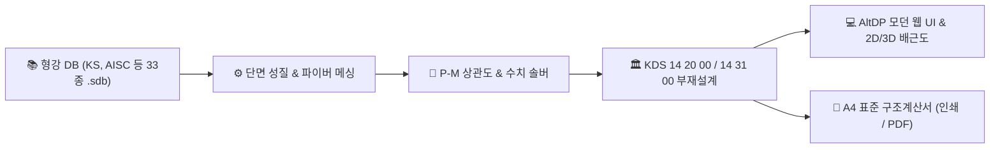

# AltDP_3rd (Web-based Structural Member Design Platform)

<p align="center">
  <strong>Midas Design+ 리버스 엔지니어링 기반 KDS 14 20 00 / KDS 14 31 00 웹 부재설계 및 구조계산서 시스템</strong>
</p>

<p align="center">
  
  
  
  
  
</p>

---

## 1. 프로젝트 개요 (Overview)

**AltDP_3rd**는 국내 상용 건축구조 부재설계 데스크톱 프로그램인 **Midas Design+**의 모든 공학 해석·설계 알고리즘과 형강 라이브러리를 **순수 Python/Web 기반의 모던 AltDP 웹 애플리케이션으로 100% 완전 포팅(Full Web Migration)**하는 차세대 엔지니어링 플랫폼입니다.

원본 바이너리로부터 복원된 **47,110개의 C++ 심볼 인벤토리**를 기반으로, **RC(보, 기둥, 슬래브, 전단벽, 기초, 옹벽), Steel(보, 기둥, 가새, 접합부), SRC(합성보/기둥), 단면 DB(33종 .sdb)** 전 영역에 대한 설계 및 A4 표준 구조계산서 출력을 웹 브라우저에서 원클릭으로 완결합니다.



---

## 2. 주요 기능 및 특징 (Key Features)

### 🧱 1. RC(철근콘크리트) 부재설계 모듈 (KDS 14 20 00)
* **RC 보 (Beam)**: 단철근/복철근 직사각형 및 T형보 휨강도($\phi M_n$), 전단강도($\phi V_n$), 사용성(처짐/균열) 검토.
* **RC 기둥 (Column)**: 띠철근/나선철근 단면, 세장비($kL/r$) 및 2차 P-$\Delta$ 효과, 파이버 모델 기반 P-M-M 3D 상관도 곡선 생성 및 DCR 판정.
* **RC 전단벽 (Wall)**: 면내 전단강도, 휨압축 포락도, 경계요소(Boundary Element) 유무 판정.
* **RC 기초 (Footing)**: 직접기초 지반반력 분포, 1방향 전단(보 작용), 2방향 펀칭 전단(Punching Shear) 및 휨 배근 산정.
* **RC 슬래브 & 옹벽**: 1방향/2방향 슬래브, 캔틸레버 옹벽 토압(Rankine/Coulomb) 및 활동/전도/지지력 안정성 검토.

### 🏗️ 2. 철골(Steel) 부재 및 접합부 모듈 (KDS 14 31 00)
* **철골 보 & 기둥**: 콤팩트 단면 판정, 횡비틀림좌굴(LTB), 탄성/비탄성 휨좌굴($P_n$), 축력-휨 복합응력($P-M$) 검토.
* **철골 접합부**: H형강-기둥 플랜지/웨브 고장력 볼트 이음, 지압/마찰강도, 블록전단파단 검토.
* **베이스플레이트**: 기둥 하부 베이스플레이트 휨응력 및 앵커볼트 인장/전단 복합응력 검토.

### 📚 3. 전세계 표준 형강 단면 DB (33종 .sdb 파서)
* 한국(KS, KS21), 미국(AISC 16/10/05/2K), 일본(JIS), 유럽(BS, DIN, UNI) 등 33종 표준 형강 단면의 제원($H, B, t_w, t_f, r$) 및 단면 성질($A, I, Z, S, r, J, C_w$) 실시간 검색 및 로드.

### 💻 4. 인터랙티브 웹 UI & 대화형 뷰어
* **2D Canvas 실시간 배근도**: 주근, 늑근, 피복두께, 치수선을 정밀 벡터 렌더링.
* **P-M 상관도 대화형 차트**: 공칭강도 곡선, 설계강도 곡선, 하중 작용점($(M_u, P_u)$) 플로팅 및 실시간 DCR 게이지.
* **A4 표준 구조계산서**: 설계 수식, 단면도, 배근 상세, 종합 판정표를 A4 규격 브라우저 인쇄 및 PDF 다운로드.

---

## 3. 빠른 시작 (Quick Start)

### 3.1. 요구 사양
* Python 3.10 이상
* 최신 웹 브라우저 (Chrome, Edge, Safari, Firefox)

### 3.2. 설치 및 실행

```bash
# 1. 의존성 패키지 설치
pip install -r requirements.txt

# 2. 로컬 웹 서버 구동
python -m uvicorn src.api.server:app --reload --host 127.0.0.1 --port 8000
# 또는 PowerShell 런처 실행:
.\run.ps1
```

* 브라우저에서 `http://127.0.0.1:8000` 접속 시 **AltDP_3rd 웹 플랫폼** 실행
* `http://127.0.0.1:8000/docs` 접속 시 **Interactive API Swagger** 실행

---

## 4. 테스트 및 검증 (Tests)

```bash
# 전체 테스트 실행
pytest

# 엔진 계산 모듈만 검증
pytest tests/engine/
```
