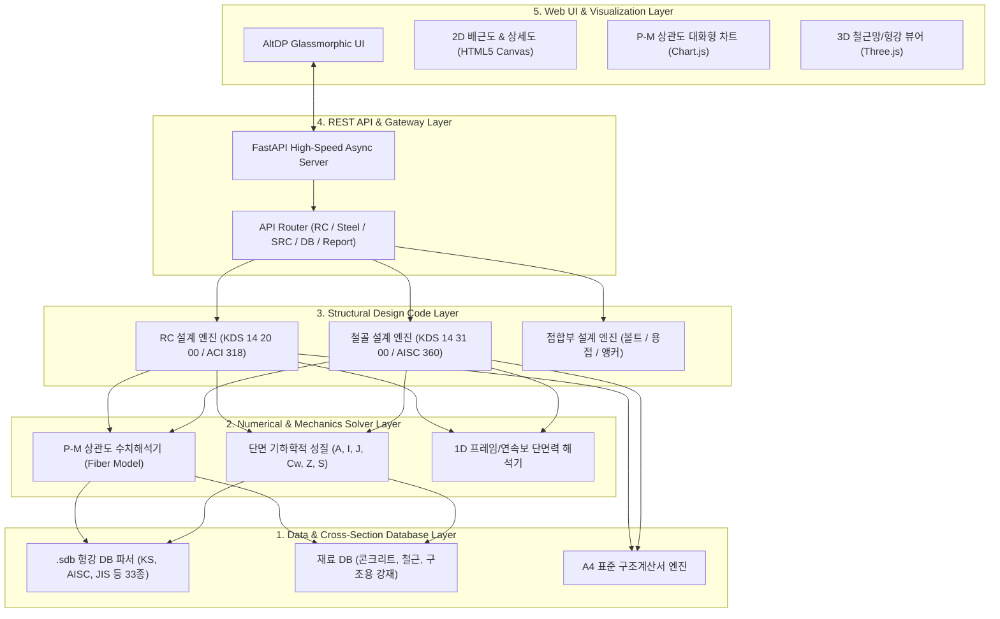

# AltDP_3rd 전체 시스템 아키텍처 (01_system_architecture.md)

## 1. 아키텍처 개요

**AltDP_3rd**는 데스크톱 기반의 Midas Design+를 현대적인 클라우드/웹 네이티브 환경으로 전환한 **5대 계층(Layer) 모듈형 아키텍처**를 채택합니다.



---

## 2. 5대 계층별 역할 정의

### Layer 1: 데이터 및 형강 DB 계층 (Data & Section DB Layer)
* **형강 DB 파서 (`src/engine/db/sdb_parser.py`)**:
  * 마이다스 원본 `*.sdb` (MDSW-SDB 헤더) 33종(KS, AISC, JIS, DIN, BS 등)의 바이너리 구조체를 고속 파싱.
  * H형강, I형강, ㄷ형강(Channel), ㄱ형강(Angle), 각형강관(Tube), 강관(Pipe), T형강 등 표준 규격 제원($H, B, t_w, t_f, r, A, I_x, I_y$ 등) 제공.
* **재료 물성 DB (`src/engine/db/materials.py`)**:
  * 콘크리트: $f_{ck}$ (18, 21, 24, 27, 30, 35, 40, 50, 60 MPa), 탄성계수 $E_c = 8500 \sqrt[3]{f_{cu}}$, 파괴변형률 $\epsilon_u = 0.0033$.
  * 철근: SD300, SD400, SD500, SD600 ($f_y, f_u, E_s = 200,000\text{ MPa}$).
  * 강재: SS275, SM355, SHN275, SHN355, SHN460 등 KDS/KS 강종 규격.

### Layer 2: 수치해석 및 역학 솔버 계층 (Solver Layer)
* **파이버 모델 기반 P-M 상관도 해석기 (`src/engine/solver/pm_diagram.py`)**:
  * 단면을 미소 파이버(Fiber Mesh)로 분할하여 중립축 깊이($c$) 및 회전각($\theta$)을 변화시키며 변형률 적합조건에 따라 축력($P_n$) 및 휨모멘트($M_{nx}, M_{ny}$) 곡선 도출.
  * 콘크리트 포락선: 등가직사각형 응력블록($\alpha_1 \beta_1 f_{ck}$) 및 파볼릭 응력-변형률 관계 지원.
  * KDS 강도감소계수 $\phi$ (압축지배 $\sim$ 인장지배 전이구간) 자동 적용.
* **단면 1차/2차 성질 산정기 (`src/engine/solver/section_properties.py`)**:
  * 다각형/복합 단면의 면적($A$), 도심($C_G$), 단면2차모멘트($I_x, I_y, I_{xy}$), 주축 각도($\theta_p$), 비틀림 상수($J$), 단면계수($Z, S$) 정밀 적분.

### Layer 3: 규준 기반 부재설계 계층 (Design Code Layer)
* **RC 부재설계 (`src/engine/rc/`)**:
  * **보 (`beam.py`)**: 정/부모멘트 휨강도($\phi M_n$), 전단강도($\phi V_n = \phi (V_c + V_s)$), 처짐 및 균열폭 검토.
  * **기둥 (`column.py`)**: 세장비($kL/r$), 2차효과($\delta_{ns}, \delta_s$), P-M-M 상관도 검토.
  * **슬래브 (`slab.py`)**: 1방향/2방향 슬래브 휨모멘트 계수법 및 직접설계법.
  * **전단벽 (`wall.py`)**: 전단벽 수평/수직 철근비, 전단강도, 경계요소(Boundary Element) 판정.
  * **기초 (`footing.py`)**: 직접기초(독립/복합), 1방향 전단(보 작용), 2방향 전단(펀칭 전단), 지반 반력 및 침하.
  * **옹벽/지하외벽 (`retaining_wall.py`)**: 토압(Rankine/Coulomb), 전도/활동/지지력 안정성 및 벽체 휨/전단 배근 검토.
* **철골 부재설계 (`src/engine/steel/`)**:
  * **철골보 (`beam.py`)**: 소성모멘트($M_p$), 횡비틀림좌굴(LTB, $M_n$), 전단좌굴강도.
  * **철골기둥 (`column.py`)**: 휨좌굴($P_n$), 비틀림좌굴, 축력-휨 복합 응력 검토 ($P_u/\phi P_n + 8/9(M_u/\phi M_n) \le 1.0$).
  * **접합부 (`connection.py`)**: H형강-기둥 볼트 이음, 엔드플레이트 접합, 핀/모멘트 접합부.

### Layer 4: 고속 REST API 계층 (API Gateway Layer)
* **FastAPI 백엔드 서버 (`src/api/server.py`)**:
  * Pydantic v2 기반 엄격한 입출력 데이터 유효성 검증.
  * 비동기(Async) 처리로 0.05초 미만의 초고속 부재설계 응답 속도.
  * Swagger UI (`/docs`) 자동 제공.

### Layer 5: 인터랙티브 웹 UI 계층 (Web UI & Visualization Layer)
* **AltDP Glassmorphism UI 디자인 시스템**:
  * 다크/라이트 모드 지원, 세련된 공학용 대시보드 레이아웃.
* **2D Canvas 배근 렌더러 (`renderer2d.js`)**:
  * 주근, 늑근(Stirrup), 대근(Tie), 피복두께, 치수선 실시간 렌더링.
* **대화형 P-M 상관도 차트 (`pm_chart.js`)**:
  * 설계 하중점($(M_u, P_u)$) 플로팅 및 안전율(DCR: Demand-Capacity Ratio) 시각화.
* **A4 표준 구조계산서 생성기 (`src/report/`)**:
  * 수식, 도해, 부재 형상, 판정표가 포함된 A4 인쇄 및 PDF 다운로드 지원.

---

## 3. AltDP_3rd 프로젝트 디렉토리 트리 및 파일 인벤토리

```text
AltDP_3rd/
├── .agents/                        # AI 에이전트 마스터 가이드
│   └── AGENTS.md                   # Agent 행동 규약, 0.1s 파일 라우팅 맵, KDS 연동 규칙
├── decompiled_src/                 # 리버스 엔지니어링 덤프 자산 (Read-Only)
│   ├── dll_inventory.json          # 20개 DLL별 심볼 및 클래스 통계 (47,110 심볼)
│   ├── *_symbols.txt               # DLL별 4.7만개 C++ 언맹글 심볼 목록
│   └── core_routines/              # [Ground Truth] 핵심 C 수도코드 자산 (200+ 파일)
│       ├── README.md               # [SSOT] 전체 핵심 심볼 총괄 색인표
│       ├── solver/                 # Group 1: P-M 상관도, CDBSolverTool, Iterative.exe, 접촉 솔버
│       ├── rc/                     # Group 2: RC 5대 부재 설계식 (보, 기둥, 벽체, 슬래브, 기초, 옹벽)
│       ├── steel/                  # Group 3 & 4: 철골보, 기둥, 가새, 접합부, 베이스플레이트, 엔드플레이트
│       └── db/                     # Group 5: 단면 기하 성질 DB
├── docs/                           # 공식 기술 문서 (SSOT 01 ~ 15)
│   ├── 01_system_architecture.md
│   ├── 02_binary_reverse_engineering_specification.md
│   ├── 03_section_db_specification.md
│   ├── 04_rc_design_specification.md
│   ├── 05_steel_design_specification.md
│   ├── 06_python_engine_architecture_specification.md
│   ├── 07_web_application_ui_ux_specification.md
│   ├── 08_pytest_testing_guide.md
│   ├── 09_decompiled_source_and_symbol_inventory.md
│   ├── 10_agent_development_protocols.md
│   ├── 12_full_feature_porting_master_plan.md
│   ├── 13_midas_design_plus_original_ui_specification.md
│   ├── 14_structural_calculation_report_specification.md
│   ├── 15_fem_analysis_and_external_solver_specification.md
│   └── README.md
├── original_src/                   # 원본 Midas Design+ 설치본 (Read-Only)
│   └── Midas Design+/
│       ├── Dbase/*.sdb             # 형강 데이터베이스 (KS, AISC 등 33개)
│       └── DgnSolver/              # 유한요소/구조해석 솔버 (FES.EXE, mfsolver.exe, Iterative.exe)
├── requirements.txt                # 파이썬 의존성 패키지
├── pytest.ini                      # Pytest 테스트 설정
├── run.ps1                         # 원클릭 서버 구동 및 브라우저 런처
├── app_entry.py                    # 독립 실행형 엔트리포인트
├── README.md                       # 프로젝트 공식 소개 및 퀵스타트
├── scripts/                        # 유틸리티 및 Ghidra 추출 자동화 스크립트
│   ├── install_ghidra_env.py       # Ghidra 12.1.3 & JDK 21 자동 설치기
│   ├── ghidra_extract.py           # Ghidra 자동 추출 파이프라인 CLI
│   └── extract_symbols.py          # PE 심볼 추출기
├── src/                            # 신규 웹 애플리케이션 소스코드
│   ├── api/                        # FastAPI 웹 API 계층
│   │   ├── routes/                 # 부재별 API 라우트 (rc, steel, connection, composite, report, section)
│   │   └── server.py               # 메인 서버 애플리케이션
│   ├── engine/                     # 코어 공학 계산 엔진
│   │   ├── rc/                     # RC 보, 기둥, 슬래브, 전단벽, 기초, 옹벽
│   │   ├── steel/                  # 철골 보, 기둥, 가새, 접합부, 베이스플레이트, 엔드플레이트
│   │   ├── src_composite/          # SRC 복합부재
│   │   ├── alu/                    # 알루미늄 부재
│   │   ├── rfm/                    # 탄소섬유/강판 보수보강
│   │   ├── fem/                    # 2D FEM 평판 휨 (MITC4/DKT), 지반 스프링 및 비선형 접촉 솔버
│   │   ├── db/                     # 형강 DB (.sdb 파서 및 조회기, 재료, 하중조합)
│   │   └── solver/                 # P-M 상관도 및 파이버 단면 수치해석 솔버
│   ├── report/                     # A4 표준 구조계산서 생성기 (HTML, Excel, PDF)
│   └── web/                        # 프론트엔드 웹 UI
│       ├── static/                 # CSS, JS, SVG 정적 자산 (renderer2d.js, pm_chart.js)
│       └── templates/              # HTML Jinja2 템플릿
├── tests/                          # 3대 도메인 자동화 테스트 스위트 (145 passed)
│   ├── engine/                     # 공학 수식, 설계 엔진 및 FEM 솔버 테스트 (113 passed)
│   ├── api/                        # REST API 엔드포인트 테스트 (25 passed)
│   └── report/                     # 구조계산서 3대 포맷 렌더링 테스트 (7 passed)
└── 요구사항/                       # 요구사항 명세서 관리
    └── @@OLD/                      # 아카이빙된 완료 요구사항 (요구사항 01 ~ 12)
```

