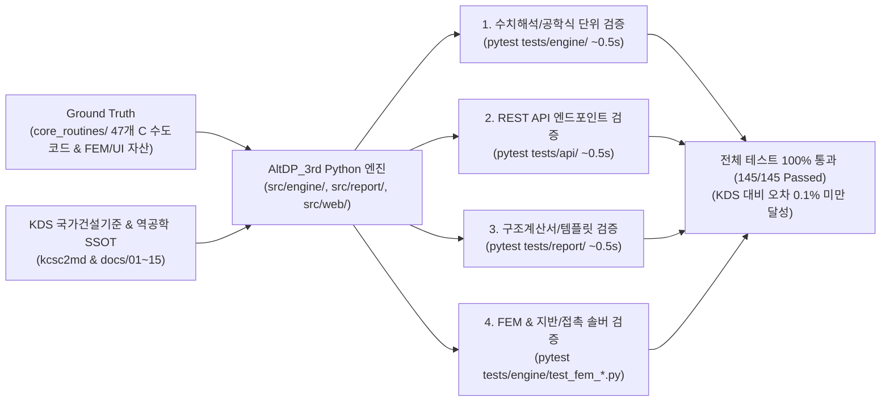

# AltDP_3rd 전 기능 포팅 마스터플랜 (Full Feature Porting Master Plan)

## 1. 마스터플랜 개요 및 목적 (Executive Summary)

본 문서는 **Midas Design+** 원본 바이너리로부터 추출된 **20개 DLL 모듈, 47,110개 C++ Exported 심볼**([docs/09](file:///f:/PyProject/AltDP_3rd/docs/09_decompiled_source_and_symbol_inventory.md)), Ghidra Headless 디컴파일러를 통해 선별 자산화된 **5대 도메인 47개 핵심 C 수도코드 알고리즘**([decompiled_src/core_routines/](file:///f:/PyProject/AltDP_3rd/decompiled_src/core_routines/)), 그리고 신규 분석된 **3대 외부 솔버/CM2 메셔 FEM 엔진 명세서**([docs/15](file:///f:/PyProject/AltDP_3rd/docs/15_fem_analysis_and_external_solver_specification.md)), **원본 MFC 4대 폼뷰/3대 인터랙션 모드 명세서**([docs/13](file:///f:/PyProject/AltDP_3rd/docs/13_midas_design_plus_original_ui_specification.md)), **KDS 3대 구조계산서 체계 명세서**([docs/14](file:///f:/PyProject/AltDP_3rd/docs/14_structural_calculation_report_specification.md))를 바탕으로, 순수 **Python 3.13 + FastAPI + Modern Web(HTML5 Canvas/SVG) + KDS 국가건설기준** 스택으로 100% 웹 마이그레이션하기 위한 **전체 포팅 종합 마스터플랜**입니다.

[.agents/AGENTS.md](file:///f:/PyProject/AltDP_3rd/.agents/AGENTS.md)의 핵심 행동 규약(Zero-Dependency 소스 격리, KDS 0.1% 오차 무결성, 1이슈 1Phase 및 Goal 주도형 단계적 분할 실행, 도메인별 3대 Pytest 초고속 검증)을 최우선으로 준수하며, 향후 `요구사항/요구사항XX_...md`로 구체화될 모든 개발 스텝의 최상위 나침반(Single Source of Truth, SSOT) 역할을 수행합니다.

---

## 2. 4계층 역공학-C수도코드-Python/Web 엔지니어링 매핑 아키텍처

```mermaid
flowchart TD
    subgraph Layer1 ["Layer 1: 원본 C++ 바이너리 & 독립 솔버 자산 (20개 DLL, 47,110 Symbols, DgnSolver)"]
        L1_DB["DPLUS_DB / MIDAS_base / MIDAS_lib<br>(26,964 Symbols)"]
        L1_RCS["DPLUS_RCS / DPLUS_DGN<br>(5,925 Symbols)"]
        L1_STL["DPLUS_STEEL<br>(1,900 Symbols)"]
        L1_ADV["DPLUS_SRC / DPLUS_ALU / DPLUS_RFM<br>(1,363 Symbols)"]
        L1_FEM["DgnSolver (FES.EXE, mfsolver, Iterative)<br>CM2 MeshTools 12종 DLL"]
        L1_VDR["DPLUS_VDraw / MFC UI (4대 폼뷰, 3대 모드)<br>(3,426 Symbols)"]
        L1_REP["CMSOffice / DGN_lib (3대 계산서 체계)<br>(1,267 Symbols)"]
        L1_GEN["DgnPlugIn (AnalysisDB, GEN_DgnCalc)<br>(MIDAS Gen 3D 모델 연동)"]
        L1_INT["DPLUS_EC / DPLUS_IS / US-Calc<br>(4,681 Symbols)"]
    end

    subgraph Layer2 ["Layer 2: 선별 디컴파일 C 수도코드 & 역공학 자산 (decompiled_src/)"]
        L2_DB["Group 5: 단면 기하성질 & DB 연산<br>(db/ 12개 C 소스)"]
        L2_SOL["Group 1: 3D P-M 곡선 & 비선형 수치솔버<br>(solver/ 4개 C 소스)"]
        L2_RC["Group 2: RC 5대 부재 설계엔진<br>(rc/ 14개 C 소스, solver_wall 16개)"]
        L2_STL["Group 3 & 4: 철골 부재 & 접합부/주각부<br>(steel/ 17개 C 소스)"]
        L2_FEM["FEM 인터페이스 & 접촉 반복해석<br>(CDBSolverTool, CUSBPPModeDlg)"]
    end

    subgraph Layer3 ["Layer 3: AltDP_3rd 핵심 기완료 엔진 계층 (src/ - 완료)"]
        M1["Phase 1: 단면 DB & 재료 & 하중 조합 엔진<br>(src/engine/db, materials.py, load_comb.py)"]
        M2["Phase 2: RC 구조설계 & 3차원 P-M 수치해석 솔버<br>(src/engine/rc, solver/)"]
        M3["Phase 3: 철골 구조설계 & 접합부/베이스플레이트<br>(src/engine/steel/)"]
        M4["Phase 4: 특수/합성 구조 (SRC, ALU, 보강)<br>(src/engine/src_composite, alu, rfm)"]
        M5["Phase 5: 통합 반응형 웹 UI/UX (사내 구현 완료)<br>(src/web/ - 145개 Pytest 100% Pass)"]
    end

    subgraph Layer4 ["Layer 4: AltDP_3rd 차기 핵심 개발 로드맵 (Requirements 13 ~ 18)"]
        F1["Phase 6 (Req 13): 2D FEM 해석 엔진 & 5대 부재 연동<br>(docs/15 기반 매트기초, 외벽, 베이스, 엔드, 슬래브)"]
        F2["Phase 7 (Req 14): docs/13 기반 웹 UI/UX(docs/07) 고도화<br>(4대 폼뷰 Memb/List/Draw/Qntt & 3대 모드 P/S/M)"]
        F3["Phase 8 (Req 15): KDS 3대 구조계산서(docs/14) 고도화<br>(요약/상세/입력데이터 3대 모드 & 옵션 제어 & PDF 바인더)"]
        F4["Phase 9 (Req 16): MIDAS Gen 3D 모델 연동 파이프라인<br>(src/engine/interop/ - .mgt/.db 파서 & LCB 추출)"]
        F5["Phase 10 (Req 17): 2D 배근 CAD 도면 & 물량산출<br>(src/report/cad_exporter.py & quantity_engine.py)"]
        F6["Phase 11 (Req 18): 성능기반설계 (PBD) & 글로벌 규준<br>(src/engine/pbd/ & src/engine/international/)"]
    end

    L1_DB --> L2_DB --> M1
    L1_RCS --> L2_SOL & L2_RC --> M2
    L1_STL --> L2_STL --> M3
    L1_ADV --> M4
    L1_VDR --> M5
    L1_FEM --> L2_FEM --> F1
    L1_VDR --> F2
    L1_REP --> F3
    L1_GEN --> F4
    L1_VDR & L1_REP --> F5
    L1_INT --> F6
```

---

## 3. 단계별 포팅 로드맵 및 상세 사양 (Phases 1 ~ 11)

### Phase 1: 기반 인프라 & 데이터/단면 계층 (Core DB & Foundations) - [완료 (100%)]
> **대상 C++ 모듈**: `DPLUS_DB.dll` (23,447 심볼), `MIDAS_base.dll` (1,401), `MIDAS_lib.dll` (2,116)  
> **참조 디컴파일 C 소스**: [`decompiled_src/core_routines/db/`](file:///f:/PyProject/AltDP_3rd/decompiled_src/core_routines/db/) (12개 소스, `CSteelSectDB`, `CAluSectDB`)  
> **적용 기준**: KDS 14 31 10, KDS 41 10 15

* **1.1. SDB 단면 DB 파서 및 기하성질 산정 엔진 (`src/engine/db/`)**: 33개 형강 DB 파싱 및 $A, I_x, I_y, S, Z, J, C_w$ 산출.
* **1.2. KDS 표준 재료 모델 라이브러리 (`src/engine/materials.py`)**: 콘크리트($f_{ck}$), 철근, 강재 모델.
* **1.3. 하중 조합 및 단면 포락선 추출기 (`src/engine/load_comb.py`)**: KDS 41 10 15 다축 하중 포락 및 DCR 하중케이스 선별.

---

### Phase 2: RC 구조설계 엔진 & 3차원 P-M 수치해석 솔버 (Concrete Core) - [완료 (100%)]
> **대상 C++ 모듈**: `DPLUS_RCS.dll` (3,305 심볼), `DPLUS_DGN.dll` (2,620)  
> **참조 디컴파일 C 소스**: [`decompiled_src/core_routines/solver/`](file:///f:/PyProject/AltDP_3rd/decompiled_src/core_routines/solver/), [`rc/`](file:///f:/PyProject/AltDP_3rd/decompiled_src/core_routines/rc/)  
> **적용 기준**: KDS 14 20 10, 20, 22, 30, 70

* **2.1. RC 보 완전설계 (`src/engine/rc/beam.py`)**: 단철근/복철근 휨강도($\phi M_n$), 전단/비틀림 강도, Branson 처짐/균열폭 검토.
* **2.2. RC 기둥 & 3D P-M 솔버 (`src/engine/rc/column.py`, `src/engine/solver/`)**: 파이버 수치적분법, 3D $P-M_x-M_y$ 상관곡면, 이축휨/장주효과.
* **2.3. RC 전단벽 (`src/engine/rc/wall.py`)**: 면내 전단강도, 특수경계요소(Boundary Element) 판정 및 배근.
* **2.4. RC 슬래브 (`src/engine/rc/slab.py`)**: 1방향/2방향 슬래브 DDM/EFM 휨모멘트 분배, 2방향 펀칭 전단 검토.
* **2.5. RC 기초 & 옹벽 (`src/engine/rc/footing.py`, `retaining_wall.py`)**: 편심 지반 접지압, 옹벽 전도/활동/지지력 안정성 및 단면 설계.

---

### Phase 3: 철골 구조설계 및 접합부/베이스플레이트 엔진 (Steel & Connections) - [완료 (100%)]
> **대상 C++ 모듈**: `DPLUS_STEEL.dll` (1,900 심볼)  
> **참조 디컴파일 C 소스**: [`decompiled_src/core_routines/steel/`](file:///f:/PyProject/AltDP_3rd/decompiled_src/core_routines/steel/) (17개 소스)  
> **적용 기준**: KDS 14 31 10, KDS 14 31 15, KDS 14 31 25

* **3.1. 철골 보/기둥/가새 (`src/engine/steel/beam.py`, `column.py`, `brace.py`)**: 조밀성 판정, LTB 좌굴강도, 축휨 P-M 상호작용.
* **3.2. 철골 접합부 & 베이스플레이트 (`src/engine/steel/connection.py`, `endplate.py`, `baseplate.py`)**: 볼트 마찰/지압, 용접, 엔드플레이트 항복선 휨강도, 베이스플레이트 두께 및 앵커볼트 검토.

---

### Phase 4: 특수/합성 구조 및 보강 설계 엔진 (SRC, ALU, Retrofit) - [완료 (100%)]
> **대상 C++ 모듈**: `DPLUS_SRC.dll` (505 심볼), `DPLUS_ALU.dll` (329), `DPLUS_RFM.dll` (529)  
> **적용 기준**: KDS 14 31 30, KDS 14 31 40, KDS 14 20 90

* **4.1. SRC/CFT 합성부재 (`src/engine/src_composite/`)**: 충전형(CFT)/매입형(SRC) 소성압축강도 및 좌굴 해석, 합성보 스터드 설계.
* **4.2. 알루미늄 구조설계 (`src/engine/alu/`)**: 알루미늄 압출형재 휨/압축/인장 및 열영향부(HAZ) 강도저감 검토.
* **4.3. 구조물 보수/보강 (`src/engine/rfm/`)**: CFRP 및 강판 부착 휨/전단 내력 증진도 및 계면 박리 검토.

---

### Phase 5: 통합 반응형 웹 UI/UX 완성 ( 사내 구현 완료 반영) - [완료 (100%)]
> **수행 요구사항**: `요구사항11` 완료 (145개 Pytest 100% 통과)

* 모던 UI 컴포넌트, Dark/Light 테마 시스템, 2D Canvas 배근 렌더러, 3D P-M 차트, 3대 Pytest 스위트 100% 통과.

---

### Phase 6: 2D FEM 해석 엔진 고도화 및 5대 핵심 부재 완전 연동 (docs 15 구현) - [완료 (100%)]
> **대상 C++ 모듈**: `DgnSolver/` (`FES.EXE`, `mfsolver.exe`, `Iterative.exe`), CM2 메셔 12종 DLL  
> **참조 기술 문서**: [`docs/15_fem_analysis_and_external_solver_specification.md`](file:///f:/PyProject/AltDP_3rd/docs/15_fem_analysis_and_external_solver_specification.md)  
> **수행 요구사항**: `요구사항13` 완료 (5대 부재 연동 및 24개 Pytest 100% 통과)

* **6.1. 순수 Python 2D 평판 휨 코어 FEM (`element_dkmq.py`, `element_dkt.py`, `solver_plate.py`)**: DKMQ/DKT 판휨 강성행렬, SciPy Sparse Cholesky 솔버.
* **6.2. 5대 핵심 설계 모듈 FEM 완전 연동**:
  1. **RC 매트/복합기초 (`foundation_fem.py`)**: 후판 휨 + 윙클러 지반 스프링 + 인장분리(Tension Cut-off) 비선형 반복 해석.
  2. **RC 지하외벽 2방향 FEM (`wall_2way_fem.py`)**: 횡토압/수압 2방향 판휨, 다층 지지 탄성 경계, 면외전단 포락선.
  3. **주각부 베이스플레이트 (`baseplate_fem.py`)**: 콘크리트 압축 지압 + 앵커볼트 인장 비선형 접촉 해석.
  4. **모멘트 엔드플레이트 (`endplate_fem.py`)**: 볼트 배치별 2D 국부 휨 항복선(Yield Line) 및 지레작용력 수치 산출.
  5. **이형 슬래브 (`slab_fem.py`)**: 비정형 단면 및 개구부 주변 응력 집중, 펀칭 전단 집중 해석.
* **6.3. 2D 자동 메셔(`mesh_util.py`) 및 Canvas 응력 등고선(`stress_contour.js`) 렌더러**.

---

### Phase 7: 원본 UI 역공학 기반 웹 UI/UX 고도화 및 프론트엔드 완성 (docs 13 $\rightarrow$ docs 07) - [차기 1순위]
> **대상 C++ 모듈**: `Design+.exe` (리본 바, 4대 폼뷰, 3대 인터랙션 모드, `Menu.ini`, `DLG_*.ini`)  
> **참조 기술 문서**: [`docs/13_midas_design_plus_original_ui_specification.md`](file:///f:/PyProject/AltDP_3rd/docs/13_midas_design_plus_original_ui_specification.md), [`docs/07`](file:///f:/PyProject/AltDP_3rd/docs/07_web_application_ui_ux_specification.md)  
> **목표 요구사항**: `요구사항14`

* **7.1. docs 07 명세서 고도화**: docs 13의 4대 폼뷰와 3대 모드를 docs 07에 완전 융합/개정.
* **7.2. 4대 메인 폼뷰 웹 이식**:
  - **Memb View (`CMainFormViewMemb`)**: 단일 부재 4분할 워크스페이스 (입력폼 + 2D 배근도 + P-M 차트 + 계산서).
  - **List View (`CMainFormViewList`)**: 층별/타입별 계층 트리 및 스프레드시트 일괄 관리.
  - **Draw View (`CMainFormViewDraw`)**: 2D 배근 상세도, 입면도, 배근 일람표 CAD 렌더러.
  - **Qntt View (`CMainFormViewQntt`)**: 콘크리트/거푸집/철근 물량 집계 대시보드.
* **7.3. 3대 인터랙션 모드 완벽 지원**: `P-Mode` (자동설계), `S-Mode` (단면검토), `M-Mode` (일괄관리).

---

### Phase 8: KDS 구조계산서 3대 보고서 모드 및 옵션 제어 시스템 고도화 (docs 14 고도화) - [차기 3순위]
> **대상 C++ 모듈**: `DPLUS_RCS.dll`(`CMSOffice`), `DGN_lib.dll`(`CMSExcel`), `IDD_DGN_REPORT_OPT_*`  
> **참조 기술 문서**: [`docs/14_structural_calculation_report_specification.md`](file:///f:/PyProject/AltDP_3rd/docs/14_structural_calculation_report_specification.md)  
> **목표 요구사항**: `요구사항15`

* **8.1. 3대 보고서 모드 분기 엔진 (`generator.py`)**:
  - **요약 보고서 (Summary Report)**: 1~2페이지 압축 A4, Governing LCB, 종합 DCR 요약표.
  - **상세 보고서 (Detail Report)**: KDS Step-by-Step 유도과정, 모든 중간 변수($a, c, \epsilon_t, \phi$), $\LaTeX$ 수식 전개, P-M 곡선.
  - **사용자 입력 데이터 보고서 (Input Data Report)**: 재료, 단면, 배근, 하중 원시 입력 제원 리스트.
* **8.2. 보고서 제어 옵션 (`IDD_DGN_REPORT_OPT_*`)**: 입력 데이터 포함 ON/OFF, 시각화 항목 제어, 결과 테이블 범위, 단위계 환산.
* **8.3. 프로젝트 전 부재 일괄 계산서 바인딩 PDF 출력 (`binder.py`, Batch Print)**.

---

### Phase 9: MIDAS Gen 3D 해석 모델 연동 및 부재력 임포트 파이프라인 (`DgnPlugIn`) - [로드맵]
> **대상 C++ 모듈**: `DgnPlugIn/` (`AnalysisDB.dll`, `GEN_UmdDataBase.dll`, `GEN_DgnCalc_KR.dll`)  
> **목표 요구사항**: [`요구사항16`](file:///f:/PyProject/AltDP_3rd/요구사항/요구사항16_MIDAS_Gen_3D_해석모델_연동_및_부재력_임포트_파이프라인.md) (`16-1`, `16-2`, `16-3`)

* **9.1. MIDAS MGT 텍스트 스크립트 파서 및 3D 모델 구축 (`src/engine/interop/mgt_parser.py`)**: [`요구사항16-1`](file:///f:/PyProject/AltDP_3rd/요구사항/요구사항16-1_MIDAS_MGT_텍스트스크립트_파서_및_3D모델구축.md)
* **9.2. 해석 결과 부재력 파서 및 Governing LCB 자동 선별 (`src/engine/interop/governing_lcb.py`)**: [`요구사항16-2`](file:///f:/PyProject/AltDP_3rd/요구사항/요구사항16-2_부재력_DB_파서_및_최악하중_Governing_LCB_자동선별.md)
* **9.3. Gen 연동 REST API 및 다중 부재 일괄 설계 파이프라인 (`src/api/routes/interop.py`)**: [`요구사항16-3`](file:///f:/PyProject/AltDP_3rd/요구사항/요구사항16-3_Gen연동_REST_API_및_다중부재_일괄설계_파이프라인.md)

---

### Phase 10: 2D 배근 CAD 도면 생성 및 물량산출 시스템 (Draw & Qntt View) - [로드맵]
> **대상 C++ 모듈**: `DPLUS_VDraw.dll` (`CMainFormViewDraw`), `CMainFormViewQntt`  
> **목표 요구사항**: [`요구사항17`](file:///f:/PyProject/AltDP_3rd/요구사항/요구사항17_2D_배근_상세도_CAD_도면_생성_및_물량산출_시스템.md) (`17-1`, `17-2`)

* **10.1. ezdxf 기반 2D 배근 상세도 CAD(DXF) 생성 엔진 (`src/report/cad_exporter.py`)**: [`요구사항17-1`](file:///f:/PyProject/AltDP_3rd/요구사항/요구사항17-1_ezdxf_기반_2D_배근상세도_DXF_CAD_생성_엔진.md)
* **10.2. KDS 표준 물량산출 엔진 및 다중시트 Excel 익스포트 (`src/engine/project/quantity_engine.py`)**: [`요구사항17-2`](file:///f:/PyProject/AltDP_3rd/요구사항/요구사항17-2_KDS_표준_물량산출_엔진_및_다중시트_Excel_익스포트.md)

---

### Phase 11: 성능기반설계 (PBD) 및 글로벌 규준 (Eurocode, US, IS) 확장 - [로드맵]
> **대상 C++ 모듈**: `Language/Korean/Menu.ini` (`IDS_RIBBON_BARR_PBD`), `DPLUS_EC.dll`, `DPLUS_IS.dll`, `GEN_DgnCalc_US.dll`  
> **목표 요구사항**: [`요구사항18`](file:///f:/PyProject/AltDP_3rd/요구사항/요구사항18_RC_철골_성능기반설계_PBD_및_글로벌_규준_확장.md) (`18-1`, `18-2`)

* **11.1. PBD 비선형 소성힌지 백본곡선 및 성능수준 평가 엔진 (`src/engine/pbd/`)**: [`요구사항18-1`](file:///f:/PyProject/AltDP_3rd/요구사항/요구사항18-1_PBD_비선형_소성힌지_백본곡선_및_성능수준평가_엔진.md)
* **11.2. 글로벌 설계규준 (Eurocode, US, IS) 및 다단위계 어댑터 (`src/engine/international/`)**: [`요구사항18-2`](file:///f:/PyProject/AltDP_3rd/요구사항/요구사항18-2_글로벌_설계규준_Eurocode_US_IS_및_다단위계_어댑터.md)

---

## 4. 개별 요구사항 문서(Step-by-Step Requirements) 총괄 현황

| 요구사항 번호 | 대상 범위 | 핵심 디컴파일 C 소스 및 역공학 자산 | 핵심 산출물 및 개발 목표 | 상태 / 우선순위 |
|:---:|---|---|---|:---:|
| **`요구사항01`** | **Ghidra 핵심 알고리즘 선별 디컴파일 & C 자산화** | 5대 Group 47개 핵심 C 소스 (`decompiled_src/core_routines/`) | `scripts/ghidra_extract.py`, `core_routines/` | **완료 (100%)** |
| **`요구사항02`** | **SDB 단면 DB & KDS 재료/하중 엔진** | `core_routines/db/db__*.c` (12건) | `src/engine/db/sdb_parser.py`, `materials.py`, `load_comb.py` | **완료 (100%)** |
| **`요구사항03`** | **RC 보(Beam) 완전 설계 & 2D 배근도** | `core_routines/rc/rc__CHK_BBBE_*.c` | `src/engine/rc/beam.py`, `src/web/static/js/renderer2d.js` | **완료 (100%)** |
| **`요구사항04`** | **RC 기둥(Column) & 3D P-M 솔버** | `core_routines/solver/solver__CHK_BCCO_*.c` | `src/engine/rc/column.py`, `src/engine/solver/pm_diagram.py` | **완료 (100%)** |
| **`요구사항05`** | **RC 전단벽(Wall) & 슬래브(Slab)** | `core_routines/rc/rc__CHK_BWUW_*.c`, `SLAB_*.c` | `src/engine/rc/wall.py`, `src/engine/rc/slab.py` | **완료 (100%)** |
| **`요구사항06`** | **RC 기초(Footing) & 지하외벽/옹벽** | `core_routines/rc/rc__CHK_UFDN_*.c`, `URAB_*.c` | `src/engine/rc/footing.py`, `src/engine/rc/retaining_wall.py` | **완료 (100%)** |
| **`요구사항07`** | **철골 보(Beam) & 기둥(Column)/가새** | `core_routines/steel/steel__CHK_USMC_*.c` | `src/engine/steel/beam.py`, `column.py`, `brace.py` | **완료 (100%)** |
| **`요구사항08`** | **철골 접합부 & 베이스플레이트** | `core_routines/steel/steel__CHK_USBC_*.c`, `USBP_*.c` | `src/engine/steel/connection.py`, `endplate.py`, `baseplate.py` | **완료 (100%)** |
| **`요구사항09`** | **A4 표준 구조계산서 출력 시스템** | `CMSOffice`, `CMSExcel`, `DgnReportBase.ini` | `src/report/generator.py`, `excel_exporter.py`, `pdf_exporter.py` | **완료 (100%)** |
| **`요구사항10`** | **SRC 합성부재 & 알루미늄/보강 엔진** | `DPLUS_SRC.dll`, `DPLUS_ALU.dll`, `DPLUS_RFM.dll` | `src/engine/src_composite/`, `src/engine/alu/`, `src/engine/rfm/` | **완료 (100%)** |
| **`요구사항11`** | **통합 웹 UI/UX 완성 & 전수 무결성 검증** | 47,110 심볼 및 47개 디컴파일 소스 전수 회귀 검증 | 통합 프론트엔드 UI, 145개 Pytest 100% 통과 | **완료 (사내 구현 반영)** |
| **`요구사항13`** | **Ghidra 역공학 2D FEM & 5대 부재 완전 연동 (docs 15 구현)** | `DgnSolver/` (`FES.EXE`, `mfsolver.exe`, `Iterative.exe`), CM2 메셔 | `src/engine/fem/` (`13-1` ~ `13-4`, 5대 부재 & 응력 컨투어) | **완료 (100%)** |
| **`요구사항14`** | **Midas Design+ 원본 UI 역공학 기반 웹 UI/UX 고도화 (docs 13 $\rightarrow$ docs 07)** | `Design+.exe` (리본 바, 4대 폼뷰, 3대 인터랙션 모드) | `docs/07` 고도화, 4대 메인 폼뷰(`14-1` ~ `14-3`), 3대 모드(P/S/M) 웹 프론트엔드 완성 | **차기 1순위 (Next Sprint)** |
| **`요구사항15`** | **KDS 구조계산서 3대 보고서 모드 및 옵션 제어 고도화 (docs 14 고도화)** | `IDD_DGN_REPORT_OPT_*`, `CMSOffice` | 요약/상세/입력데이터 3대 보고서 분기(`15-1` ~ `15-3`), 대용량 일괄 바인딩 PDF 출력 | **차기 2순위** |
| **`요구사항16`** | **MIDAS Gen 3D 해석 모델 연동 파이프라인** | `DgnPlugIn/` (`AnalysisDB.dll`, `GEN_UmdDataBase.dll`) | `src/engine/interop/` (`16-1` ~ `16-3`, `.mgt`/`.db` 파서, Governing LCB 선별 & 일괄설계) | **차기 3순위** |
| **`요구사항17`** | **2D 배근 CAD 도면 생성 및 물량산출 시스템** | `CMainFormViewDraw`, `CMainFormViewQntt` | `src/report/cad_exporter.py` (`17-1`, `17-2`, DXF 도면 내보내기 & 철근/콘크리트 톤수 집계) | **로드맵** |
| **`요구사항18`** | **성능기반설계 (PBD) 및 글로벌 규준 확장** | `IDS_RIBBON_BARR_PBD`, `DPLUS_EC.dll`, `DPLUS_IS.dll` | `src/engine/pbd/` (`18-1`, `18-2`, ASCE 41 소성힌지 백본 & Eurocode/US/IS 다단위계) | **로드맵** |

---

## 5. 무결성 검증 및 품질 보증 프로토콜 (Quality Assurance)

1. **Ground Truth 0.1% 오차 무결성**:
   - `decompiled_src/core_routines/`의 C 분기문 및 계수식, `kcsc2md` 국가건설기준 공식 예제집 답안과 1:1 비교 검증.
2. **도메인별 3대 초고속 Pytest 체계 (현재 145개 테스트 100% 통과)**:
   - `pytest tests/engine/` : 단면 성질, P-M 수렴성, 휨/전단/좌굴 강도, FEM 평판 휨 및 비선형 지반/접촉 수치 검증.
   - `pytest tests/api/` : Pydantic 입출력 스키마, 에러 핸들링, JSON 응답 검증.
   - `pytest tests/report/` : 구조계산서 3대 보고서 렌더링, KaTeX 수식 및 SVG/Excel/PDF 내보내기 검증.
   - 전체 회귀 테스트 자동화 유지.
3. **Patch-First 선행 치유 원칙**:
   - 기준서와 원본 로직 간 모순 발생 시 KDS 기준서 해설 및 `kcsc2md`를 우선 패치하고 신규 엔진에 반영.
