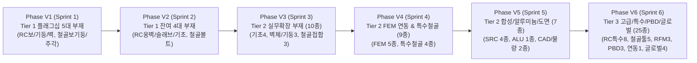

# 12. 원본앱 61종 전수 모듈 수직 포팅 마스터플랜 (Vertical Porting Master Plan)

## 1. 마스터플랜 개요 및 패러다임 전환 (Executive Summary)

본 문서는 **원본앱 (`원본앱(Design+.exe)`)** 원본 바이너리(20개 DLL, 47,110개 심볼)와 47종 핵심 C 수도코드, 공식 매뉴얼, 그리고 KDS 국가건설기준 자산을 바탕으로, **총 61종 전수 모듈(RC 21종, Steel 16종, SRC 4종, ALU 2종, RFM 3종, FEM 5종, PBD 3종, CAD/물량/연동 3종, 글로벌 4종)**을 순수 **Python 3.13 + FastAPI + Modern Web(HTML5 Canvas/KaTeX)** 스택으로 100% 웹 마이그레이션하기 위한 **최상위 실행 마스터플랜**입니다.

### 🔄 패러다임 전환: 수평적 인프라 $\rightarrow$ 부재별 5대 공정 수직 개발 (Vertical End-to-End)
- **과거 방식의 한계 (수평적 레이어 개발)**: 백엔드 엔진, 프론트엔드 UI, 계산서 등을 분리하여 수평 개발할 경우 더미 코드와 WIP가 누적되고, 실사용 가능한 완결성이 지연되는 문제 발생.
- **신규 마스터플랜 원칙 (부재 단위 수직 관통)**: 단면 DB, 솔버, 4열 웹 프레임워크 등 **공통 인프라가 완비**되었으므로, 이제부터는 **개별 부재(모듈) 단위로 Step 1(엔진)부터 Step 5(E2E)까지 수직으로 단번에 관통(Vertical End-to-End Slice)**하여 100% 작동 가능한 상태로 완성합니다.

```
┌─────────────────────────────────────────────────────────────────────────────────────────────────┐
│ AltDP_3rd 부재별 5대 정밀 수직 관통 개발 파이프라인 (docs/16 규약 연동)                         │
├─────────────────────────────────────────────────────────────────────────────────────────────────┤
│ [Step 1: KDS 엔진] ──► [Step 2: 1:1 입력폼] ──► [Step 3: 2D 캔버스] ──► [Step 4: A4 계산서] ──► [Step 5: E2E 통합] │
│ (0.1% 오차 TDD)        (원본앱 DLG)         (VDraw 갈고리/치수)      (5대장 KaTeX 수식)       (100ms 무에러) │
└─────────────────────────────────────────────────────────────────────────────────────────────────┘
```

---

## 2. 기완료 기반 인프라 현황 (Foundational Baseline - 100% Completed)

과거 Phase 1~6 및 Phase 20, 21-1~4를 통해 수평적 공통 인프라는 전면 구축 및 안정화되었습니다:

| 인프라 영역 | 완료 내역 및 산출물 | 상태 |
|---|---|:---:|
| **단면 DB & 재료/하중** | • 33개 형강 DB 및 단면 기하성질 산정 (`src/engine/db/`)<br>• KDS 14 20/31 콘크리트·강재 모델 (`materials.py`), LCB 다축 포락 (`load_comb.py`) | **완료** |
| **수치 솔버 코어** | • 200 파이버 수치적분 3D P-M 상관곡면 솔버 (`src/engine/solver/pm_diagram.py`)<br>• DKMQ/DKT 2D 평판 휨 요소 및 Winkler 지반/접촉 솔버 코어 (`src/engine/fem/`) | **완료** |
| **4열 웹 워크스페이스** | • 1열(트리메뉴) - 2열(VDraw 캔버스) - 3열(파라메트릭 입력) - 4열(A4 구조계산서)<br>• 반응형 글래스모피즘 UI, 테마 시스템, ProjectStore 상태 관리 | **완료** |
| **모듈 디스패처 & WIP 체계** | • Phase 20 더미 코드 전면 청산 및 정직한 WIP 디스패처/안내 카드 구축<br>• 61종 전수 모듈 3단계 티어 메타데이터 체계 확립 ([`docs/04`](04_master_original_app_modules_comprehensive_catalog.md)) | **완료** |
| **4대 SSOT 검증 파이프라인** | • Ghidra C 루틴(1순위) $\leftrightarrow$ 매뉴얼/DLG(2순위) $\leftrightarrow$ 학회 예제집(3순위) $\leftrightarrow$ KDS 원문(4순위)<br>• 3자 삼각대조 0.10% 오차 검증 및 kcsc2md Self-Healing 선 치유 프로토콜 (기준서 및 예제집) | **완료** |

---

## 3. 부재별 5대 정밀 수직 공정 파이프라인 (Vertical 5-Step Micro Pipeline)

개별 부재 모듈 개발 시 [`docs/16_goal_micro_execution_protocol.md`](16_goal_micro_execution_protocol.md)에 정의된 5대 마이크로 공정을 순차적으로 완수합니다:

| 공정 단계 | 권장 모델 | 공정 명칭 | 핵심 산출물 및 작업 내용 | 필수 검증 기준 (DoD) |
|:---:|:---:|---|---|:---:|
| **Step 1** | 🧠 High | **KDS 계산 엔진 & Pydantic 스키마** | • KDS 14 20 / 14 31 표준 수식 순수 Python 구현<br>• Pydantic 입출력 스키마 정의 (`src/engine/<domain>/`)<br>• P-M / FEM 수치 솔버 연동 | `pytest` 100% Pass<br>(학회 예제집 대비 **오차 $\le 0.10\%$**) |
| **Step 2** | ⚙️ Medium | **원본앱 1:1 서브탭 입력폼 & 모달** | • 원본 `DLG_*.ini` 1:1 매핑 서브탭 폼 구현<br>• 버튼(`...`) 클릭 서브대화창 웹 모달 구현 (`dialogs.js`)<br>• 재료/단면(.sdb) 선택 모달 및 유효성 검증 | 브라우저 DOM 렌더링 확인<br>콘솔 에러 0건 |
| **Step 3** | ⚙️ Medium | **2D VDraw 캔버스 배근/단면 그래픽스** | • VDraw 원본 드로잉 기하 알고리즘 이식 (`renderer2d.js`)<br>• 135° 스터럽 절곡, 피복 옵셋, 솔리드 원형 주철근<br>• 치수선, 철근 배근 지시선 태그, P-M 상호작용 차트 | Canvas 그래픽스 렌더링 확인<br>축척/줌/팬 인터랙션 |
| **Step 4** | 🧠 High | **A4 5대 장구분 8단계 KaTeX 구조계산서** | • 원본 `DgnReportBase.ini` 5대 장구분 완벽 계승<br>• 8단계 Step-by-Step 수식 전개식 (LaTeX/KaTeX)<br>• 단면도/P-M 그림 삽입, `  →  O.K / N.G` 판정 화살표 | A4 인쇄 프리뷰 확인<br>공학 계산서 레이아웃 검증 |
| **Step 5** | ⚙️ Medium | **4열 통합 E2E 검증 & 실사용 UI 확립** | • 1열(트리) - 2열(캔버스) - 3열(폼) - 4열(계산서) 4열 연동<br>• 파라미터 입력 시 **100ms 이내 실시간 3-View 동시 동기화**<br>• WIP 해제 및 정식 온라인(`is_wip: false`) 전환 | E2E 전수 테스트 Pass<br>브라우저 콘솔 에러 0건 |

---

## 4. 61종 전수 모듈 수직 개발 스프린트 로드맵 (Phases V1 ~ V6)

전체 61종 모듈([`docs/04`](04_master_original_app_modules_comprehensive_catalog.md))은 실무 활용도 및 의존성 계층에 따라 6대 수직 스프린트로 분할 실행됩니다:



---

### Phase V1 (Sprint 1): Tier 1 플래그십 5대 핵심 부재 수직 완성 - [최우선 과제]
> **목표**: 실무에서 가장 빈번하게 사용되는 5대 주부재를 5대 공정(Step 1~5)으로 100% 수직 관통 완수.

| No | 모듈 식별자 (`type`) | 부재 명칭 | 원본 DLG / 소스 | 핵심 수직 개발 내용 (Step 1 ~ 5) | 상태 |
|:---:|---|---|---|---|:---:|
| **1** | `rc_beam` | **RC 보** | `IDD_RCS_BEAM_PMODE_DLG`<br>`rc__CHK_BBBE_*.c` | 단/복철근 휨·전단·처짐 + 135° 스터럽 다단배근 캔버스 + A4 8단계 KaTeX 계산서 | 개발 대기 |
| **2** | `rc_column` | **RC 기둥** | `IDD_RCS_COLUMN_PMODE_DLG`<br>`solver__CHK_BCCO_*.c` | 200 파이버 3D P-M 곡면 + 원형/사각 주철근 배열 캔버스 + 이축휨/장주 계산서 | 개발 대기 |
| **3** | `rc_shear_wall` | **RC 전단벽** | `IDD_RCS_WALL_PMODE_DLG`<br>`rc__CHK_BWUW_*.c` | 전단강도·특수경계요소 판정 + 단부 보강근 캔버스 + 벽체 전단 A4 계산서 | 개발 대기 |
| **4** | `steel_beam_column` | **철골 보/기둥** | `IDD_STL_BEAMCOLUMN_INPUT_DLG`<br>`steel__CHK_USMC_*.c` | 조밀/비조밀 판정·LTB 좌굴·축휨 P-M + H/Box 단면 치수선 캔버스 + 강재 계산서 | 개발 대기 |
| **5** | `steel_baseplate` | **철골 주각부** | `IDD_STL_USBP_PMODE_DLG`<br>`steel__CHK_USBP_*.c` | 콘크리트 지압·베이스플레이트 두께·앵커볼트 + 베이스 상세도 + 주각부 계산서 | 개발 대기 |

---

### Phase V2 (Sprint 2): Tier 1 잔여 4대 부재 수직 완성 (Tier 1 완결)
> **목표**: Tier 1 기반 부재 9종 전수 완성을 달성하여 기본 골조 부재 100% 정식 온라인화.

| No | 모듈 식별자 (`type`) | 부재 명칭 | 원본 DLG / 소스 | 핵심 수직 개발 내용 (Step 1 ~ 5) | 상태 |
|:---:|---|---|---|---|:---:|
| **6** | `rc_retaining_wall` | **RC 옹벽** | `IDD_RCS_RETAINING_WALL_*`<br>`rc__CHK_URAB_*.c` | 캔틸레버 옹벽 토압, 전도/활동/지지력 안정 + 저판/벽체 단면 배근 캔버스/계산서 | 대기 |
| **7** | `rc_slab` | **RC 슬래브** | `IDD_RCS_SLAB_PMODE_DLG`<br>`rc__CHK_SLAB_*.c` | 1방향/2방향 DDM/EFM 휨·2방향 펀칭전단 + 상/하부 배근도 + 슬래브 계산서 | 대기 |
| **8** | `rc_iso_footing` | **RC 독립기초** | `IDD_RCS_FOOT_PMODE_DLG`<br>`rc__CHK_UFDN_*.c` | 지반 허용지지력·2방향 펀칭·1방향 전단·휨 + 푸팅 배근도 + 기초 계산서 | 대기 |
| **9** | `steel_bolt_conn` | **철골 접합부** | `IDD_STL_BOLTCONNECTION_INPUT_DLG`<br>`steel__CHK_USBC_*.c` | 고장력볼트 마찰/지압·블록전단파단 + 볼트 군(Group) 배치 캔버스 + 접합 계산서 | 대기 |

---

### Phase V3 (Sprint 3): Tier 2 실무 확장 기초 / 벽체 / 철골접합군 (10종)
> **목표**: 실무 프로젝트에서 빈출되는 복합 기초, 다지벽체, 특수 접합부 10종 수직 관통.

* **확장 기초군 (4종)**:
  - `rc_comb_footing` (복합기초): 2주 이상 복합기초 지내력 평형 및 휨/전단 단면설계
  - `rc_strip_footing` (줄기초): 벽체 하부 연속 줄기초 단위폭 휨/전단 설계
  - `rc_pile_footing` (말뚝기초): 파일캡 말뚝 배치별 반력 분배 및 펀칭전단 검토
  - `rc_anchor_bolt` (콘크리트 앵커볼트): KDS 14 20 54 인장파열, 콘파괴, 전단마찰 검토
* **확장 벽체/기둥군 (3종)**:
  - `rc_gencolumn` (임의형상 기둥): L/T/십자형 임의단면 2D 파이버 P-M 상관곡면
  - `rc_comb_wall` (조합/코어 전단벽): L형, ㄷ형 코어벽체 3차원 축휨/전단 연동 검토
  - `rc_basement_wall` (지하외벽): 다층 토압/수압 1방향/2방향 휨모멘트 및 면외전단 검토
* **철골 접합군 (3종)**:
  - `steel_brace` (가새/트러스): 인장 순단면 파단($U$ 전단지체) 및 압축 좌굴($KL/r$)
  - `steel_endplate` (모멘트 엔드플레이트): 항복선 이론(Yield-Line) 플랜지 휨 및 볼트 인장
  - `steel_welding` (강재 용접접합부): 필릿/맞댐 용접 유효목두께 및 응력 검토

---

### Phase V4 (Sprint 4): Tier 2 2D FEM 연동 및 특수 철골 부재군 (9종)
> **목표**: 2D 평판 휨 및 접촉 비선형 FEM 솔버 연동 부재 5종 및 특수 철골 부재 4종 수직 완성.

* **2D FEM 평판 휨 연동 부재군 ([`docs/15`](15_fem_analysis_and_external_solver_specification.md) 연동 5종)**:
  - `foundation_fem` (매트기초 FEM): Winkler 탄성지반 + 인장분리(Tension Cut-off) 비선형 반복해석
  - `wall_2way_fem` (지하외벽 2방향 FEM): 횡토압/수압 2방향 판휨 및 다층 지지 경계조건 해석
  - `baseplate_fem` (주각부 접촉 FEM): 콘크리트 압축 지압 - 앵커볼트 인장 비선형 접촉 FEM
  - `endplate_fem` (엔드플레이트 항복선 FEM): 볼트 배치별 2D 국부 휨 항복선 수치해석
  - `slab_fem` (이형 슬래브 FEM): 비정형 단면 및 개구부 주변 응력집중 판휨 해석
* **특수 철골 부재군 (4종)**:
  - `steel_web_opening` (개구부보): 보 웨브 원형/사각 개구부 Vierendeel 휨-전단 및 보강재 검토
  - `steel_crane_girder` (크레인 주행거더): 수직/수평 충격계수, 처짐제한, 피로한계상태 검토
  - `steel_purlin_girt` (중도리/띠장): 냉간성형 C/Z 형강 2축휨 및 새그로드(Sag-rod) 지지 검토
  - `steel_embedplate` (매립 강판): 콘크리트 매립 스터드 앵커 전단/인장 콘파괴 검토

---

### Phase V5 (Sprint 5): Tier 2 합성구조(SRC), 알루미늄(ALU), 도면/물량 (7종)
> **목표**: 합성부재, 비철금속 및 실무 필수 엔지니어링 산출물(DXF/Excel) 모듈 수직 완성.

* **합성구조 SRC 부재군 (4종)**:
  - `src_composite_beam` (합성보): 강재보+슬래브 완전/부분합성, 전단연결재(Stud) 설계
  - `src_baseplate` (SRC 주각부): 매립형/노출형 SRC 기둥 주각부 지압 및 앵커볼트 검토
  - `src_column` (매립형 SRC 기둥): H/십자형강 매립 콘크리트 기둥 소성압축 및 P-M 곡선
  - `src_cft_column` (충전형 CFT 기둥): 강관 콘크리트 구속효과(Confinement) 반영 P-M 해석
* **알루미늄 구조설계 (1종)**:
  - `alu_beam_col` (알루미늄 보/기둥): 표준 압출형재 휨/압축 및 용접 열영향부(HAZ) 강도저감 검토
* **도면 및 물량산출 모듈군 (2종)**:
  - `cad_draw_dxf` (CAD 배근 상세도): `ezdxf` 기반 부재 단면/배근도 DXF CAD 도면 내보내기
  - `quantity_excel` (적산 및 물량산출): 콘크리트($m^3$), 거푸집($m^2$), 철근 규격별 톤수 집계 Excel 내보내기

---

### Phase V6 (Sprint 6): Tier 3 고급 특수 / 보수보강 / PBD / 연동 / 글로벌 (25종)
> **목표**: 잔여 고급 엔지니어링, 보수보강, PBD, Gen 연동 및 글로벌 규준 모듈을 수직 완수하여 61종 100% 포팅 완결.

* **RC 특수/일괄/일람표 (8종)**: `rc_corbel` (코벨), `rc_stair` (계단), `rc_buttress` (부벽), `rc_beam_table` (보일람표), `rc_slab_table` (슬래브일람표), `rc_batch_beam` (보일괄), `rc_batch_column` (기둥일괄), `rc_batch_wall` (벽체일괄)
* **철골 특수/보조툴 (5종)**: `steel_stair` (철골계단), `steel_corweb_beam` (파형웨브), 철골 엔지니어링 보조툴 4종 통합 (`steel_tool_*`)
* **보수보강 RFM 부재군 (3종)**: `rfm_beam` (보 보강), `rfm_column` (기둥 보강), `rfm_slab` (슬래브 보강) - CFRP/강판 보강설계
* **알루미늄 비정형 (1종)**: `alu_beam_col_gen` (커튼월 등 임의형상 중공 압출형재 다축설계)
* **성능기반설계 PBD (3종)**: `pbd_rc_beam`, `pbd_rc_column`, `pbd_rc_wall` - ASCE 41 소성힌지 백본곡선 및 성능평가
* **MIDAS Gen 3D 모델 연동 (1종)**: `gen_mgt_interop` - `.mgt` 텍스트 스크립트 파싱 및 3D 해석결과 부재력 일괄 임포트
* **글로벌 설계규준 어댑터 (4종)**: `ec_rc_member` (유로코드 RC), `ec_steel_member` (유로코드 강재), `is_rc_member` (인도 IS 456), `us_member` (미국 ACI/AISC Imperial 단위계)

---

## 5. 수직 개발 완료 정의 (Definition of Done: DoD) & 품질 보증 규약

단일 모듈(부재)의 수직 개발 완료 보고를 위해 충족해야 할 **5대 무결성 기준**:

1. **수치 무결성 ($\le 0.10\%$)**:
   - 학회 공인 예제집 및 원본앱 대비 **계산 오차율 0.10% 이하 엄수**.
   - `pytest tests/engine/` 단위/통합 테스트 100% Pass (Exit Code 0).
2. **원본앱 1:1 입력 체계**:
   - 원본 `DLG_*.ini`의 입력 항목 및 서브 대화창(`...`) 모달 브라우저 렌더링 검증 완료.
3. **2D Canvas VDraw 정밀 드로잉**:
   - 135° 스터럽 갈고리, 피복두께 옵셋, 솔리드 주철근, 치수선 및 철근 태그 렌더링 검증.
4. **A4 5대 장구분 8단계 KaTeX 구조계산서**:
   - 원본 계산서 5대 장구분 포맷 계승, LaTeX 수식 전개식, O.K/N.G 판정 및 A4 인쇄 프리뷰 확인.
5. **4열 통합 실시간 동기화 & 에러 0건**:
   - 파라미터 입력 시 100ms 이내 캔버스/계산서/DCR 동시 업데이트 및 브라우저 콘솔 에러 0건 입증.

> [!CAUTION]
> **🚨 증거 강제 제출 규약 (Proof-First Mandate, docs/16)**:
> 부재 단위 개발 완료 시 단순 텍스트 주장은 금지되며, 반드시 **4대 물리적 증거(원본 Ground Truth 발췌, 3자 삼각대조 오차표, raw 테스트 로그, git diff 및 커밋 해시)**를 포함하여 보고해야 합니다.

---

## 6. 개발 지시 및 실행 가이드 (Agent Prompting Guide)

사용자는 본 마스터플랜의 스프린트 및 부재 단위에 맞추어 아래와 같이 초간결 명령으로 실행을 지시합니다:

```markdown
# [부재 단위 Step 1 실행 예시]
/goal
docs 16을 확인하고, Phase V1의 rc_beam Step 1을 구현해줘.

# [부재 단위 Step 2~5 순차 실행 예시]
/goal
docs 16을 확인하고, Phase V1의 rc_beam Step 2를 구현해줘.

# [스프린트 전체 단위 실행 예시]
/goal
docs 16을 확인하고, Phase V1의 5대 플래그십 부재를 순차적으로 구현해줘.
```
