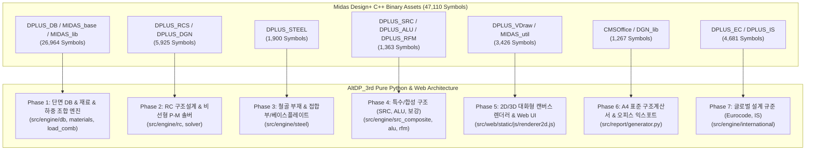

# AltDP_3rd 전 기능 포팅 마스터플랜 (Full Feature Porting Master Plan)

## 1. 마스터플랜 개요 및 목적 (Executive Summary)

본 문서는 **Midas Design+** 원본 바이너리로부터 추출된 **20개 DLL 모듈, 47,110개 C++ Exported 심볼, 1,000+ 핵심 엔지니어링 클래스**([docs/09](file:///f:/PyProject/AltDP_3rd/docs/09_decompiled_source_and_symbol_inventory.md))를 완벽하게 분석하여, 순수 **Python 3.13 + FastAPI + Modern Web(HTML5 Canvas/SVG) + KDS 국가건설기준** 스택으로 100% 웹 마이그레이션하기 위한 **전체 포팅 마스터플랜**입니다.

본 마스터플랜은 향후 `요구사항/요구사항XX_...md`로 구체화될 개별 개발 스텝의 최상위 나침반(Master Blueprint) 역할을 수행합니다.

---

## 2. 모듈별 역공학 심볼 및 포팅 아키텍처 매핑

---

## 3. 단계별 포팅 로드맵 및 세부 구현 스텝 (Step-by-Step Phases)

### Phase 1: 기반 인프라 & 데이터/단면 계층 (Core DB & Structural Foundations)
> **대상 C++ 모듈**: `DPLUS_DB.dll` (23,447), `MIDAS_base.dll` (1,401), `MIDAS_lib.dll` (2,116)

* **1.1. SDB 단면 데이터베이스 파서 및 조회 엔진 완성 (`src/engine/db/`)**:
  - `original_src/Midas Design+/Dbase/*.sdb` 33개 형강 DB(KS, AISC, JIS, DIN, GB 등) 바이너리 포맷 100% 디코딩.
  - H형강, ㄷ형강(Channel), ㄱ형강(Angle), 각형강관(Tube), 원형강관(Pipe), T형강, C형강 등 전 단면 기하학적 성질($A, I_x, I_y, Z_x, Z_y, S_x, S_y, r_x, r_y, J, C_w$) 계산 및 캐싱.
* **1.2. KDS 표준 재료 모델 라이브러리 (`src/engine/materials.py`)**:
  - 콘크리트($f_{ck} = 18 \sim 80\,\text{MPa}$, 고강도 콘크리트 압축응력블록 계수 $\alpha_1, \beta_1$ 자동 산정, 탄성계수 $E_c = 8500\sqrt[3]{f_{cu}}$ 반영).
  - 철근(SD300 ~ SD600, 탄성계수 $E_s = 200,000\,\text{MPa}$, 극한변형률 및 항복변형률 모델).
  - 구조용 강재(SS275, SM355, SHN460 등 항복강도 $F_y$, 인장강도 $F_u$, 두께별 강도저감 반영).
* **1.3. 하중 조합 및 단면 포락선(Envelope) 추출기 (`src/engine/load_comb.py`)**:
  - KDS 41 10 15 극한강도설계법 및 허용응력설계법 하중조합 ($1.2D + 1.6L$, $1.2D + 1.0L \pm 1.0E$ 등).
  - 다축 하중 조건($P_u, V_{ux}, V_{uy}, M_{ux}, M_{uy}, T_u$)의 최대/최소 포락 조건 자동 판별.

---

### Phase 2: RC 구조설계 엔진 & 비선형 P-M 수치해석 솔버 (Concrete Engineering Core)
> **대상 C++ 모듈**: `DPLUS_RCS.dll` (3,305), `DPLUS_DGN.dll` (2,620) | **기준**: KDS 14 20 00

* **2.1. RC 보(Beam) 완전 설계 엔진 (`src/engine/rc/beam.py` / `CHK_BBBE`)**:
  - 정/부모멘트 단철근/복철근 휨강도($\phi M_n$), 균형철근비 및 최대/최소 철근비 검토.
  - 전단강도($V_c, V_s, \phi V_n$) 및 전단철근(스터럽) 간격/배근 검토, 비틀림강도($T_n, T_u$) 합성 검토.
  - 사용성 검토: 유효단면2차모멘트($I_e$) 기반 즉하시침 및 장기처짐(크리프/건조수축), 균열폭($w_{max}$) 검토.
* **2.2. RC 기둥(Column) & 3차원 P-M 상관도 솔버 (`src/engine/rc/column.py`, `solver/` / `CHK_BCCO`)**:
  - 기둥 축압축/축인장 강도($\phi P_{n,max}, \phi P_n$), 띠철근/나선철근 연성도 검토.
  - 단면 파이버 분할(Fiber Section Method) 기반 비선형 수치적분 P-M 곡선 계산.
  - 이축 휨(Biaxial Bending) 브레슬러(Bresler) 상호작용 방정식($1/P_n = 1/P_{nx} + 1/P_{ny} - 1/P_0$) 및 윤곽선법(Load Contour Method) 완전 구현.
  - 장주 효과(Slenderness Effect): 모멘트 확대계수법($\delta_{ns}, \delta_s$) 검토.
* **2.3. RC 전단벽(Shear Wall) 설계 엔진 (`src/engine/rc/wall.py` / `CHK_BWUW`)**:
  - 면내 전단강도($V_c, V_s, V_n$) 및 수직/수평 전단보강근비 검토.
  - 벽체 단부 구속요소(Boundary Element) 필요성 판정 및 특수경계요소 상세 설계.
* **2.4. RC 1방향/2방향 슬래브(Slab) 엔진 (`src/engine/rc/slab.py` / `CHK_SLAB`)**:
  - 1방향 슬래브 최소 두께 및 휨/온도수축철근비 검토.
  - 2방향 슬래브 직접설계법(DDM) 및 등가골조법(EFM) 휨모멘트 분배, 1방향/2방향 펀칭 전단 검토.
* **2.5. RC 기초(Footing) & 지중보 엔진 (`src/engine/rc/footing.py` / `CHK_UFDN`, `CHK_URBE`)**:
  - 독립기초/복합기초 지반 지지력 및 접지압 분포 계산 (편심 하중 대응).
  - 기둥 주변 2방향 펀칭전단(Punching Shear) 및 1방향 보 전단 검토.
  - 휨 모멘트에 따른 하부/상부 주철근 배근 및 지압응력 검토.
* **2.6. RC 지하외벽 및 옹벽(Retaining Wall) 엔진 (`src/engine/rc/retaining_wall.py` / `CHK_URAB`)**:
  - Rankine/Coulomb 토압론 및 수압, 상재하중에 의한 횡토압 산정.
  - 옹벽의 전도(Overturning), 활동(Sliding, 전단키 고려), 지반 지지력 안전율($F_s$) 검토.
  - 저판(Heel/Toe) 및 벽체(Stem) 단면 휨/전단 설계.

---

### Phase 3: 철골 구조설계 및 접합부/베이스플레이트 엔진 (Steel & Connections)
> **대상 C++ 모듈**: `DPLUS_STEEL.dll` (1,900) | **기준**: KDS 14 31 00

* **3.1. 철골 보(Steel Beam) 설계 엔진 (`src/engine/steel/beam.py` / `CHK_SBM`)**:
  - 조밀/비조밀/세장 플랜지 및 웨브 폭두께비 판정.
  - 소성모멘트($M_p$) 및 비지지길이($L_b$)에 따른 횡비틀림좌굴(LTB) 휨강도($M_n$) 계산.
  - 웨브 전단항복 및 전단좌굴강도($V_n$), 하중 작용점 국부항복/웨브 크리플링(Web Crippling) 검토.
* **3.2. 철골 기둥(Steel Column) 및 축-휨 복합부재 (`src/engine/steel/column.py` / `CHK_SCOL`)**:
  - 강축/약축 휨좌굴($P_n$), 비틀림좌굴 및 휨비틀림좌굴 강도 산정.
  - 한계상태설계법 2축 휨-압축 상호작용 수식 검토 ($P_u / \phi P_n \ge 0.2$ 분기 수식 완벽 구현).
* **3.3. 철골 가새(Steel Brace) 설계 엔진 (`src/engine/steel/brace.py` / `CHK_SBRC`)**:
  - 인장부재 총단면 항복($P_n = F_y A_g$) 및 순단면 파단($P_n = F_u A_e$, 전단지체계수 $U$ 반영).
  - 압축부재 세장비($KL/r \le 200$) 및 좌굴강도 검토.
* **3.4. 철골 볼트/용접 접합부 설계 엔진 (`src/engine/steel/connection.py` / `CSteelBoltConnection`, `CSteelWelding`)**:
  - 고장력 볼트(F10T, TS볼트) 전단접합(마찰접합/지압접합) 및 인장접합 강도.
  - 연단거리, 볼트 피치, 모재 블록전단파단(Block Shear Rupture) 및 지압파괴 검토.
  - 필릿용접(Fillet Weld) 유효목두께 및 그루브용접(CJP/PJP) 강도 검토.
* **3.5. 주각부 베이스플레이트 및 앵커볼트 (`src/engine/steel/baseplate.py` / `CBasePlate`, `CDgnAnchBoltDlg`)**:
  - 콘크리트 기초 지압응력 분포 및 베이스플레이트 소요 두께($t_p$) 계산.
  - 앵커볼트 인장파단, 전단파단, 콘크리트 콘파칭(Breakout), 프라이아웃(Pryout) 강도 검토.

---

### Phase 4: 특수/합성 구조 및 보강 설계 엔진 (SRC, ALU, Retrofit)
> **대상 C++ 모듈**: `DPLUS_SRC.dll` (505), `DPLUS_ALU.dll` (329), `DPLUS_RFM.dll` (529)

* **4.1. 철골철근콘크리트(SRC) 합성부재 엔진 (`src/engine/src_composite/` / `CSRCCodeCheck`)**:
  - 충전형 각형/원형 CFT 기둥 및 매입형 SRC 기둥 휨/압축 강도 계산.
  - 합성보(Composite Beam) 스터드 앵커 전단연결재 수량 및 유효 플랜지 폭 산정.
* **4.2. 알루미늄 구조설계 엔진 (`src/engine/alu/` / `CALUCodeCheck`)**:
  - 알루미늄 합금 압출형재 휨, 압축, 인장, 국부좌굴 검토.
* **4.3. 기존 구조물 보수/보강(Retrofit) 엔진 (`src/engine/rfm/` / `CRFMCodeCheck`)**:
  - 탄소섬유판/시트(CFRP) 및 강판 부착에 따른 RC 보/기둥 휨·전단 내력 증진도 계산.

---

### Phase 5: 2D/3D 대화형 캔버스 렌더러 & 웹 UI 계층 (Visualization & Canvas)
> **대상 C++ 모듈**: `DPLUS_VDraw.dll` (2,674), `MIDAS_util.dll` (752)

* **5.1. HTML5 Canvas / SVG 2D 배근 단면 렌더러 (`src/web/static/js/renderer2d.js`)**:
  - 직사각형/T형/L형 RC 보 배근도(주근 단수, 피복두께, 스터럽 갈고리 형상).
  - RC 기둥/벽체/기초 단면 배근 및 치수선(Dimension Line) 자동 스케일링 렌더링.
  - H형강, 각형강관, 볼트 홀 배치도, 베이스플레이트 앵커볼트 배치도 2D 시각화.
* **5.2. 대화형 P-M 상관도 곡선 차트 (`src/web/static/js/pm_chart.js`)**:
  - 공칭강도 곡선($P_n-M_n$) 및 설계강도 곡선($\phi P_n-\phi M_n$) 렌더링.
  - 계수하중 작용점($P_u, M_u$) 플로팅 및 안전율(DCR) 색상 표시(Safe: Green, Over: Red).
* **5.3. 반응형 파라메트릭 웹 UI (`src/web/templates/`, `src/web/static/css/`)**:
  - 단면 치수, 배근 정보, 작용 하중 입력 시 0.05초 실시간 재해석 및 검토 결과 갱신.

---

### Phase 6: A4 표준 구조계산서 및 오피스 익스포트 (Calculation Report & Office)
> **대상 C++ 모듈**: `DPLUS_RCS.dll`(`CMSOffice`), `DGN_lib.dll`(`CMSExcel`, `CMSWorkRec`)

* **6.1. A4 표준 구조계산서 생성 엔진 (`src/report/generator.py`, `templates/report_template.html`)**:
  - 설계 일반 사항, 적용 기준(KDS), 재료 물성치 요약표.
  - 단계별 수식 전개 과정($\LaTeX$ 렌더링), 대입값, 산출 결과, 허용치 대조 표.
  - 2D 배근 단면도 및 P-M 상관도 벡터 그래픽 자동 삽입.
* **6.2. 원클릭 인쇄 및 PDF/Excel 내보내기**:
  - 브라우저 인쇄 CSS 최적화(Page-break 방지, 페이지 번호).
  - Excel/CSV 데이터 구조화 내보내기.

---

### Phase 7: 글로벌 설계 규준 확장 (Eurocode & Indian Standard)
> **대상 C++ 모듈**: `DPLUS_EC.dll` (2,493), `DPLUS_IS.dll` (2,188)

* **7.1. Eurocode (EC2, EC3, EC4) 규준 어댑터 (`src/engine/international/eurocode/`)**:
  - EN 1992-1-1(콘크리트), EN 1993-1-1(강구조) 계수 및 설계식 분기.
* **7.2. Indian Standard (IS 456, IS 800) 규준 어댑터 (`src/engine/international/is/`)**:
  - IS 456(LSM 콘크리트), IS 800(LSM 강구조) 설계 파이프라인.

---

## 4. 개별 요구사항 문서(Step-by-Step Requirements) 분할 가이드

본 마스터플랜을 기준으로 작성될 하위 요구사항 명세서 체계 및 구현 상태는 다음과 같습니다:

| 요구사항 번호 | 대상 범위 | 핵심 산출물 및 구현 모듈 | 상태 |
|:---:|---|---|:---:|
| **`요구사항01`** | **Ghidra 핵심 알고리즘 선별 디컴파일 & C 자산화** | `scripts/ghidra_extract.py`, `ExportTargetFunctions.java`, `decompiled_src/core_routines/` (47개 C 소스) | **완료 (100%)** |
| **`요구사항02`** | **SDB 단면 DB & KDS 재료 모델 완성** | `sdb_parser.py`, `materials.py`, `load_comb.py`, 단면 조회 API | 진행 예정 |
| **`요구사항03`** | **RC 보(Beam) 완전 설계 & 2D 배근도** | `rc/beam.py`, 전단/비틀림/처짐 검토, `renderer2d.js` 보 렌더러 | 진행 예정 |
| **`요구사항04`** | **RC 기둥(Column) & P-M 솔버** | `rc/column.py`, 파이버 단면 솔버, `pm_chart.js`, 이축휨 검토 | 진행 예정 |
| **`요구사항05`** | **RC 전단벽(Wall) & 슬래브(Slab)** | `rc/wall.py`, `rc/slab.py`, 펀칭전단, 경계요소 설계 | 진행 예정 |
| **`요구사항06`** | **RC 기초(Footing) & 지하외벽/옹벽** | `rc/footing.py`, `rc/retaining_wall.py`, 토압/전도/활동 검토 | 진행 예정 |
| **`요구사항07`** | **철골 보(Beam) & 기둥(Column)** | `steel/beam.py`, `steel/column.py`, LTB/좌굴/조합응력 | 진행 예정 |
| **`요구사항08`** | **철골 접합부 & 베이스플레이트** | `steel/connection.py`, `steel/baseplate.py`, 볼트/용접/앵커 | 진행 예정 |
| **`요구사항09`** | **A4 표준 구조계산서 출력 시스템** | `report/generator.py`, 수식 Trace 전개, PDF 인쇄 템플릿 | 진행 예정 |
| **`요구사항10`** | **SRC 합성부재 & 알루미늄 부재** | `src_composite/`, `alu/`, 합성효과 및 알루미늄 좌굴 | 진행 예정 |
| **`요구사항11`** | **통합 웹 UI/UX 완성 & 회귀 검증** | 반응형 레이아웃, 도메인별 3대 Pytest 100% 통과 | 진행 예정 |

---

## 5. 무결성 검증 및 품질 보증 프로토콜 (Quality Assurance)

1. **Ground Truth 0.1% 오차 검증**:
   - `original_src/` Midas Design+ 실행 결과값 및 `kcsc2md` 공인 예제집 답안과 1:1 비교 검증.
2. **도메인별 3대 초고속 단위 테스트**:
   - `pytest tests/engine/`: 공학 수식 및 수치해석 검증
   - `pytest tests/api/`: 입출력 스키마 및 REST API 검증
   - `pytest tests/ui/`: 렌더러 캔버스 좌표 및 템플릿 검증
3. **무결성 선행 치유 (Patch-First)**:
   - KDS 기준서 불일치 발견 시 `kcsc2md` 기준서를 우선 패치하고 신규 엔진에 반영.
