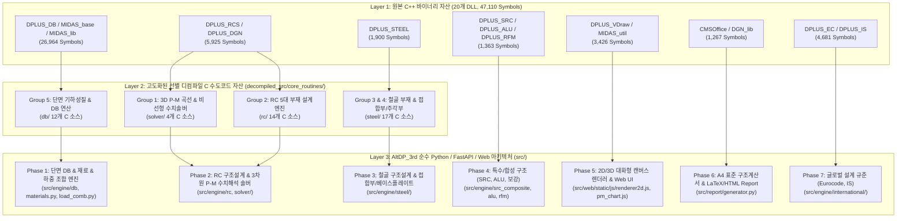
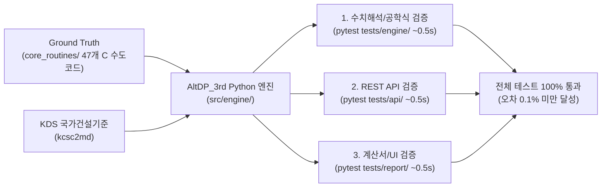

# AltDP_3rd 전 기능 포팅 마스터플랜 (Full Feature Porting Master Plan)

## 1. 마스터플랜 개요 및 목적 (Executive Summary)

본 문서는 **Midas Design+** 원본 바이너리로부터 추출된 **20개 DLL 모듈, 47,110개 C++ Exported 심볼**([docs/09](file:///d:/PyProject/AltDP_3rd/docs/09_decompiled_source_and_symbol_inventory.md))과 Ghidra Headless 디컴파일러를 통해 선별 자산화된 **5대 도메인 47개 핵심 C 수도코드 알고리즘**([decompiled_src/core_routines/](file:///d:/PyProject/AltDP_3rd/decompiled_src/core_routines/))을 바탕으로, 순수 **Python 3.13 + FastAPI + Modern Web(HTML5 Canvas/SVG) + KDS 국가건설기준** 스택으로 100% 웹 마이그레이션하기 위한 **전체 포팅 종합 마스터플랜**입니다.

[.agents/AGENTS.md](file:///d:/PyProject/AltDP_3rd/.agents/AGENTS.md)의 핵심 행동 규약(Zero-Dependency 소스 격리, KDS 0.1% 오차 무결성, 1이슈 1Phase 및 Goal 주도형 단계적 분할 실행, 도메인별 3대 Pytest 초고속 검증)을 최우선으로 준수하며, 향후 `요구사항/요구사항XX_...md`로 구체화될 모든 개발 스텝의 최상위 나침반(Single Source of Truth, SSOT) 역할을 수행합니다.

---

## 2. 3계층 역공학-C수도코드-Python/Web 엔지니어링 매핑 아키텍처

---

## 3. 단계별 포팅 로드맵 및 고도화 추출 소스 매핑 (Phases 1 ~ 7)

### Phase 1: 기반 인프라 & 데이터/단면 계층 (Core DB & Structural Foundations) - [완료]
> **대상 C++ 모듈**: `DPLUS_DB.dll` (23,447 심볼), `MIDAS_base.dll` (1,401), `MIDAS_lib.dll` (2,116)  
> **참조 디컴파일 C 소스**: [`decompiled_src/core_routines/db/`](file:///d:/PyProject/AltDP_3rd/decompiled_src/core_routines/db/) (12개 소스, `CSteelSectDB`, `CAluSectDB`)  
> **적용 기준**: KDS 14 31 10, KDS 41 10 15

* **1.1. SDB 단면 데이터베이스 파서 및 기하학적 성질 엔진 (`src/engine/db/`)**:
  - `original_src/Midas Design+/Dbase/*.sdb` 33개 형강 DB(KS, AISC, JIS, DIN, GB 등) 바이너리 포맷 디코딩.
  - `decompiled_src/core_routines/db/db__*.c`의 기하학적 성질 산정 수식을 순수 Python으로 구현:
    - 단면적($A$), 도심위치($c_x, c_y$), 단면2차모멘트($I_x, I_y$), 탄성단면계수($S_x, S_y$), 회전반경($r_x, r_y$)
    - 비틀림상수($J$), 뜀상수/워핑상수($C_w$), 소성단면계수($Z_x, Z_y$), 전단중심($x_s, y_s$)
  - 대상 단면형상: H형강, ㄷ형강(Channel), ㄱ형강(Angle), 각형강관(Tube), 원형강관(Pipe), T형강, C형강 등.
* **1.2. KDS 표준 재료 모델 라이브러리 (`src/engine/materials.py`)**:
  - 콘크리트 모델: $f_{ck} = 18 \sim 80\,\text{MPa}$, 고강도 콘크리트 압축응력블록 파라미터 $\alpha_1, \beta_1$ 자동 산정 (KDS 14 20 10 4.1.2), 탄성계수 $E_c = 8500\sqrt[3]{f_{cu}}$.
  - 철근 모델: SD300 ~ SD600, 탄성계수 $E_s = 200,000\,\text{MPa}$, 극한변형률 $\epsilon_{cu} = 0.0033$, 강도저감계수 $\phi$ (인장지배 $\phi = 0.85$, 압축지배 $\phi = 0.65 \sim 0.70$).
  - 강재 모델: SS275, SM355, SHN460 등 항복강도 $F_y$, 인장강도 $F_u$, 두께별 강도저감 반영.
* **1.3. 하중 조합 및 단면 포락선(Envelope) 추출기 (`src/engine/load_comb.py`)**:
  - KDS 41 10 15 극한강도설계법 및 허용응력설계법 하중조합 ($1.2D + 1.6L$, $1.2D + 1.0L \pm 1.0E$ 등).
  - 다축 작용하중($P_u, V_{ux}, V_{uy}, M_{ux}, M_{uy}, T_u$)의 최대/최소 포락 조건 및 DCR 산출용 하중 케이스 자동 선별.

---

### Phase 2: RC 구조설계 엔진 & 3차원 P-M 수치해석 솔버 (Concrete Engineering Core) - [완료]
> **대상 C++ 모듈**: `DPLUS_RCS.dll` (3,305 심볼), `DPLUS_DGN.dll` (2,620)  
> **참조 디컴파일 C 소스**: 
> - 솔버: [`decompiled_src/core_routines/solver/`](file:///d:/PyProject/AltDP_3rd/decompiled_src/core_routines/solver/) (`solver__CHK_BCCO_*.c`, `solver__CHK_BCGR_*.c`)
> - RC 부재: [`decompiled_src/core_routines/rc/`](file:///d:/PyProject/AltDP_3rd/decompiled_src/core_routines/rc/) (14개 소스, `CHK_BBBE`, `CHK_BWUW`, `CHK_SLAB`, `CHK_UFDN`, `CHK_URAB`, `CHK_URBE`)  
> **적용 기준**: KDS 14 20 10, 20, 22, 30, 70

* **2.1. RC 보(Beam) 완전 설계 엔진 (`src/engine/rc/beam.py` / `rc__CHK_BBBE_*.c`)**:
  - **휨 설계(KDS 14 20 20)**: 단철근/복철근 휨강도($\phi M_n$), 균형철근비($\rho_b$), 최대/최소 철근비 검토, 단면 유효높이($d$) 및 피복두께 자동 산정.
  - **전단 및 비틀림 설계(KDS 14 20 22)**: 콘크리트 부담 전단강도($V_c$), 스터럽 전단강도($V_s$), 최대 전단강도 상한($V_c + 0.66\sqrt{f_{ck}}b_w d$), 임계단면($d$) 전단검토, 비틀림 균열모멘트($T_{cr}$) 및 비틀림강도($T_n, T_u$) 공간트러스 모델 검토.
  - **사용성 검토(KDS 14 20 30)**: Branson 식 기반 유효단면2차모멘트($I_e$), 탄성 즉하시침, 건조수축/크리프 장기처짐 증폭계수($\xi / (1 + 50\rho')$), 직접 균열폭($w_{max} = 1.08 \beta \epsilon_s \sqrt[3]{d_c A}$) 검토.
* **2.2. RC 기둥(Column) & 3차원 P-M 상관도 솔버 (`src/engine/rc/column.py`, `src/engine/solver/` / `solver__CHK_BCCO_*.c`)**:
  - **파이버 분할 수치적분법(Fiber Section Method)**: 콘크리트 및 철근 레이어를 100~200개 파이버로 이산화하여 중립축 깊이($c$) 및 회전각($\theta$)에 따른 단면 모멘트-축력 비선형 수렴 적분.
  - **3차원 P-M 상관곡선**: 순수압축($P_0, \phi P_{n,max}$), 균형파괴점($P_b, M_b$), 순수인장($P_t$) 및 $\phi$ 강도저감계수 전이영역 연속 계산.
  - **이축 휨(Biaxial Bending)**: 브레슬러(Bresler) 상호작용 방정식($1/P_n = 1/P_{nx} + 1/P_{ny} - 1/P_0$) 및 PCA 부하 윤곽선법(Load Contour Method, $(M_{ux}/\phi M_{nx})^\alpha + (M_{uy}/\phi M_{ny})^\alpha \le 1.0$) 완전 구현.
  - **장주 효과(Slenderness Effect, KDS 14 20 20)**: 횡구속/비횡구속 골조 판정, 유효좌굴길이계수($k$), 모멘트 확대계수법($\delta_{ns}, \delta_s$).
* **2.3. RC 전단벽(Shear Wall) 설계 엔진 (`src/engine/rc/wall.py` / `rc__CHK_BWUW_*.c`)**:
  - 면내 전단강도($V_c = \alpha_c \sqrt{f_{ck}} h d + \frac{N_u d}{4 l_w}$, $V_s = \frac{A_v f_y d}{s}$), 수직/수평 전단보강근 최소 배근비 검토.
  - 단부 구속요소(Boundary Element) 필요성 판정(변위기반 및 응력기반 판별식) 및 특수경계요소 상세 철근량 설계.
* **2.4. RC 1방향/2방향 슬래브(Slab) 엔진 (`src/engine/rc/slab.py` / `rc__CHK_SLAB_*.c`)**:
  - 1방향 슬래브 최소 두께 및 휨/온도수축균열 철근비 검토.
  - 2방향 슬래브 직접설계법(DDM) 및 등가골조법(EFM) 주열대/중간대 휨모멘트 분배.
  - 기둥-슬래브 접합부 2방향 펀칭 전단(Punching Shear at $d/2$) 및 불균등 모멘트 전달 전단응력 검토.
* **2.5. RC 기초(Footing) & 지중보 엔진 (`src/engine/rc/footing.py` / `rc__CHK_UFDN_*.c`, `rc__CHK_URBE_*.c`)**:
  - 독립기초/복합기초 편심 하중에 따른 3차원 지반 접지압($q_{max}, q_{min}$) 분포 해석 (인장 분리 시 유효 압축면적 수렴 계산).
  - 1방향 보 전단 검토 및 기둥 주변 위험단면($d/2$) 2방향 펀칭 전단 검토.
  - 캔틸레버 휨 모멘트에 따른 하부/상부 주철근 배근 및 기둥 접촉면 지압강도($\phi P_{nb}$) 검토.
* **2.6. RC 지하외벽 및 옹벽(Retaining Wall) 엔진 (`src/engine/rc/retaining_wall.py` / `rc__CHK_URAB_*.c`)**:
  - Rankine/Coulomb 정지토압($K_0$), 주동토압($K_a$), 수압 및 상재하중($q$)에 의한 횡토압 합력 산정.
  - 옹벽의 안정성 검토: 전도 안전율($F_s \ge 2.0$), 활동 안전율($F_s \ge 1.5$, 전단키(Shear Key) 고려), 지반 지지력 안전율.
  - 저판(Heel/Toe Slab) 및 전면벽(Stem)의 단면 휨/전단 설계 및 철근 정착 길이 산정.

---

### Phase 3: 철골 구조설계 및 접합부/베이스플레이트 엔진 (Steel & Connections) - [완료]
> **대상 C++ 모듈**: `DPLUS_STEEL.dll` (1,900 심볼)  
> **참조 디컴파일 C 소스**: [`decompiled_src/core_routines/steel/`](file:///d:/PyProject/AltDP_3rd/decompiled_src/core_routines/steel/) (17개 소스, `CHK_USMC`, `CHK_USBP`, `CHK_USBC`, `CHK_USEP`, `CHK_USWE`, `CHK_USWO`, `CHK_USPG`, `CHK_USWB`)  
> **적용 기준**: KDS 14 31 10, KDS 14 31 15, KDS 14 31 25

* **3.1. 철골 보(Steel Beam) 설계 엔진 (`src/engine/steel/beam.py` / `steel__CHK_USMC_*.c`, `USWO_*.c`, `USPG_*.c`)**:
  - **단면 조밀성 판정**: 플랜지 및 웨브 폭두께비($\lambda = b/t, h/t_w$)에 따른 조밀(Compact), 비조밀(Non-compact), 세장(Slender) 단면 분류.
  - **휨강도($M_n$)**: 소성모멘트($M_p = F_y Z_x$), 비지지길이($L_b$)와 한계비지지길이($L_p, L_r$) 대조를 통한 횡비틀림좌굴(LTB) 모멘트 산정 ($C_b$ 모멘트 구배계수 반영).
  - **전단강도($V_n$)**: 웨브 전단항복 및 전단좌굴계수($C_v$) 기반 전단강도.
  - **웨브 개구부 및 플레이트 거더**: 개구부 보강재 검토(`CHK_USWO`), 플레이트 거더 휨-전단 상호작용(`CHK_USPG`).
* **3.2. 철골 기둥(Steel Column) 및 축-휨 복합부재 (`src/engine/steel/column.py` / `steel__CHK_USMC_*.c`)**:
  - **압축좌굴강도($P_n$)**: 강축/약축 휨좌굴, 비틀림좌굴, 휨비틀림좌굴 탄성좌굴응력($F_e$) 및 임계응력($F_{cr}$) 산정 ($KL/r \le 200$).
  - **축력-휨 한계상태 상호작용(P-M Interaction)**:
    - $\frac{P_u}{\phi_c P_n} \ge 0.2 \implies \frac{P_u}{\phi_c P_n} + \frac{8}{9}\left(\frac{M_{ux}}{\phi_b M_{nx}} + \frac{M_{uy}}{\phi_b M_{ny}}\right) \le 1.0$
    - $\frac{P_u}{\phi_c P_n} < 0.2 \implies \frac{P_u}{2\phi_c P_n} + \left(\frac{M_{ux}}{\phi_b M_{nx}} + \frac{M_{uy}}{\phi_b M_{ny}}\right) \le 1.0$
* **3.3. 철골 가새(Steel Brace) 설계 엔진 (`src/engine/steel/brace.py` / `steel__CHK_USMC_*.c`, `USWB_*.c`)**:
  - 인장부재 총단면 항복($P_n = F_y A_g$), 순단면 파단($P_n = F_u A_e$, $A_e = U A_n$, $U$ 전단지체계수).
  - 거셋플레이트(Gusset Plate) 유효폭(Whitmore Section) 인장/압축 및 블록전단 검토.
* **3.4. 철골 접합부 설계 엔진 (`src/engine/steel/connection.py`, `endplate.py` / `steel__CHK_USBC_*.c`, `USEP_*.c`, `USWE_*.c`)**:
  - **고장력 볼트(F10T, TS볼트)**: 전단접합(마찰접합 볼트 미끄럼강도 / 지압접합 볼트 전단강도), 인장강도, 인장-전단 조합응력.
  - **모재 한계상태**: 볼트 홀 지압강도($R_n = 1.2 L_c t F_u$), 블록전단파단(Block Shear Rupture: $R_n = 0.6 F_u A_{nv} + U_{bs} F_u A_{nt}$).
  - **엔드플레이트 모멘트 접합**: 두께($t_p$), 볼트 인장력, 항복선 이론(Yield Line Theory) 휨강도 검토.
  - **용접부**: 필릿용접 유효목두께($a = 0.707 s$) 전단강도($R_n = 0.6 F_{EXX} A_w$), 완전용입/부분용입 그루브용접(CJP/PJP).
* **3.5. 주각부 베이스플레이트 및 앵커볼트 (`src/engine/steel/baseplate.py` / `steel__CHK_USBP_*.c`)**:
  - 콘크리트 기초 지압응력 분포(삼각/사다리꼴/전단면) 및 외팔보 휨모멘트에 따른 플레이트 소요두께($t_p = l \sqrt{\frac{2 P_u}{0.9 F_y B N}}$) 산출.
  - 앵커볼트 인장파단, 전단파단, 콘크리트 콘파칭(Breakout), 프라이아웃(Pryout), 복합 인장-전단 상호작용 검토.

---

### Phase 4: 특수/합성 구조 및 보강 설계 엔진 (SRC, ALU, Retrofit) - [완료]
> **대상 C++ 모듈**: `DPLUS_SRC.dll` (505 심볼), `DPLUS_ALU.dll` (329), `DPLUS_RFM.dll` (529)  
> **적용 기준**: KDS 14 31 30, KDS 14 31 40, KDS 14 20 90

* **4.1. 철골철근콘크리트(SRC) 합성부재 엔진 (`src/engine/src_composite/` / `CSRCCodeCheck`)**:
  - 충전형(CFT, 원형/각형) 및 매입형(SRC) 합성기둥 소성압축강도($P_{no}$) 및 유효강성($EI_{eff}$) 기반 좌굴 해석.
  - 합성보(Composite Beam) 전단연결재(헤디드 스터드) 수량 산정 및 소성중립축(PNA) 기반 휨강도($M_n$).
* **4.2. 알루미늄 구조설계 엔진 (`src/engine/alu/` / `CALUCodeCheck`)**:
  - 알루미늄 합금 압출형재 휨, 압축, 인장, 국부좌굴 및 열영향부(HAZ) 강도저감 검토.
* **4.3. 기존 구조물 보수/보강(Retrofit) 엔진 (`src/engine/rfm/` / `CRFMCodeCheck`)**:
  - CFRP 탄소섬유판/그리드 부착 및 강판 보강에 따른 보/기둥 휨·전단 내력 증진도 및 계면 부착파괴 검토.

---

### Phase 5: 2D/3D 대화형 캔버스 렌더러 & 웹 UI 계층 (Visualization & Canvas) - [진행 중]
> **대상 C++ 모듈**: `DPLUS_VDraw.dll` (2,674 심볼), `MIDAS_util.dll` (752)  
> **기술 스택**: HTML5 Canvas, SVG 2D, Chart.js / Pure Canvas P-M 차트, Vanilla CSS 토큰 시스템

* **5.1. HTML5 Canvas / SVG 2D 대화형 배근 단면 렌더러 (`src/web/static/js/renderer2d.js`)**:
  - RC 보/기둥/벽체/슬래브/기초 단면 형상, 주철근/스터럽/띠철근/갈고리 형상 자동 스케일링 벡터 드로잉.
  - 철골 H형강, 각형강관, 볼트 홀 배치도, 앵커볼트 평면도 및 상세 치수선(Dimension Line) 시각화.
  - 마우스 호버 시 각 철근/강재 레이어의 직경, 중심 간격, 응력비 툴팁 실시간 인터랙션.
* **5.2. 대화형 3D P-M 상관도 곡선 차트 (`src/web/static/js/pm_chart.js`)**:
  - 공칭강도 곡선($P_n-M_n$) 및 설계강도 곡선($\phi P_n-\phi M_n$) 렌더링.
  - 다축 계수하중 조합 작용점($P_u, M_{ux}, M_{uy}$) 동시 플로팅 및 최대 DCR(Demand-Capacity Ratio) 색상 코딩 (Safe: 녹색, Over: 적색).
* **5.3. 반응형 파라메트릭 웹 UI (`src/web/templates/`, `src/web/static/css/`)**:
  - 부재 치수, 배근, 하중 입력값 변경 시 0.05초 이내 FastAPI 비동기 재해석 및 캔버스 실시간 동기화.

---

### Phase 6: A4 표준 구조계산서 및 오피스 익스포트 (Calculation Report & Office) - [완료]
> **대상 C++ 모듈**: `DPLUS_RCS.dll`(`CMSOffice`), `DGN_lib.dll`(`CMSExcel`, `CMSWorkRec`)  
> **기술 스택**: Python Jinja2, MathJax/KaTeX ($\LaTeX$), WeasyPrint / CSS Paged Media

* **6.1. A4 표준 구조계산서 생성 엔진 (`src/report/generator.py`, `templates/report_template.html`)**:
  - 설계 개요, 적용 KDS 기준, 재료 물성치 요약 테이블.
  - 공학 수식 전개 과정(기호식 $\rightarrow$ 수치 대입 $\rightarrow$ 최종 강도 $\rightarrow$ 허용치 대조) $\LaTeX$ 수식 렌더링.
  - 2D 배근 단면 벡터 그래픽 및 P-M 상관도 차트 자동 임베딩.
* **6.2. 원클릭 인쇄 및 PDF/Excel 내보내기**:
  - A4 인쇄 규격 완벽 준수 (Page-break 방지, 머리글/바닥글, 페이지 번호 자동 매김).
  - 계산 데이터 및 부재 검토 요약표 MS Excel/CSV 익스포트.

---

### Phase 7: 글로벌 설계 규준 확장 (Eurocode & Indian Standard) - [로드맵]
> **대상 C++ 모듈**: `DPLUS_EC.dll` (2,493 심볼), `DPLUS_IS.dll` (2,188)

* **7.1. Eurocode (EC2, EC3, EC4) 규준 어댑터 (`src/engine/international/eurocode/`)**:
  - EN 1992-1-1(콘크리트), EN 1993-1-1(강구조) 재료 계수 및 부분안전계수($\gamma_M$) 분기 파이프라인.
* **7.2. Indian Standard (IS 456, IS 800) 규준 어댑터 (`src/engine/international/is/`)**:
  - IS 456(LSM 콘크리트), IS 800(LSM 강구조) 설계식 어댑터.

---

## 4. 개별 요구사항 문서(Step-by-Step Requirements) 분할 로드맵

AGENTS.md의 **Goal 주도형 단계적 연속 구현** 및 **1이슈 1Phase 분할 원칙**에 따라 확정된 하위 요구사항 명세서 체계입니다:

| 요구사항 번호 | 대상 범위 | 핵심 디컴파일 C 소스 자산 | 핵심 산출물 및 파이썬 엔진 | 상태 |
|:---:|---|---|---|:---:|
| **`요구사항01`** | **Ghidra 핵심 알고리즘 선별 디컴파일 & C 자산화** | 5대 Group 47개 핵심 C 소스 (`decompiled_src/core_routines/`) | `scripts/ghidra_extract.py`, `core_routines/` (C/JSON 메타데이터) | **완료 (100%)** |
| **`요구사항02`** | **SDB 단면 DB & KDS 재료/하중 엔진** | `core_routines/db/db__*.c` (12건) | `src/engine/db/sdb_parser.py`, `materials.py`, `load_comb.py` | **완료 (100%)** |
| **`요구사항03`** | **RC 보(Beam) 완전 설계 & 2D 배근도** | `core_routines/rc/rc__CHK_BBBE_*.c` | `src/engine/rc/beam.py`, `src/web/static/js/renderer2d.js` | **완료 (100%)** |
| **`요구사항04`** | **RC 기둥(Column) & 3D P-M 솔버** | `core_routines/solver/solver__CHK_BCCO_*.c`, `BCGR_*.c` | `src/engine/rc/column.py`, `src/engine/solver/pm_diagram.py`, `pm_chart.js` | **완료 (100%)** |
| **`요구사항05`** | **RC 전단벽(Wall) & 슬래브(Slab)** | `core_routines/rc/rc__CHK_BWUW_*.c`, `SLAB_*.c` | `src/engine/rc/wall.py`, `src/engine/rc/slab.py` | **완료 (100%)** |
| **`요구사항06`** | **RC 기초(Footing) & 지하외벽/옹벽** | `core_routines/rc/rc__CHK_UFDN_*.c`, `URAB_*.c`, `URBE_*.c` | `src/engine/rc/footing.py`, `src/engine/rc/retaining_wall.py` | **완료 (100%)** |
| **`요구사항07`** | **철골 보(Beam) & 기둥(Column)/가새** | `core_routines/steel/steel__CHK_USMC_*.c`, `USWO_*.c`, `USPG_*.c` | `src/engine/steel/beam.py`, `src/engine/steel/column.py`, `brace.py` | **완료 (100%)** |
| **`요구사항08`** | **철골 접합부 & 베이스플레이트** | `core_routines/steel/steel__CHK_USBC_*.c`, `USBP_*.c`, `USEP_*.c`, `USWE_*.c`, `USWB_*.c` | `src/engine/steel/connection.py`, `src/engine/steel/endplate.py`, `baseplate.py` | **완료 (100%)** |
| **`요구사항09`** | **A4 표준 구조계산서 출력 시스템** | `CMSOffice`, `CMSExcel`, `CMSWorkRec` 심볼군 | `src/report/generator.py`, `report_template.html`, PDF/인쇄 파이프라인 | **완료 (100%)** |
| **`요구사항10`** | **SRC 합성부재 & 알루미늄/보강 엔진** | `DPLUS_SRC.dll`, `DPLUS_ALU.dll`, `DPLUS_RFM.dll` 심볼군 | `src/engine/src_composite/`, `src/engine/alu/`, `src/engine/rfm/` | **완료 (100%)** |
| **`요구사항11`** | **통합 웹 UI/UX 완성 & 전수 무결성 검증** | 전체 47,110 심볼 및 47개 디컴파일 소스 전수 회귀 검증 | 통합 프론트엔드 UI, 3대 Pytest 스위트 100% 통과 | **진행 중 (Roadmap)** |
| **`요구사항12`** | **Ghidra 핀포인트 2D FEM & 지반/접촉 솔버** | `CDBSolverTool`, `Iterative.exe`, `CUSBPPModeDlg` 4종 | `src/engine/fem/` (DKMQ/MITC4 판휨, 윙클러/접촉 비선형 솔버) | **완료 (100%)** |

---

## 5. 무결성 검증 및 품질 보증 프로토콜 (Quality Assurance)

1. **Ground Truth 0.1% 오차 무결성**:
   - `decompiled_src/core_routines/`의 C 분기문 및 계수식, `kcsc2md` 국가건설기준 공식 예제집 답안과 1:1 비교 검증.
2. **도메인별 3대 초고속 Pytest 체계**:
   - `pytest tests/engine/` : 단면 성질, P-M 수렴성, 휨/전단/좌굴 강도 수치 검증.
   - `pytest tests/api/` : Pydantic 입출력 스키마, 에러 핸들링, JSON 응답 검증.
   - `pytest tests/report/` : 구조계산서 렌더링, 수식 및 PDF/Excel 내보내기 검증.
   - `pytest` : 전체 1.5초 이내 회귀 테스트 완료.
3. **Patch-First 선행 치유 원칙**:
   - 기준서와 원본 로직 간 모순 발생 시 KDS 기준서 해설 및 `kcsc2md`를 우선 패치하고 신규 엔진에 반영.
