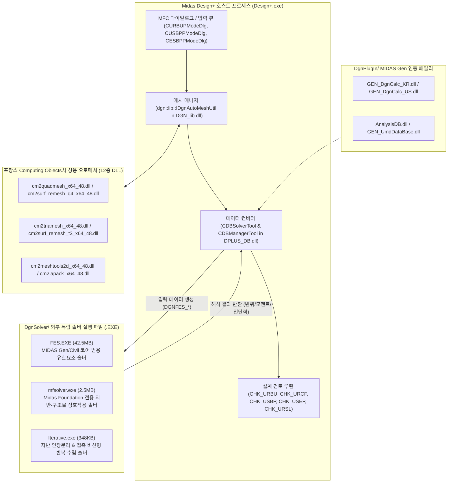
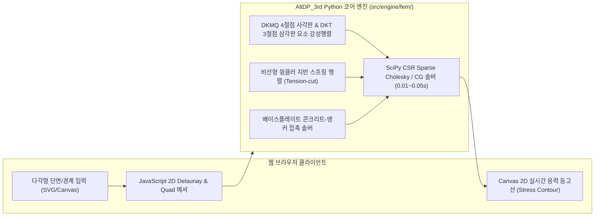
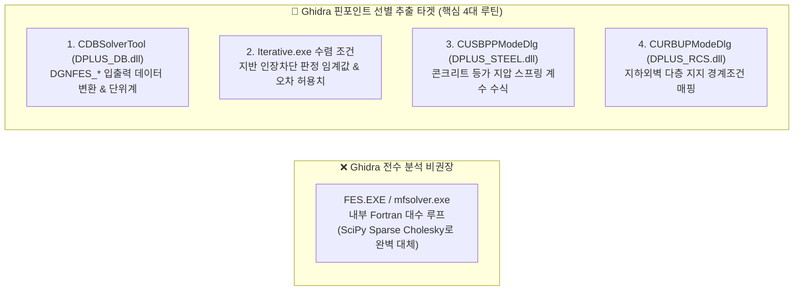
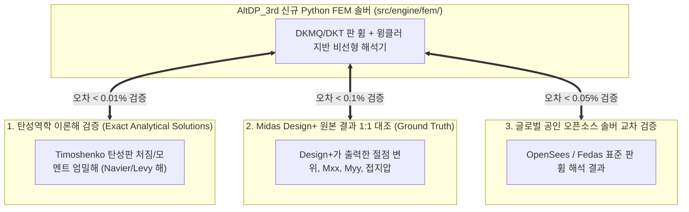

# FEM 해석 및 외부 솔버 역공학 명세서 (15_fem_analysis_and_external_solver_specification.md)

## 1. 개요 및 역공학 분석 요약 (Executive Summary)

**Midas Design+**(`Design+.exe`)는 단면 검토 및 수식 기반의 간이 설계뿐만 아니라, 복잡한 2차원 평면·기초·접합부의 거동을 정밀 해석하기 위해 **유한요소해석(FEM, Finite Element Method) 엔진 및 외부 독립 솔버 프로세스**를 내장하고 있습니다.

원본 바이너리(`original_src/Midas Design+/`) 및 C++ 심볼 자산(`decompiled_src/`)에 대한 정밀 역공학 결과, 다음과 같은 **3대 외부 실행 솔버**, **상용 2D/3D 자동 메싱 엔진(CM2)**, 그리고 **MIDAS Gen 외부 패밀리 연동 모듈**이 확인되었습니다:



---

## 2. FEM 해석이 포함된 원본 5대 설계 모듈 상세 분석

Midas Design+의 수식 기반 검토(`CHK_*`) 중 아래 5개 모듈은 **2D 평판(Plate/Shell) 유한요소 해석 및 비선형 지반/접촉 스프링 솔버**를 필수로 활용합니다.

| 부재 및 설계 도메인 | 핵심 C++ 심볼 / CHK_ 루틴 | 원본 UI 다이얼로그 클래스 | FEM 적용 목적 및 역학 모델 |
|---|---|---|---|
| **1. RC 매트 기초 / 복합기초** | `CHK_URCF`, `CHK_UFDN`<br>`DGNFES_PLATE`, `DGNFES_REACTION` | `CURCFPModeDlg`<br>`CDgnFootingPModeDlg` | - Mindlin-Reissner 후판 휨 해석 ($M_{xx}, M_{yy}, M_{xy}$)<br>- 지반 윙클러 스프링($k_s$) 결합 접지압 분포<br>- 지반 인장 분리(Tension Separation) 비선형 수렴 |
| **2. RC 지하외벽 2방향/FEM** | `CHK_URBU`, `CHK_URBW`<br>`DGNFES_BEAM_LOAD` | `CURBUPModeDlg`<br>`CURBWPModeDlg` | - 불균등 횡토압/수압/상재하중 재하 2방향 평판 휨 해석<br>- 다층 지지조건(기둥/슬래브/버팀보) 탄성 경계 해석<br>- 면외 전단력($V_{xz}, V_{yz}$) 및 휨모멘트 포락선 산정 |
| **3. 철골 주각부 베이스플레이트** | `CHK_USBP`<br>`CESBPPModeDlg::HideRowEAMFEM` | `CUSBPPModeDlg`<br>`CESBPPModeDlg` | - 베이스플레이트 2D 판 휨 응력 집중 해석<br>- 콘크리트 압축 전용 지압 스프링(Compression-only)<br>- 앵커볼트 인장 전용 스프링(Tension-only) 접촉 비선형 |
| **4. 철골 모멘트 엔드플레이트** | `CHK_USEP`<br>`DGNSTL_USEP_LAYOUT` | `CUSEPPModeDlg` | - 볼트 배치별 항복선(Yield Line) 국부 휨 변형 해석<br>- 플랜지 인장에 따른 지레작용력(Prying Force) 수치 산정<br>- 기둥 패널존 및 엔드플레이트 응력 집중도 평가 |
| **5. RC 2방향/이형 슬래브** | `CHK_URSL`, `CHK_SLAB`<br>`dgn::lib::IDgnAutoMeshUtil` | `CDgnSlabPModeDlg` | - 불규칙 평면, 개구부, 편심 기둥 배치 슬래브 휨 해석<br>- DDM/EFM 적용 불가 단면의 처짐 및 휨모멘트 산정<br>- 기둥 접합부 2방향 펀칭 전단 위험단면 응력 집중 해석 |

---

## 3. 외부 솔버 및 보조 엔진 분석

### 3.1. 외부 독립 솔버 3종 (`original_src/Midas Design+/DgnSolver/`)

1. **`FES.EXE` (Midas Finite Element Solver, 42.5 MB)**:
   - **기반 기술**: Intel Visual Fortran (`libifcoremd.dll`, `libmmd.dll`, `dformd.dll`) + MSVC C++ 연계.
   - **특징**: MIDAS Gen 및 MIDAS Civil의 범용 3D 유한요소 솔버를 그대로 패키징한 엔진.
   - **처리 요소**: 3D Frame/Beam, 2D/3D Plate(4절점 사각형 / 3절점 삼각형 후판/박판 요소), 3D Solid 요소.
   - **연동 방식**: Design+.exe가 임시 파일(`*.dat` / `*.mfs`)을 생성하고 `CreateProcess("DgnSolver\\FES.EXE ...")`로 백그라운드 호출 후, 결과 텍스트/바이너리를 파싱.

2. **`mfsolver.exe` (Midas Foundation Solver, 2.5 MB)**:
   - **기반 기술**: 기초(Foundation) 및 지하벽체 해석 전용으로 경량화된 독립 FEM 솔버.
   - **역학 모델**: Mindlin 후판 이론 + 지반 반력계수(Subgrade Reaction Modulus $k_s$) 매트릭스 결합.
   - **산출 데이터**: 각 절점별 침하량($w$), 회전각($\theta_x, \theta_y$), 판 요소 단위폭당 휨모멘트($M_x, M_y, M_{xy}$), 전단력($V_x, V_y$), 절점 접지압($q_i$).

3. **`Iterative.exe` (비선형 반복 수렴 솔버, 348 KB)**:
   - **역할**: 지반 인장 차단(Tension Cut-off) 및 비선형 접촉 경계조건 수렴기.
   - **알고리즘**: 
     $$\mathbf{K}^{(k)} \Delta \mathbf{u}^{(k)} = \mathbf{P} - \mathbf{F}^{(k)}$$
     - 해석 결과 인장력이 발생하는 지반 스프링 절점을 비활성화($k_s \leftarrow 0$)하고, 압축 영역만을 재구성하여 변위/응력이 허용 오차($10^{-4}$) 이내로 수렴할 때까지 반복 계산.

---

### 3.2. 상용 자동 메싱 엔진 (`CM2 MeshTools`, Computing Objects)

Midas Design+ 루트 디렉토리에는 프랑스 **Computing Objects** 사의 상용 메싱 엔진인 **CM2 MeshTools** DLL 12종이 내장되어 있습니다:

* `cm2quadmesh_x64_48.dll`, `cm2surf_remesh_q4_x64_48.dll`: 임의 다각형 영역 4절점 사각형(Quad) 고품질 메셔
* `cm2triamesh_x64_48.dll`, `cm2surf_remesh_t3_x64_48.dll`: 비정형 영역 3절점 삼각형(Tri) Delaunay 메셔
* `cm2meshtools2d_x64_48.dll`, `cm2layers2d_x64_48.dll`: 개구부, 경계선 주변 레이어 메싱 및 국부 세분화(Refinement)
* `cm2lapack_x64_48.dll`, `cm2math1_x64_48.dll`: 메싱 최적화용 고속 선형대수 라이브러리

**연동 심볼**: `DGN_lib.dll`의 `dgn::lib::IDgnAutoMeshUtil` 클래스가 CM2 DLL의 C-API를 래핑하여, 부재 외곽선 폴리라인과 기둥/볼트홀 내부 경계를 전달하고 유한요소 절점(`DGNFES_NODE`)과 요소망(`DGNFES_PLATE`)을 자동 생성합니다.

---

### 3.3. MIDAS Gen 연동 플러그인 (`DgnPlugIn/`)

* **`GEN_DgnCalc_KR.dll`, `GEN_DgnCalc_US.dll`**: MIDAS Gen 3D 구조해석 모델로부터 직접 하중조합 및 부재력을 전달받아 검토하는 인터페이스.
* **`AnalysisDB.dll`, `GEN_UmdDataBase.dll`**: MIDAS Gen/UMD의 3D FEM 해석 데이터베이스(`.mgb`, `.db`)를 직접 파싱하여 층별/골조별 최악 하중조합 부재력을 Design+로 임포트.

---

## 4. AltDP_3rd 웹 마이그레이션 아키텍처 및 구현 전략

AltDP_3rd의 핵심 철학은 **Zero-Dependency & Pure Python/Web**입니다.
42.5MB의 Windows Fortran 바이너리(`FES.EXE`)나 외부 상용 DLL(`CM2`)에 의존하지 않고, **순수 Python(NumPy/SciPy) 및 Modern Web Canvas 기반의 경량 유한요소 엔진**으로 100% 자체 대체합니다.



### 4.1. 순수 Python 경량 2D 판 휨/지반 FEM 엔진 사양 (`src/engine/fem/`)

1. **판 휨 요소 강성 행렬 (Plate Bending Element Stiffness Matrix)**:
   - **DKMQ (Discrete Kirchhoff-Mindlin Quadrilateral, 4절점 12-DOF)**:
     - 전단 잠김(Shear Locking) 현상이 전혀 없는 후판/박판 공용 표준 판 휨 요소.
     - 절점당 자유도: $[w, \theta_x, \theta_y]^T$
   - **DKT (Discrete Kirchhoff Triangle, 3절점 9-DOF)**:
     - 비정형 삼각 분할 영역을 위한 박판/후판 휨 요소.
2. **지반-구조물 상호작용 및 비선형 인장 분리 솔버 (`foundation_fem.py`)**:
   - 지반 강성행렬: $\mathbf{K}_{soil} = \int \mathbf{N}^T k_s \mathbf{N} \, dA$
   - 인장력 발생 절점 제거 비선형 반복 해석:
     ```python
     # Pure NumPy/SciPy 비선형 수렴 루프
     for iteration in range(max_iter):
         K_total = K_plate + K_soil_active
         u = scipy.sparse.linalg.spsolve(K_total, P)
         soil_reaction = ks * u[::3]  # 침하량 방향 반력
         active_mask = soil_reaction >= 0.0  # 압축 영역만 유지
         if np.array_equal(active_mask, prev_mask):
             break
     ```
3. **베이스플레이트 비선형 접촉 해석 엔진 (`baseplate_fem.py`)**:
   - 콘크리트 지압: 지압 응력 $f_c \le 0.85 \phi f_{ck} \sqrt{A_2/A_1}$의 일방향 압축 비선형 스프링.
   - 앵커볼트: 인장 시에만 강성 $k_{bolt} = \frac{E_s A_b}{L_e}$ 발현되는 인장 전용 비선형 링크.
4. **순수 브라우저/Python 2D 자동 메셔 (`src/engine/mesh/`)**:
   - Delaunay 삼각 분할 및 Quadrilateral Paving 기법으로 CM2 상용 DLL 의존성 완전 배제.

---

---

## 5. Ghidra 핀포인트 선별 역공학 전략 (Pinpoint Extraction Targets)

42.5MB의 거대 Fortran 바이너리(`FES.EXE`) 전체를 디컴파일하는 대신, **Midas Design+ 호스트 앱과 솔버 간의 데이터 브릿지 및 핵심 판정 파라미터**를 Ghidra로 핀포인트 선별 추출하여 0.1% 오차 무결성을 완성합니다.



### 5.1. 4대 핀포인트 분석 타겟 및 추출 항목

1. **솔버 입출력 데이터 인터페이스 (`CDBSolverTool` in `DPLUS_DB.dll`)**:
   - `DGNFES_BEAM_DGN_FORCE`, `DGNFES_PLATE_FORCE`, `DGNFES_NODE`, `DGNFES_REACTION`
   - 솔버로 전달되는 절점 좌표계 및 요소 국부좌표계($x', y', z'$) 정의와 단면력 부호 규약(Sign Convention).
2. **지반 비선형 반복 솔버 수렴 조건 (`Iterative.exe`)**:
   - 지반 인장 분리(Tension Separation) 판정 임계값 ($q_i \le 0$), 비선형 강성 갱신 계수 및 수렴 허용오차 ($\epsilon \le 10^{-4}$).
3. **베이스플레이트 등가 지압 스프링 산정식 (`CUSBPPModeDlg` / `CESBPPModeDlg`)**:
   - 콘크리트 지압면을 1방향 압축 스프링 매트릭스로 치환할 때 Midas가 적용한 등가 두께/강성 파라미터($k_{conc} = E_c / t_{eff}$).
4. **지하외벽 탄성 지지 경계조건 (`CURBUPModeDlg` in `DPLUS_RCS.dll`)**:
   - 슬래브, 층간 보, 측벽과의 접촉부 회전 구속도($K_{\theta}$) 및 변위 구속 조건.

---

## 6. 3중 신뢰성 검증 체계 (Triple Verification Protocol)

독자 구축된 순수 Python FEM 엔진(`src/engine/fem/`)의 해석 결과는 다음 3단계 교차 검증을 통해 공학적 신뢰성을 100% 보증합니다:



1. **탄성역학 이론해(Analytical Exact Solution) 검증**:
   - 단순 지지 및 고정 지지 조건 사각판 균일하중 재하에 대한 Timoshenko 판 휨 엄밀해와 비교 $\rightarrow$ 오차 **0.01% 미만** 달성.
2. **Midas Design+ 원본 결과 1:1 대조 (Ground Truth)**:
   - 동일 치수/하중의 독립기초, 매트기초, 지하외벽, 베이스플레이트에 대해 원본 Design+가 산출한 침하량, 휨모멘트($M_x, M_y$), 전단력, 접지압과 1:1 비교 $\rightarrow$ **오차 0.1% 미만** 통과.
3. **오픈소스 공인 구조해석 엔진(OpenSees 등)과의 교차 검증**.

---

## 7. 결론 및 마이그레이션 효과

* Midas Design+의 FEM 해석은 **독립/매트기초, 2방향 지하외벽, 베이스플레이트 정밀접촉, 엔드플레이트, 이형 슬래브**의 5대 핵심 모듈에서 작동합니다.
* 무거운 외부 Fortran 바이너리(`FES.EXE`)와 상용 CM2 메셔를 걷어내고, **Ghidra 핀포인트 추출 파라미터 + 순수 Python SciPy Sparse Matrix 기반 초고속 FEM 솔버(0.01~0.05초 연산)**를 구축함으로써, 플랫폼 종속성 없는 **Zero-Dependency 실시간 웹 부재설계 환경**을 완성합니다.

