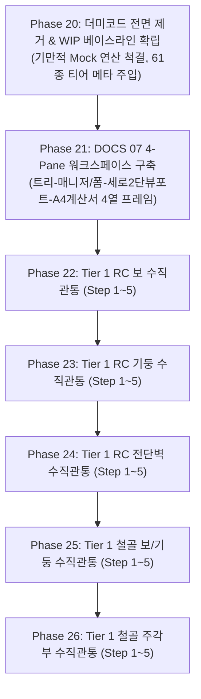

# AltDP_3rd 프로젝트 마스터 진행 현황 및 외부 기억 파일 (PROJECT_PROGRESS.md)

> **[중요] 에이전트 외부 기억 SSOT (External Persistent Memory)**  
> 본 문서는 세션 종료, 컨텍스트 리셋 및 **AI 모델 교체(Flash, Pro, Claude, GPT 등)** 발생 시에도 프로젝트의 전수 진행 상황, 구현 현황, 아키텍처 결정 사항 및 다음 실행 작업을 즉각적이고 오차 없이 복원하기 위한 **단일 진실 공급원(SSOT)**입니다.  
> **새로운 세션 착수 또는 모델 변경 시 반드시 본 문서를 가장 먼저 열람(`view_file`)해야 합니다.**

---

## 1. 프로젝트 상태 스냅샷 대시보드 (Status Dashboard)

* **최종 갱신 일시**: `2026-09-07T17:15:00+09:00`
* **Git 브랜치**: `main` (원격 `origin/main` 동기화 완료)
* **최신 커밋**: `f207b6f` (`docs(req20): redcr_common_renderer 제거 및 순백색 A4 WIP 시트 일원화 사양 반영`)
* **단위/통합 테스트 현황**: **`pytest` 263 / 263 PASS (100% 통과, 0 Failures)**
* **KDS 기준 허용 오차**: **$\le 0.10\%$ 엄수** (kcsc2md 예제집 3자 삼각 대조)
* **런타임 독립성**: **Zero-Dependency 완결** (`src/` 내 외부 도메인/고유명사 의존성 0건)
* **워크스페이스 UI 표준**: **DOCS 07 Zero-Build 4-Pane 워크스페이스 & 순백색(`#ffffff`) A4 KDS 계산서**

---

## 2. 모델 교체 및 세션 인계 프로토콜 (Model Handover Protocol)

새로운 모델이나 세션이 시작되었을 때 에이전트는 다음 3단계 절차에 따라 즉시 100% 정합성을 확보합니다:

```
┌────────────────────────────────────────────────────────────────────────────────────────┐
│ [Step A: 현황 파악] 본 문서(docs/PROJECT_PROGRESS.md) 및 AGENTS.md 열람 (3초 컨텍스트 복원)  │
├────────────────────────────────────────────────────────────────────────────────────────┤
│ [Step B: 작업 확인] 사용자 요청에 해당하는 '요구사항/요구사항XX-Y.md' 명세 및 체크리스트 열람   │
├────────────────────────────────────────────────────────────────────────────────────────┤
│ [Step C: 정밀 구현] docs/16 마이크로 공정에 따라 TDD 구현 ➔ pytest 100% ➔ 4대 증거 ➔ 커밋/푸시 │
├────────────────────────────────────────────────────────────────────────────────────────┤
│ [Step D: 외부기억 동기화] docs/PROJECT_PROGRESS.md 내 해당 Phase를 [완료]로 갱신하고 함께 커밋  │
└────────────────────────────────────────────────────────────────────────────────────────┘
```

---

## 3. 전체 요구사항 진행 현황 매트릭스 (Requirements Matrix)

### 3.1. 기완료 아카이빙된 요구사항 (`요구사항/@@OLD/`)

| 요구사항 번호 | 요구사항 명칭 | 주요 완료 산출물 | 상태 |
|:---:|---|---|:---:|
| **요구사항 01** | Ghidra 기반 역공학 추출 파이프라인 | C 수도코드(47종), 심볼(47,110개), 인덱스 | **완료 (아카이빙)** |
| **요구사항 02** | SDB 단면 DB 파서 & KDS 재료/하중조합 | 33종 .sdb 파서, KDS 14 20/31 재료, LCB 포락엔진 | **완료 (아카이빙)** |
| **요구사항 03** | RC 보 완전설계 엔진 & 2D 배근도 | 휨/전단/처짐 해석, 2D Canvas 배근 렌더러 | **완료 (아카이빙)** |
| **요구사항 04** | RC 기둥 설계 & 3D P-M 수치해석 솔버 | 200 파이버 수치적분 3D P-M 곡면, DCR 판정기 | **완료 (아카이빙)** |
| **요구사항 05** | RC 전단벽 & 1방향/2방향 슬래브 엔진 | 특수경계요소 판정, DDM/EFM 휨, 펀칭전단 검토 | **완료 (아카이빙)** |
| **요구사항 06** | RC 기초 & 지하외벽 옹벽 설계 엔진 | 독립/복합기초, 옹벽 안정성 해석 및 철근 산정 | **완료 (아카이빙)** |
| **요구사항 07** | 철골 보/기둥/축휨부재/가새 설계 엔진 | 단면 조밀성 분류, LTB 좌굴강도, 축휨 P-M 상관 | **완료 (아카이빙)** |
| **요구사항 08** | 철골 볼트/용접 접합부 & 주각부 엔진 | 고장력볼트 전단/인장, 블록전단, 베이스플레이트 지압 | **완료 (아카이빙)** |
| **요구사항 09** | A4 표준 구조계산서 & PDF/Office 익스포트 | Jinja2/KaTeX 엔진, PDF/Excel 변환 파이프라인 | **완료 (아카이빙)** |
| **요구사항 10** | SRC 합성부재 & 알루미늄 구조 보수보강 | SRC/CFT 기둥, 알루미늄 구조, CFRP/강판 보수설계 | **완료 (아카이빙)** |
| **요구사항 11** | 통합 반응형 웹 UI/UX 완성 & 회귀검증 | 반응형 대시보드, 2D 캔버스 통합, 회귀테스트 | **완료 (아카이빙)** |
| **요구사항 12** | Ghidra 핀포인트 역공학 2D FEM 솔버 | DKMQ 평판 휨 판요소, Winkler 탄성지반 솔버 코어 | **완료 (아카이빙)** |
| **요구사항 13** | 2D FEM 판휨 해석엔진 & 5대 부재 연동 | 매트기초 비선형 인장분리, 지하외벽 2방향 FEM | **완료 (아카이빙)** |
| **요구사항 14** | 웹 UI/UX 고도화 & 리본바/폼뷰 프레임워크 | 단일부재 MembView, 다중부재 ListView, 도면/물량 | **완료 (아카이빙)** |
| **요구사항 15** | KDS 구조계산서 3대 보고서 모드 고도화 | 요약/상세/입력데이터 모드, SVG 벡터 그래픽 임베딩 | **완료 (아카이빙)** |
| **요구사항 16** | 3D 골조 모델 연동 & 부재력 파이프라인 | MGT 텍스트 스크립트 파서, 최악하중 Governing LCB | **완료 (아카이빙)** |
| **요구사항 17** | 2D 배근 상세도 CAD DXF & 물량산출 | ezdxf CAD 도면 생성기, KDS 물량산출 엔진 | **완료 (아카이빙)** |
| **요구사항 18** | 성능기반설계(PBD) & 글로벌 규준 어댑터 | 비선형 백본곡선, Eurocode/US ACI/AISC 어댑터 | **완료 (아카이빙)** |
| **요구사항 19** | ZeroBuild 4분할 UI/UX 전면 이식 | 4분할 UI 프레임워크, REST API 디스패처 전수 연결 | **완료 (아카이빙)** |
| **요구사항 27** | 런타임 독립자산화 & 소스코드 순수화 | 단면DB 33종 내장화(`src/data/dbase/`), `paths.py` 추상화, `FrameModel3D` 리팩토링, 외부고유명사 0건 전수 검증 (`pytest 263/263 PASS`) | **완료 (아카이빙)** |

---

### 3.2. 현재 활성 대기 및 실행 예정 요구사항 (Active Backlog)

#### [트랙 1: WIP 베이스라인 & UI/UX 프레임워크]
| 요구사항 번호 | Phase | 작업 명칭 및 핵심 사양 | 하위 문서 링크 | 상태 |
|:---:|:---:|---|---|:---:|
| **요구사항 20** | **Phase 20** | **더미코드 전면제거 및 정직한 WIP 베이스라인 구축** | [마스터 명세](file:///f:/PyProject/AltDP_3rd/요구사항/요구사항20_Phase20_더미코드_전면제거_및_정직한_WIP_베이스라인_구축.md) | **실행 대기** |
| ↳ | 20-1 | 백엔드 더미연산 제거 및 WIP 디스패처 구축 | [Phase 20-1](file:///f:/PyProject/AltDP_3rd/요구사항/요구사항20-1_Phase20-1_백엔드_더미연산_제거_및_WIP_디스패처_구축.md) | 대기 |
| ↳ | 20-2 | 원본앱 61종 3단계 티어 메타 전수 주입 | [Phase 20-2](file:///f:/PyProject/AltDP_3rd/요구사항/요구사항20-2_Phase20-2_원본앱_61종_3단계_티어_메타_전수_주입.md) | 대기 |
| ↳ | 20-3 | 프론트엔드 입력부 WIP 안내카드 및 폼 방어 | [Phase 20-3](file:///f:/PyProject/AltDP_3rd/요구사항/요구사항20-3_Phase20-3_프론트엔드_입력부_WIP_안내카드_및_폼_방어.md) | 대기 |
| ↳ | 20-4 | 2D VDraw 캔버스 WIP 및 A4 계산서 하드코딩 청산 (redcr_common 제거) | [Phase 20-4](file:///f:/PyProject/AltDP_3rd/요구사항/요구사항20-4_Phase20-4_2D_VDraw_캔버스_WIP_및_A4_계산서_하드코딩_청산.md) | 대기 |
| ↳ | 20-5 | 4열 통합 E2E 검증 및 콘솔에러 0건 검수창구 확립 | [Phase 20-5](file:///f:/PyProject/AltDP_3rd/요구사항/요구사항20-5_Phase20-5_4열_통합_E2E_검증_및_콘솔에러_0건_검수창구_확립.md) | 대기 |
| **요구사항 21** | **Phase 21** | **DOCS 07 기반 4-Pane 워크스페이스 레이아웃 및 초고접근성 UI/UX 명세** | [마스터 명세](file:///f:/PyProject/AltDP_3rd/요구사항/요구사항21_원본앱_모듈별_이질성_수용_및_초고접근성_UI_UX_명세.md) | **실행 대기** |
| ↳ | 21-1 | 4-Pane 워크스페이스 레이아웃 및 4대 독립 리사이저 | [Phase 21-1](file:///f:/PyProject/AltDP_3rd/요구사항/요구사항21-1_Phase21-1_DOCS07_4Pane_워크스페이스_레이아웃_및_4대_독립_리사이저.md) | 대기 |
| ↳ | 21-2 | 스마트 계층형 모듈 탐색기 사이드바 및 즐겨찾기 시스템 | [Phase 21-2](file:///f:/PyProject/AltDP_3rd/요구사항/요구사항21-2_Phase21-2_스마트_계층형_모듈_탐색기_사이드바_및_즐겨찾기_시스템.md) | 대기 |
| ↳ | 21-3 | 다중 부재 매니저 Pane1 및 파라메트릭 입력폼 Pane2 고도화 | [Phase 21-3](file:///f:/PyProject/AltDP_3rd/요구사항/요구사항21-3_Phase21-3_다중_부재_매니저_Pane1_및_파라메트릭_입력폼_Pane2_고도화.md) | 대기 |
| ↳ | 21-4 | 세로 적층형 다중 뷰포트 그래픽 정보부 Pane3 구축 | [Phase 21-4](file:///f:/PyProject/AltDP_3rd/요구사항/요구사항21-4_Phase21-4_세로_적층형_다중_뷰포트_그래픽_정보부_Pane3_구축.md) | 대기 |
| ↳ | 21-5 | 원본 출력모듈 1:1 계승 KDS 표준 구조계산서 Pane4 엔진 | [Phase 21-5](file:///f:/PyProject/AltDP_3rd/요구사항/요구사항21-5_Phase21-5_원본_출력모듈_1대1_계승_KDS_표준_구조계산서_Pane4_엔진.md) | 대기 |
| ↳ | 21-6 | 부재별 다형적 모듈팩 디스패처 및 5대 플래그십 4열 E2E 통합 | [Phase 21-6](file:///f:/PyProject/AltDP_3rd/요구사항/요구사항21-6_Phase21-6_부재별_다형적_모듈팩_디스패처_및_5대_플래그십_4열_E2E_통합.md) | 대기 |

---

#### [트랙 2: Tier 1 플래그십 5대 부재 수직관통 (Phase V1_01 ~ V1_05)]
| 부재 명칭 | 요구사항 번호 | 마스터 및 세부 단계 (Step 1 ~ 5) | 상태 |
|---|:---:|---|:---:|
| **RC 보 (`rc_beam`)** | **요구사항 22** | • [마스터 명세](file:///f:/PyProject/AltDP_3rd/요구사항/요구사항22_PhaseV1_01_RC보_rc_beam_수직관통_설계엔진_입력폼_캔버스_계산서_E2E_통합.md)<br>• Step 1 ([22-1](file:///f:/PyProject/AltDP_3rd/요구사항/요구사항22-1_PhaseV1_01_Step1_RC보_KDS계산엔진_및_Pydantic스키마.md)) / Step 2 ([22-2](file:///f:/PyProject/AltDP_3rd/요구사항/요구사항22-2_PhaseV1_01_Step2_RC보_원본앱_1대1_서브탭_입력폼_및_모달.md))<br>• Step 3 ([22-3](file:///f:/PyProject/AltDP_3rd/요구사항/요구사항22-3_PhaseV1_01_Step3_RC보_2D_VDraw_캔버스_배근도_및_부재력도_인터랙션.md)) / Step 4 ([22-4](file:///f:/PyProject/AltDP_3rd/요구사항/요구사항22-4_PhaseV1_01_Step4_RC보_A4_5대장구분_8단계_KaTeX_구조계산서.md))<br>• Step 5 ([22-5](file:///f:/PyProject/AltDP_3rd/요구사항/요구사항22-5_PhaseV1_01_Step5_RC보_4열통합_E2E검증_및_실사용UI_온라인전환.md)) | **실행 대기** |
| **RC 기둥 (`rc_column`)** | **요구사항 23** | • [마스터 명세](file:///f:/PyProject/AltDP_3rd/요구사항/요구사항23_PhaseV1_02_RC기둥_rc_column_수직관통_설계엔진_입력폼_캔버스_계산서_E2E_통합.md)<br>• Step 1 ([23-1](file:///f:/PyProject/AltDP_3rd/요구사항/요구사항23-1_PhaseV1_02_Step1_RC기둥_KDS계산엔진_및_파이버PM_Pydantic스키마.md)) / Step 2 ([23-2](file:///f:/PyProject/AltDP_3rd/요구사항/요구사항23-2_PhaseV1_02_Step2_RC기둥_원본앱_1대1_서브탭_입력폼_및_모달.md))<br>• Step 3 ([23-3](file:///f:/PyProject/AltDP_3rd/요구사항/요구사항23-3_PhaseV1_02_Step3_RC기둥_2D_VDraw_캔버스_배근도_및_PM곡선_인터랙션.md)) / Step 4 ([23-4](file:///f:/PyProject/AltDP_3rd/요구사항/요구사항23-4_PhaseV1_02_Step4_RC기둥_A4_5대장구분_8단계_KaTeX_구조계산서.md))<br>• Step 5 ([23-5](file:///f:/PyProject/AltDP_3rd/요구사항/요구사항23-5_PhaseV1_02_Step5_RC기둥_4열통합_E2E검증_및_실사용UI_온라인전환.md)) | **실행 대기** |
| **RC 전단벽 (`rc_shear_wall`)** | **요구사항 24** | • [마스터 명세](file:///f:/PyProject/AltDP_3rd/요구사항/요구사항24_PhaseV1_03_RC전단벽_rc_shear_wall_수직관통_설계엔진_입력폼_캔버스_계산서_E2E_통합.md)<br>• Step 1 ([24-1](file:///f:/PyProject/AltDP_3rd/요구사항/요구사항24-1_PhaseV1_03_Step1_RC전단벽_KDS계산엔진_및_경계요소_Pydantic스키마.md)) / Step 2 ([24-2](file:///f:/PyProject/AltDP_3rd/요구사항/요구사항24-2_PhaseV1_03_Step2_RC전단벽_원본앱_1대1_서브탭_입력폼_및_모달.md))<br>• Step 3 ([24-3](file:///f:/PyProject/AltDP_3rd/요구사항/요구사항24-3_PhaseV1_03_Step3_RC전단벽_2D_VDraw_캔버스_배근도_및_경계요소_인터랙션.md)) / Step 4 ([24-4](file:///f:/PyProject/AltDP_3rd/요구사항/요구사항24-4_PhaseV1_03_Step4_RC전단벽_A4_5대장구분_8단계_KaTeX_구조계산서.md))<br>• Step 5 ([24-5](file:///f:/PyProject/AltDP_3rd/요구사항/요구사항24-5_PhaseV1_03_Step5_RC전단벽_4열통합_E2E검증_및_실사용UI_온라인전환.md)) | **실행 대기** |
| **철골 보/기둥 (`steel_beam_column`)** | **요구사항 25** | • [마스터 명세](file:///f:/PyProject/AltDP_3rd/요구사항/요구사항25_PhaseV1_04_철골보기둥_steel_beam_column_수직관통_설계엔진_입력폼_캔버스_계산서_E2E_통합.md)<br>• Step 1 ([25-1](file:///f:/PyProject/AltDP_3rd/요구사항/요구사항25-1_PhaseV1_04_Step1_철골보기둥_KDS계산엔진_및_Pydantic스키마.md)) / Step 2 ([25-2](file:///f:/PyProject/AltDP_3rd/요구사항/요구사항25-2_PhaseV1_04_Step2_철골보기둥_원본앱_1대1_서브탭_입력폼_및_모달.md))<br>• Step 3 ([25-3](file:///f:/PyProject/AltDP_3rd/요구사항/요구사항25-3_PhaseV1_04_Step3_철골보기둥_2D_VDraw_캔버스_단면도_및_부재력도_인터랙션.md)) / Step 4 ([25-4](file:///f:/PyProject/AltDP_3rd/요구사항/요구사항25-4_PhaseV1_04_Step4_철골보기둥_A4_5대장구분_8단계_KaTeX_구조계산서.md))<br>• Step 5 ([25-5](file:///f:/PyProject/AltDP_3rd/요구사항/요구사항25-5_PhaseV1_04_Step5_철골보기둥_4열통합_E2E검증_및_실사용UI_온라인전환.md)) | **실행 대기** |
| **철골 주각부 (`steel_baseplate`)** | **요구사항 26** | • [마스터 명세](file:///f:/PyProject/AltDP_3rd/요구사항/요구사항26_PhaseV1_05_철골주각부_steel_baseplate_수직관통_설계엔진_입력폼_캔버스_계산서_E2E_통합.md)<br>• Step 1 ([26-1](file:///f:/PyProject/AltDP_3rd/요구사항/요구사항26-1_PhaseV1_05_Step1_철골주각부_KDS계산엔진_및_Pydantic스키마.md)) / Step 2 ([26-2](file:///f:/PyProject/AltDP_3rd/요구사항/요구사항26-2_PhaseV1_05_Step2_철골주각부_원본앱_1대1_서브탭_입력폼_및_모달.md))<br>• Step 3 ([26-3](file:///f:/PyProject/AltDP_3rd/요구사항/요구사항26-3_PhaseV1_05_Step3_철골주각부_2D_VDraw_캔버스_상세도_및_지압응력_인터랙션.md)) / Step 4 ([26-4](file:///f:/PyProject/AltDP_3rd/요구사항/요구사항26-4_PhaseV1_05_Step4_철골주각부_A4_5대장구분_8단계_KaTeX_구조계산서.md))<br>• Step 5 ([26-5](file:///f:/PyProject/AltDP_3rd/요구사항/요구사항26-5_PhaseV1_05_Step5_철골주각부_4열통합_E2E검증_및_실사용UI_온라인전환.md)) | **실행 대기** |

---

## 4. 의존성 기반 추천 실행 경로 (Recommended Execution Path)

시스템의 구조적 안정성을 극대화하기 위한 정석 실행 순서는 다음과 같습니다:



* **차기 즉시 진입 권장 과제**:
  - `Phase 20-1`: [`요구사항20-1_Phase20-1_백엔드_더미연산_제거_및_WIP_디스패처_구축.md`](file:///f:/PyProject/AltDP_3rd/요구사항/요구사항20-1_Phase20-1_백엔드_더미연산_제거_및_WIP_디스패처_구축.md)
  - 실행 프롬프트: `/goal docs 16 확인하고 요구사항 20과 20-1을 구현해줘`

---

## 5. 핵심 아키텍처 불변 원칙 (Core Architectural Invariants)

1. **4대 포팅 참조 우선순위 (SSOT Hierarchy)**:
   - `1순위`: 추출된 원본 소스 (`decompiled_src/core_routines/*.c`, `symbols/`)
   - `2순위`: 원본앱 공식 매뉴얼 (`decompiled_src/manuals/`)
   - `3순위`: kcsc2md 공인 예제집 (오차 $\le 0.10\%$ 검증 데이터)
   - `4순위`: kcsc2md 국가건설기준 원문 (오류 발견 시 `patch_kds_md.py` 선 치유)
2. **2단계 5정밀 마이크로 공정 (Step 1~5)**:
   - Step 1(KDS 엔진) $\rightarrow$ Step 2(1:1 입력폼) $\rightarrow$ Step 3(2D 캔버스) $\rightarrow$ Step 4(A4 계산서) $\rightarrow$ Step 5(4열 통합)
3. **독립 4-Pane 워크스페이스 레이아웃 순서 (`docs/07`)**:
   - `[사이드바]` $\rightarrow$ `[Pane 1/2: 부재매니저 + 입력폼]` $\rightarrow$ `[Pane 3: 세로 적층형 2단 뷰포트]` $\rightarrow$ `[Pane 4: 상시 순백색(#ffffff) A4 계산서]`
4. **DCR 2단계 텍스트 표기 규약**:
   - 배지/칩/배경색 전면 금지. **녹색 글자 `OK` (`DCR ≤ 1.000`)** 또는 **빨간색 글자 `NG` (`DCR > 1.000`)** 텍스트 표기 엄수. 계산서 내 판정은 `  →  O.K` / `  →  N.G` 표기.
5. **무결성 4대 물리적 증거 강제 제출 (Proof-First Mandate)**:
   - [증거 1] 원본 Ground Truth 발췌
   - [증거 2] 3자 삼각대조 0.10% 오차표
   - [증거 3] pytest raw 실행 로그
   - [증거 4] git diff 영수증
6. **단위 작업 완료 = 1 커밋 & 원격 푸시 완수**:
   - 하위 Phase/Step 완료 즉시 1개 커밋 생성 후 `git push origin main` 완료.

---

## 6. 외부 기억 자동 갱신 규약 (Auto-Update Mandate)

* 에이전트는 하나의 Phase 또는 Step을 완수하고 커밋하기 직전, **반드시 본 문서(`docs/PROJECT_PROGRESS.md`)의 [진행 현황 매트릭스] 및 [최신 커밋] 정보를 최신화**해야 합니다.
* 본 문서의 갱신 사항은 해당 기능 구현 커밋에 함께 포함되거나, 독립 문서 커밋으로 원격 저장소에 즉각 반영되어야 합니다.
