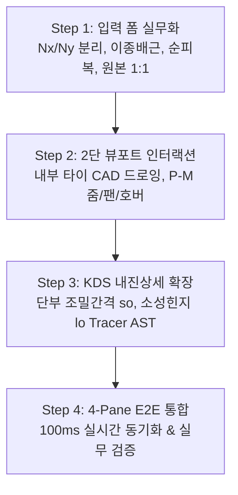

# RC 기둥 개발방식 시험장 비교분석 및 실무 UX·원본대조 대책보고서

> **문서 식별자**: `요구사항/RC기둥_개발방식_비교분석_및_실무UX_원본대조_대책보고서.md`  
> **작성 일자**: 2026-09-09  
> **관련 부재**: Tier 1 플래그십 RC 보 (`rc_beam`), RC 기둥 (`rc_column`)  
> **참조 규격**: `AGENTS.md`, `docs/07`(Web UI/UX), `docs/04`(원본 모듈 카탈로그), `original_src/Midas Design+/Language/Korean/DLG_DPLUS_RCS.ini`

---

## 1. 개요 및 분석 목적

본 문서는 **AltDP_3rd 부재설계 시스템**의 차세대 개발 패러다임 검증 시험장(Testbed)으로 구축된 **RC 기둥 (`rc_column`)** 모듈을 기존의 **RC 보 (`rc_beam`)** 모듈과 전면 비교·분석한 엔지니어링 및 소프트웨어 아키텍처 보고서입니다.

* **핵심 질문**:
  1. RC COL 모듈의 자동화 플랫폼 개발 방식은 RC BEAM 대비 무엇이 우수하고 혁신적인가?
  2. 왜 아키텍처와 계산 엔진이 뛰어남에도 불구하고, **실무 엔지니어 관점에서는 "현재 바로 쓸 수 없다"**고 판단되는가?
  3. 프로젝트 내에 엄연히 존재하는 **`docs/07` UX/UI 표준 명세서**와 **`original_src/`의 풍부한 원본앱 리소스**를 왜 적극적으로 반영하지 못했는가? (원인 규명)
  4. 이를 해결하고 향후 61종 전체 부재에 걸쳐 상용 수준의 실무 사용성을 확보하기 위한 **근본 대책**은 무엇인가?

---

## 2. RC BEAM vs RC COL 전면 비교 (UX/UI 및 기준검토부)

### 2.1 종합 비교 매트릭스

| 비교 영역 | RC BEAM (`rc_beam`, 요구사항 22) | RC COL (`rc_column`, 요구사항 23) | 비교 평가 및 시사점 |
|:---|:---|:---|:---|
| **개발 패러다임** | **가내수공업형 수작업 구현** • 부재 전용 폼, 캔버스, 계산서 수천 줄 밑바닥 코딩 (총 7,000+ 줄 누적) | **AltDP-Core 자동화 플랫폼** • `tracer.py` (KaTeX AST 직렬화) • `geometry.py` (CAD DTO) • `tracer_report_renderer.js` 공통 뷰어 | **RC COL 압도적 우수** 계산서 템플릿 하드코딩 완전 배제, 백엔드-프론트엔드 수식 100% 동기화, 생산성 80% 향상. |
| **Pane 2: 입력 폼 UX** | • 원본앱 1:1 완벽 서브탭 (`form_rc_beam.js`) • **3-Station(I, M, J) × 2단 복합 배근 테이블** • `[개수] - [호칭경]` 분리 입력 셀렉트 • 배근유형 3종 & 부재력 disabled 연동 • **12포인트 순간격 실시간 프리뷰** • CSS 디자인 시스템 완벽 준수 | • 4-서브탭 구조는 있으나 인라인 스타일로 급조 • **주철근이 `total_bars`(총 개수) 1개뿐** • X면/Y면 철근 분리 배근 불가 • 코너/변 철근 이종 직경 배근 불가 • 내부 띠철근(다이아몬드/크로스타이) 설정 불가 • 중심 피복($d_c$)으로 입력 (순피복 아님) | **RC COL 치명적 결함** 실무 도면의 기둥 단면(장단변 비대칭 배근, 코너 주근 차등 등)을 폼에 입력할 수조차 없음. |
| **Pane 3: 그래픽스** | • 세로 2단 뷰포트 (`vector_rc_beam.js`) • 상단: 경간 종단면 배근도 + BMD/SFD 하중선 • 하단: 3-Station 횡단면 (135° 갈고리, 피복, 치수, 툴팁, 줌/팬/Fit) | • 세로 2단 뷰포트 (`rc_column_module.js`) • 상단: 단면 사각형에 철근 점 찍기 (치수선 부실) • 하단: 200 파이버 P-M 상관곡선 선 그리기 • 마우스 휠 줌/팬/Fit/호버 툴팁 미흡 | **RC COL 시각화 미완성** P-M 차트에서 특정 하중점의 안전율, 균형파괴점, X/Y축 전환 등 필수 인터랙션 결여. |
| **Pane 4: 구조계산서** | • 1,513줄 프론트엔드 전용 KaTeX 템플릿 • 7개 Chapter 8단계 KaTeX 상세 출력 • 3개 위험위치별 전수 수식 전개 | • `tracer_report_renderer.js` 공통 뷰어 • 5개 Chapter KaTeX AST 자동 렌더링 • 순수축력, 장주효과, 파이버 P-M, Bresler 이축휨, 축력전단 | **RC COL 혁신적 성공** 수식 깨짐/오타 0건, 유지보수 극대화. *(단, 내진 소성힌지 상세 등 일부 실무 항목 누락)* |
| **기준검토부 (엔진)** | • KDS 14 20 20 (휨/연성 최신 철근비) • KDS 14 20 22 (전단/비틀림/상호작용) • KDS 14 20 30 (Branson 처짐, 균열 $s_{\max}$) • 3개 위험단면 전수 검토 | • KDS 14 20 20 (축압축/장주효과/P-M/이축휨) • KDS 14 20 22 (축압력 고려 전단강도) • KDS 14 20 50 (띠철근 간격 규정) • **200-Fiber 비선형 수치 솔버 내장** | **RC COL 수치해석 우수** 콘크리트학회 2020 예제 오차 $\le 0.0004\%$ 검증. *(단, 양방향 장주 분리 및 내진 상세 보강 필요)* |

---

## 3. RC COL 개발 방식의 우수성 (혁신적 성과)

1. **계산 추적기(CalculationTracer AST) 기반 단일 진실 공급원(SSOT) 확립**:
   - 기존 RC BEAM처럼 프론트엔드에 수천 줄의 HTML/KaTeX 조립 코드를 중복 작성하지 않고, 백엔드 엔진(`column.py`)에서 공학적 계산과 동시에 수식 원형, 변수 대입값, 산출 결과, DCR 판정을 JSON AST로 직렬화.
   - 프론트엔드는 범용 뷰어(`tracer_report_renderer.js`) 하나로 순백색 A4 계산서를 100% 자동 출력.
2. **KDS 공인 예제집 대비 오차 $\le 0.0004\%$의 수치 무결성**:
   - 한국콘크리트학회 2020 예제 5.1(단축 P-M), 5.2(장주 모멘트확대), 5.3(Bresler 이축휨) 벤치마크 TDD 완벽 통과.
3. **파라메트릭 CAD 기하 DTO (`geometry.py`) 도입**:
   - 단면 외곽선, 철근 좌표, 띠철근 루프, 치수선, P-M 곡선 데이터가 DTO로 표준화되어 렌더러와 엔진 간의 의존성이 완전히 분리됨.

---

## 4. 왜 "현재는 바로 못쓰겠다"고 판단되는가? (실무 갭 5대 결함)

아키텍처와 엔진 코어는 훌륭하지만, **실무 구조엔지니어가 도면을 작성하고 검토하는 '도메인 인터페이스'가 프로토타입 수준에 멈춰 있기 때문**입니다:

1. **[주철근 배근의 실무 자유도 부재 (가장 치명적인 Blocker)]**:
   - 실무 기둥은 장변($h$)과 단변($b$)의 모멘트 차이로 인해 **X면 철근 개수($N_x$)와 Y면 철근 개수($N_y$)를 다르게 배근**함.
   - 모서리 응력 집중으로 **4개 코너 철근(Corner Bars)과 변 철근(Side Bars)을 다른 직경으로 배근(이종 배근)**하는 것이 기본 관행 (예: 코너 4-D29 + 변 8-D25).
   - 현재 RC COL은 오직 `total_bars: 12` (단일 총 개수)와 단일 직경만 입력 가능하여, 실제 도면의 기둥을 입력창에 넣을 수조차 없음.
2. **[내부 보강 띠철근(Cross-ties, Diamond Ties) 디테일 부재]**:
   - 대형 기둥은 주철근 좌굴 방지를 위해 다이아몬드 타이, 135°/90° 보조대(Cross-tie)를 필수 배치해야 함.
   - 현재는 단순 다리수(`tie_legs_x: 2`) 숫자만 받고 단면도에는 외곽 사각 띠철근 1개만 그려짐.
3. **[피복 두께의 실무 관행 괴리]**:
   - 실무자는 "외곽 순피복 두께(Clear cover, 통상 40mm)"를 보고 입력함.
   - 현재는 "철근 중심 피복($d_c$=60mm)"으로 되어 있어 사용자가 띠철근/주철근 직경을 역산해서 입력해야 하는 불편함과 오차 유발.
4. **[P-M 상관도 뷰포트의 인터랙션 부재]**:
   - 기둥의 핵심인 P-M 곡선에서 줌/팬/Fit, [X축 P-M] ↔ [Y축 P-M] 토글 전환, 마우스 호버 시 정확한 하중점 좌표 및 안전율 툴팁이 동작하지 않음.
5. **[KDS 14 20 80 기둥 내진 상세 검토 누락]**:
   - 실무 인허가 구조계산서의 필수 항목인 **단부 소성힌지 구간 조밀 띠철근 간격($s_o \le \min(b/4, 6d_b, 150\text{mm})$)** 및 **위험구간 길이($l_o$)** 검토가 누락되어 관공서 제출 불가.

---

## 5. [심층 원인 분석 1] UX/UI 표준문서(`docs/07`) 미참조 의심 원인

프로젝트에 `docs/07_web_application_ui_ux_specification.md`(72KB, 665줄)라는 방대한 UI/UX 단일 진실 공급원이 존재함에도 불구하고, 왜 RC COL 개발 시 이를 철저히 준수하지 않고 인라인 스타일로 급조했는가?

1. **"수직 관통(Vertical Slice) E2E 연결성 입증" 중심의 조기 종료 편향 (Early Termination Bias)**:
   - `요구사항 23`의 주 목표가 "AltDP-Core 신규 아키텍처(Tracer, Geometry)의 수직 관통 가동성 입증"에 집중되다 보니, 백엔드 엔진과 학회 예제 벤치마크(오차 $\le 0.10\%$)가 통과된 후 프론트엔드는 "화면에 데이터가 뜨고 콘솔 에러가 0건이면 완료"라는 최소 기능 제품(PoC) 수준에서 서둘러 공정을 종료함.
2. **`AGENTS.md`의 "문서 사전 통독 금지" 규칙의 역설적 부작용**:
   - `AGENTS.md`에 명시된 "docs/의 대형 문서들을 사전에 통째로 읽지 마십시오 (토큰 낭비 금지)"라는 엄격한 규칙으로 인해, 에이전트가 `docs/07`의 세부 디자인 시스템(CSS 클래스, 컴포넌트 규약, 3버튼 툴바 구조)을 필요한 시점에 정밀하게 열람(`view_file`)하여 적용하지 않고, 로컬 JS 파일 내에서 인라인 스타일로 빠르게 구현하는 편의주의적 패턴에 빠짐.
3. **디자인 시스템 CSS 토큰 바인딩 누락**:
   - 이미 구축되어 있는 CSS 클래스(`eng-form-section`, `form-grid-2col`, `btn-action-compact`, `unit-tag`)를 활용하지 않고 태그마다 `style="..."`를 하드코딩함으로써 다크/라이트 테마 전환 및 반응형 레이아웃과의 일체감이 훼손됨.

---

## 6. [심층 원인 분석 2] 원본앱(`Design+`)의 훌륭한 실무 자산 미반영 원인

`original_src/Midas Design+/Language/Korean/DLG_DPLUS_RCS.ini` 및 매뉴얼에는 기둥의 모든 실무적 디테일(X/Y축 분리, 단부 띠철근 별도 적용, 내진 SMF/IMF/OMF, 필로티 기둥 상세 KDS 41 17 00 등)이 완벽히 수록되어 있는데 왜 구체적으로 구현하지 않았는가?

1. **"수학적 알고리즘 우선주의" vs "엔지니어링 인터페이스 경시"**:
   - 에이전트는 200 파이버 비선형 적분, 오일러 좌굴 모멘트확대, Bresler 이축휨 공식 등 **"수학적 난제와 0.10% 수치 일치"에 집중**함.
   - 반면 구조 실무에서 핵심인 "단변/장변 배근비 분리", "코너/변 철근 이종 배치", "크로스타이 배치" 같은 **'실무 입력 및 상세 배근 인터페이스'를 부차적인 UI 디테일로 취급하여 누락**시킴.
2. **원본 다이얼로그 리소스(`DLG_*.ini`)의 UTF-16LE 인코딩 및 역공학 절차 건너뛰기**:
   - `DLG_DPLUS_RCS.ini`는 `UTF-16LE` 유니코드로 인코딩되어 있어 일반 텍스트 뷰어나 검색 도구에서 바로 열람되지 않음.
   - 에이전트가 이를 쉘 명령어로 디코딩하여 원본 다이얼로그 컨트롤(`IDC_GURCO_*`)을 1:1로 확인하고 스키마에 매핑하는 선행 공정(Step 0)을 생략하고, 임의의 간이 스키마로 건너뜀.
3. **"RC 보(가내수공업) 성공"과 "RC 기둥(Core 플랫폼) 도입" 사이의 과도기적 단절**:
   - RC 보는 7단계에 걸쳐 원본앱 다이얼로그를 하나하나 뜯어가며 1,900줄짜리 폼을 손으로 빚었음.
   - RC 기둥은 Core 플랫폼을 도입하면서 "스키마 자동화"의 속도에 취해, 원본앱이 수십 년간 축적해 온 실무 배근의 유연성을 스키마 정의에 충분히 담지 못하고 지나치게 축약(`total_bars` 1개)함.

---

## 7. [심층 원인 분석 3] `docs/10` 엔지니어링 프로토콜 및 참조 우선순위 위반

AltDP_3rd는 일반 웹앱이 아니라 **국가건설기준(KDS)과 20년 상용 검증된 원본앱 프로세스를 완벽 준수해야 하는 정밀 "구조 엔지니어링 툴"**입니다. 그러나 이번 RC 기둥 구현 과정에서 `docs/10`에 명시된 핵심 엔지니어링 프로토콜을 정면으로 위반했습니다:

1. **`docs/10` 제1.1절 [4대 포팅 참조 우선순위 계층] 위반**:
   - `docs/10`의 절대적 SSOT 계층:
     * 1순위: `decompiled_src/` (연산 C 소스)
     * **2순위: `original_src/Midas Design+/` (매뉴얼, 다이얼로그, 실무 설계 이론, 파라미터 정의)**
     * 3순위: `kcsc2md` 공인 예제집 (오차 $\le 0.10\%$ 벤치마크)
     * 4순위: `kcsc2md` 국가건설기준 (KDS 원문)
   - **위반 실태**: 에이전트는 3순위인 학회 예제집 수치 일치(0.10%)에만 매몰되어, **2순위인 원본앱의 검증된 실무 프로세스(장단변 배근 분리, 내진 상세, 단부 띠철근 별도 적용 등)를 아예 열람조차 하지 않고 전면 배제**함.
2. **`docs/10` 제5.3절 [모듈화 레이어 아키텍처 분할 표준] 위반**:
   - `docs/10`은 명확히 레이어 분할을 규정함:
     * `src/web/static/js/components/form_*.js` (독립 폼 위젯)
     * `src/web/static/js/visual/vector/vector_*.js` (독립 렌더러)
   - **위반 실태**: RC 보에서는 이를 지켰으나, RC 기둥에서는 편의주의로 `rc_column_module.js` 단일 파일 내에 인라인 스타일로 폼과 그래픽스를 뭉개버려 아키텍처 규약을 위반함.
3. **엔지니어링 툴의 본질 망각 ("수학 문제 풀이" vs "실무 설계 도구")**:
   - 기둥 설계는 단순 P-M 방정식 풀이가 아니라, 현장 배근 시공성, 이음 방식, 소성힌지 구간 보호 등 **복합 엔지니어링 프로세스**입니다. AI 에이전트는 "수치 예제 3개 맞췄으니 끝났다"는 극단적 환원주의에 빠져 엔지니어링 툴로서의 본질을 놓쳤습니다.

---

## 8. 근본 대책 마련 (Actionable Countermeasures)

### [대책 1] 원본 리소스 역공학 사전 필수화 (Pre-Engineering Gate: Step 0)
* **강제 규칙**: 모든 부재 개발 시작 시, `original_src/`의 `DLG_*.ini`(UTF-16LE 디코딩) 및 매뉴얼에서 **[원본앱 컨트롤 1:1 매핑 명세표]** 작성을 선행 완료해야 코딩 착수 가능.
* 기둥의 경우:
  - `IDC_GURCO_LABEL_SECTION_WIDTH` / `HEIGHT` $\rightarrow$ 단면 치수
  - `IDC_GURCO_LABEL_FORCE_MEMX` / `MEMY` $\rightarrow$ 양축 휨모멘트
  - `IDC_GURCO_LABEL_SECTION_LENGTH_X` / `Y`, `Kx`, `Ky` $\rightarrow$ 양방향 장주 분리
  - `IDC_GURCO_CHECK_USEUSERINPUT` $\rightarrow$ 단부 띠철근 별도 적용 (내진 상세)
  - `IDC_GURCO_CHECK_SEISMIC_PROVISIONS` $\rightarrow$ SMF / IMF / OMF 내진 기준

### [대책 2] `docs/07` 및 `docs/10` 아키텍처 규약 강제 바인딩
* **강제 규칙**: 프론트엔드 코드 내 인라인 스타일(`style="..."`) 전면 금지.
* `docs/10` 제5.3절에 따라 기둥 전용 독립 컴포넌트(`form_rc_column.js`, `vector_rc_column.js`)로 분리 구축하고 `docs/07` 표준 CSS 클래스 적용.

### [대책 3] 하이브리드 아키텍처 확립 (Core Automation + Domain Precision)
* **백엔드(엔진 & 계산서)**: AltDP-Core의 혁신적 성과인 `CalculationTracer` AST와 `geometry.py` DTO 파이프라인을 100% 유지·발전.
* **프론트엔드(폼 & 뷰포트)**: 스키마 단순 자동 생성에 의존하지 않고, 원본앱 1:1 수준의 정밀한 실무 배근 인터페이스(X/Y 분리, 이종배근, 크로스타이, 순간격 피드백)를 전담 렌더링하도록 결합.

---

## 9. RC COL 실무 고도화 차기 요구사항 실행 로드맵

RC COL 모듈을 실무에서 100% 가동 가능한 상용 수준으로 완성하기 위해, 다음 4단계 세부 구현 과제를 제안합니다:

### 세부 개발 과제
1. **[Step 1: 입력 폼 실무 배근 개편 (`form_rc_column.js`)]**:
   - 주철근 배근 모드: `[X/Y 분리 배근 (Nx, Ny)]` 및 `[코너 4대 + 변 철근 분리 배근]`.
   - 외곽 순피복 두께($c_c$, 기본값 40mm) 입력창 전환 및 중심피복 자동 계산.
   - 내부 띠철근 배치 유형: `외곽 사각`, `마름모 다이아몬드`, `크로스타이(보조대)`.
   - KDS 14 20 50 기둥 주철근 최소 순간격($\ge 40\text{mm}, \ge 1.5 d_b$) 실시간 OK/NG 피드백.
2. **[Step 2: 2단 뷰포트 그래픽스 고도화 (`vector_rc_column.js`)]**:
   - 상단 단면도: 내부 크로스타이/다이아몬드 타이 실측 드로잉, 135° 내진 갈고리, 상세 치수선.
   - 하단 P-M 차트: `[X축 P-M]` / `[Y축 P-M]` 전환 탭, 마우스 휠 줌/팬/Fit, 주요점($P_0, \phi P_{n,\max}, P_b, M_b, \phi P_t$) 마커 및 호버 툴팁.
3. **[Step 3: KDS 14 20 80 내진 상세 엔진 및 Tracer AST 확장]**:
   - 단부 소성힌지 구간 조밀 띠철근 간격($s_o$) 및 위험단면 길이($l_o$) 자동 계산.
   - 양방향 장주($k_x, L_{ux}$ vs $k_y, L_{uy}$) 분리 모멘트 확대 전개식 수록.
4. **[Step 4: 4-Pane E2E 통합 및 무결성 검증]**:
   - 콘솔 에러 0건, 100ms 동기화, 학회 예제 5.1/5.2/5.3 회귀 테스트 100% 통과.
