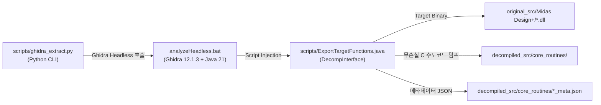

# 요구사항 01-1: Ghidra Headless 파이프라인 및 자동 추출 엔진 구축

## 1. 개요 및 목적 (Overview & Goals)

### 1.1. 배경
Midas Design+ 바이너리(`original_src/Midas Design+/`)로부터 핵심 공학 알고리즘을 반복적이고 무손실로 추출하기 위해서는, 수작업 GUI 분석 대신 Ghidra Headless Analyzer(`analyzeHeadless.bat`)를 파이썬 CLI에서 프로그래밍 방식으로 제어하는 자동화 파이프라인이 필수적입니다.

### 1.2. 목적
1. Windows OS 및 Java 21(`C:\Program Files\Eclipse Adoptium\jdk-21.0.12.101-hotspot`) 환경에서 구동되는 Ghidra Headless 연동 자동화 스크립트 작성.
2. 타겟 DLL 및 선별 심볼 목록을 입력받아 Ghidra Decompiler AST로부터 순수 C/C++ 수도코드(Pseudocode)와 심볼 메타데이터를 일괄 추출하는 Ghidra Script(`ExportTargetFunctions.java` 또는 Python) 개발.
3. 파이프라인의 정상 동작을 검증하는 단위 테스트(`tests/engine/test_ghidra_pipeline.py`) 구현.

---

## 2. 아키텍처 및 세부 설계



### 2.1. 개발 대상 파일
1. **`scripts/ExportTargetFunctions.java` (Ghidra 스크립트)**:
   - Ghidra의 `DecompInterface`, `DecompileOptions` API를 활용하여 대상 함수의 AST를 디컴파일.
   - 인자로 전달된 함수 이름/망글드 심볼 목록을 조회하여 각 함수별 C 수도코드, 반환 타입, 파라미터 정보, 호출 관계를 추출.
2. **`scripts/ghidra_extract.py` (CLI 파이프라인 래퍼)**:
   - Ghidra 설치 경로(`C:\tools\ghidra_12.1.3_PUBLIC\support\analyzeHeadless.bat`) 및 Java 21 환경 자동 감지.
   - 임시 Ghidra 프로젝트 폴더 관리 (`scratch/ghidra_proj/`).
   - 단일 DLL 또는 전체 DLL 대상 선별 추출 CLI 인터페이스 제공:
     ```bash
     python scripts/ghidra_extract.py --dll DPLUS_RCS.dll --symbols CHK_BCCO,CHK_BBBE --out decompiled_src/core_routines/rc/
     ```
3. **`tests/engine/test_ghidra_pipeline.py` (파이프라인 검증 테스트)**:
   - Ghidra Headless 환경 유효성 및 단일 테스트 심볼 디컴파일 정상 동작 확인.

---

## 3. 세부 작업 항목 (Checklist)

- [x] `scripts/ExportTargetFunctions.java` 작성 (Ghidra Java Scripting API 기반)
  - `DecompInterface.decompileFunction()` 호출 및 C 코드 문자열 추출
  - 함수별 시작 주소, Mangled Name, Demangled Prototype 메타데이터 JSON 생성
- [x] `scripts/ghidra_extract.py` 구현
  - `JAVA_HOME` 및 `analyzeHeadless.bat` 경로 검증 및 실행 파이프라인
  - 출력 경로 자동 생성 및 인코딩(UTF-8) 보장
- [x] 임시 프로젝트 및 캐시 관리 구현 (`scratch/ghidra_proj/`)
- [x] `tests/engine/test_ghidra_pipeline.py` 작성 및 `pytest tests/engine/` 통과

---

## 4. 검증 및 수용 기준 (Acceptance Criteria)

1. `python scripts/ghidra_extract.py --help` 명령어가 정상 동작할 것.
2. `pytest tests/engine/test_ghidra_pipeline.py`가 100% 통과할 것.
3. 대상 바이너리(`DPLUS_RCS.dll` 등)에서 샘플 함수가 성공적으로 `.c` 및 `.json` 파일로 추출될 것.
