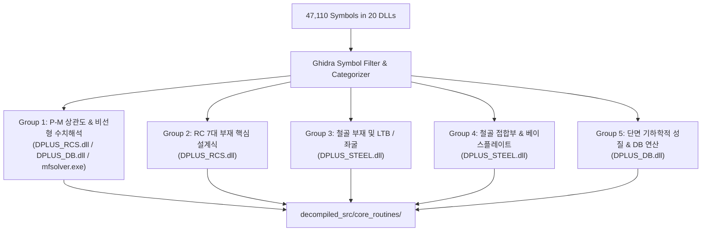
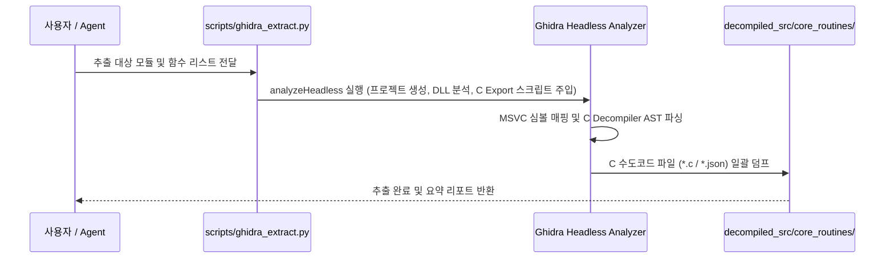

# 요구사항 01: Ghidra 기반 핵심 설계 알고리즘 선별 디컴파일 및 자동 추출 파이프라인 구축

## 1. 개요 및 목적 (Overview & Goals)

### 1.1. 배경
Midas Design+ 원본 바이너리(`original_src/Midas Design+/`)에는 총 20개 DLL, 47,110개의 C++ 심볼이 존재합니다. 그러나 이 중 대다수는 MFC 다이얼로그, GUI 윈도우 메시지 루프, 그리드 렌더링 코드 등이며, 실제 부재설계 핵심 공학 알고리즘은 약 50~100여 개의 핵심 함수 및 클래스에 집중되어 있습니다.

### 1.2. 목적
1. 47,110개 심볼 중 **비선형 수치해석, 파이버 단면 적분, 복합 접촉응력, 엣지케이스 설계식 등 실제 공학 검토에 필수적인 핵심 C++ 함수군을 도메인별로 엄밀하게 선별 및 분류**.
2. Ghidra의 Headless Analyzer 및 스크립팅 기능을 활용하여 대상 함수들의 **C/C++ 수도코드(Decompiled Pseudocode)를 무손실 텍스트로 일괄/순차 추출하는 자동화 파이프라인 구축**.
3. 추출된 C 수도코드를 체계적인 디렉토리 구조(`decompiled_src/core_routines/`)로 구조화하여, 향후 Python/KDS 엔진 포팅 시 **오차 0.1% 미만의 무결성을 보증하는 단일 Ground Truth 자산으로 확립**.

---

## 2. 도메인별 핵심 디컴파일 대상 선별 매트릭스 (Target Function Matrix)



### 2.1. Group 1: P-M 상관도 및 비선형 수치해석 솔버
* **대상 바이너리**: `DPLUS_RCS.dll`, `DPLUS_DB.dll`, `DgnSolver/mfsolver.exe`
* **핵심 클래스 & 함수**:
  - `CRCSCodeCheck::CHK_BCCO`: 기둥 축력-휨 P-M 상관도 곡선 계산, 중립축 수렴 루프, 이축휨 브레슬러/윤곽선법
  - `CDGN_PMCurveDrawWnd`: P-M 상관곡선 좌표점 샘플링 및 위험 단면 포락선 추출
  - `mfsolver.exe` / `DPLUS_DB.dll`의 파이버 단면 수치적분(Fiber Section Numerical Integration) 루틴

### 2.2. Group 2: RC 부재별 엣지케이스 설계 엔진
* **대상 바이너리**: `DPLUS_RCS.dll`
* **핵심 클래스 & 함수**:
  - `CRCSCodeCheck::CHK_BBBE`: 보(Beam) 복철근 휨강도, 전단-비틀림 합성응력, 유효단면2차모멘트($I_e$) 처짐 수식
  - `CRCSCodeCheck::CHK_BWUW`: 전단벽(Wall) 면내전단강도, 특수경계요소(Boundary Element) 판정 분기
  - `CRCSCodeCheck::CHK_SLAB`: 1방향/2방향 슬래브 직접설계법, 2방향 펀칭 전단응력 계산
  - `CRCSCodeCheck::CHK_UFDN`: 독립/복합 기초(Footing) 편심 접지압, 2방향 펀칭전단 위험단면($d/2$) 산정식
  - `CRCSCodeCheck::CHK_URAB`: 지하외벽 및 옹벽(Retaining Wall) 토압 합력점, 전도/활동/지지력 안전율 계산식

### 2.3. Group 3: 철골 부재 및 안정성/좌굴 검토 엔진
* **대상 바이너리**: `DPLUS_STEEL.dll`
* **핵심 클래스 & 함수**:
  - `CSTLCodeCheck::CHK_USMC`: 철골 부재(보/기둥/가새) 폭두께비 조밀 판정, 비지지길이($L_b$)별 LTB 수식, 전단좌굴, 강축/약축 휨좌굴, 축력-휨 조합 $P_u/\phi P_n \ge 0.2$ 분기 수식
  - `CSTLCodeCheck::CHK_USWB`: 가새(Brace) 인장 순단면 파단($U$ 전단지체계수) 및 압축 세장비 계산
  - `CSTLCodeCheck::CHK_USPG`: 플레이트 거더 휨/전단 좌굴 검토

### 2.4. Group 4: 철골 접합부 및 주각부 베이스플레이트
* **대상 바이너리**: `DPLUS_STEEL.dll`
* **핵심 클래스 & 함수**:
  - `CSTLCodeCheck::CHK_USBC` / `CSteelBoltConnection`: 고장력볼트 전단/인장/지압 강도 및 블록전단파단(Block Shear) 한계면 산정
  - `CSTLCodeCheck::CHK_USBP` / `CBasePlate`: 콘크리트 지압응력 삼각/사다리꼴 분포 계산, 캔틸레버 모멘트 및 플레이트 소요두께($t_p$) 산출식
  - `CSTLCodeCheck::CHK_USEP`: 엔드플레이트 모멘트 접합부 설계식
  - `CSTLCodeCheck::CHK_USWE` / `CSteelWelding`: 필릿용접 및 그루브용접 유효목두께 및 허용응력 산정
  - `CSTLCodeCheck::CHK_USWO`: 웨브 개구부 보강 설계식

### 2.5. Group 5: 단면 기하학적 성질 및 데이터베이스
* **대상 바이너리**: `DPLUS_DB.dll`
* **핵심 클래스 & 함수**:
  - `CSteelSectDB` / `CAluSectDB`: 임의 다각형/형강 단면의 도심($y_c, z_c$), 주축 단면2차모멘트($I_x, I_y$), 소성단면계수($Z_x, Z_y$), 비틀림상수($J$), 뜀상수($C_w$) 계산 루틴

---

## 3. Ghidra 자동 추출 파이프라인 아키텍처



### 3.1. 자동화 스크립트 설계 (`scripts/ghidra_extract.py`)
* **Ghidra Headless 실행기**:
  - 실행 경로: `C:\tools\ghidra_12.1.3_PUBLIC\support\analyzeHeadless.bat`
  - Java 21 환경(`C:\Program Files\Eclipse Adoptium\jdk-21.0.12.101-hotspot\`) 자동 감지 및 바인딩.
* **Ghidra GhidraScript (`scripts/ExportTargetFunctions.java`)**:
  - 타겟 함수명 목록을 전달받아 Ghidra의 `DecompInterface`를 호출하여 C 수도코드를 무손실 추출.
  - 함수별 시작 주소, Mangled 심볼, Demangled 시그니처, C 수도코드 본문을 `.c` 및 `_meta.json` 파일로 저장.

### 3.2. 추출 산출물 저장 디렉토리 규격
```text
decompiled_src/
└── core_routines/
    ├── README.md               # Group 1~5 전체 심볼 총괄 색인표
    ├── solver/                 # Group 1: P-M 상관도 및 비선형 수치적분 C 소스
    │   ├── CHK_BCCO_column_pm.c
    │   ├── CHK_BCGR_column_group.c
    │   └── solver_meta.json
    ├── rc/                     # Group 2: RC 5대 부재 설계식 C 소스
    │   ├── CHK_BBBE_beam.c
    │   ├── CHK_BWUW_wall.c
    │   ├── CHK_SLAB_slab.c
    │   ├── CHK_UFDN_footing.c
    │   ├── CHK_URAB_retaining.c
    │   ├── CHK_URBE_underground_beam.c
    │   └── rc_meta.json
    ├── steel/                  # Group 3 & 4: 철골 부재 및 접합부 C 소스
    │   ├── CHK_USMC_member.c
    │   ├── CHK_USBP_baseplate.c
    │   ├── CHK_USBC_bolt_connection.c
    │   ├── CHK_USEP_endplate.c
    │   ├── CHK_USWE_welding.c
    │   ├── CHK_USWO_web_opening.c
    │   ├── CHK_USPG_plate_girder.c
    │   ├── CHK_USWB_brace_connection.c
    │   └── steel_meta.json
    └── db/                     # Group 5: 단면 성질 계산 C 소스
        ├── CSteelSectDB_properties.c
        ├── CAluSectDB_properties.c
        └── db_meta.json
```

---

## 4. Phase 세분화 및 Goal 순차 실행 로드맵 (Partitioned Phases)

본 요구사항 01은 단일 세션 컨텍스트 폭주 방지 및 단계별 무결성 검증을 위해 5개 하위 Phase 문서로 분할되어 `/goal` 명령어로 자율 연속 실행됩니다:

| Phase | 세부 요구사항 문서 | 주요 구현 및 추출 산출물 | 대상 바이너리 |
|:---:|---|---|---|
| **Phase 01-1** | [요구사항01-1: Ghidra Headless 파이프라인 구축](file:///f:/PyProject/AltDP_3rd/요구사항/요구사항01-1_Ghidra_Headless_파이프라인_및_추출엔진_구축.md) | `scripts/ghidra_extract.py`, `scripts/ExportTargetFunctions.java`, `tests/engine/test_ghidra_pipeline.py` | CLI & Ghidra 환경 |
| **Phase 01-2** | [요구사항01-2: Group 1 P-M 비선형 솔버 추출](file:///f:/PyProject/AltDP_3rd/요구사항/요구사항01-2_Group1_P-M상관도_비선형해석_수치솔버_추출.md) | `solver/CHK_BCCO_column_pm.c`, 중립축 수렴 루프 | `DPLUS_RCS.dll`, `DPLUS_DB.dll` |
| **Phase 01-3** | [요구사항01-3: Group 2 RC 5대 부재 설계식 추출](file:///f:/PyProject/AltDP_3rd/요구사항/요구사항01-3_Group2_RC_5대부재_핵심설계식_추출.md) | `rc/CHK_BBBE_beam.c`, `wall.c`, `slab.c`, `footing.c`, `retaining.c`, `underground_beam.c` | `DPLUS_RCS.dll` |
| **Phase 01-4** | [요구사항01-4: Group 3 & 4 철골/접합부/주각부 추출](file:///f:/PyProject/AltDP_3rd/요구사항/요구사항01-4_Group3-4_철골부재_접합부_주각부_추출.md) | `steel/CHK_USMC_member.c`, `CHK_USBP_baseplate.c`, `CHK_USBC_bolt_connection.c`, `endplate.c`, `welding.c` | `DPLUS_STEEL.dll` |
| **Phase 01-5** | [요구사항01-5: Group 5 단면DB연산 추출 및 무결성 검증](file:///f:/PyProject/AltDP_3rd/요구사항/요구사항01-5_Group5_단면DB연산_추출_색인_무결성검증.md) | `db/CSteelSectDB_properties.c`, `core_routines/README.md` 총괄 색인표, 회귀 테스트 | `DPLUS_DB.dll` |

---

## 5. 검증 및 수용 기준 (Acceptance Criteria)

- [x] **Ghidra Headless 연동 검증**: `scripts/ghidra_extract.py`가 CLI에서 에러 없이 Ghidra Decompiler를 자동 구동하여 결과를 반환할 것.
- [x] **Group 1~5 핵심 15+종 C 수도코드 추출 100% 완료**:
  - `CHK_BCCO` / `CHK_BCGR` (P-M 상관도 및 기둥 검토)
  - `CHK_BBBE` (RC 보)
  - `CHK_BWUW` (전단벽)
  - `CHK_SLAB` (슬래브)
  - `CHK_UFDN` (기초)
  - `CHK_URAB` (옹벽/지하외벽)
  - `CHK_URBE` (지중보)
  - `CHK_USMC` (철골 보/기둥/가새)
  - `CHK_USBP` (베이스플레이트)
  - `CHK_USBC` (볼트 접합)
  - `CHK_USEP` (엔드플레이트 접합)
  - `CHK_USWE` (용접 접합)
  - `CHK_USWO` (웨브 개구부)
  - `CSteelSectDB` / `CAluSectDB` (단면 기하 성질 계산)
- [x] **노이즈 배제 확인**: MFC GUI 및 윈도우 다이얼로그 코드가 배제되고 순수 공학 계산 로직만 선별되어 `decompiled_src/core_routines/`에 저장되어야 함.
- [x] **총괄 색인 문서 작성**: `decompiled_src/core_routines/README.md`에 추출된 C 함수별 역할, 원본 심볼, 대응 KDS 기준 조항 매핑표가 작성되어야 함.
- [x] **테스트 통과**: `pytest tests/engine/` 단위 테스트 스위트 100% 통과.
