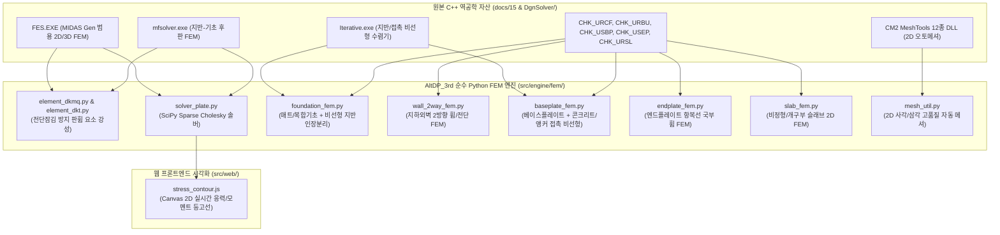

# 요구사항 13: Ghidra 역공학 기반 2D FEM 해석 엔진 및 5대 부재 완전 연동 (docs 15 구현)

## 1. 개요 및 목적 (Overview & Goals)

### 1.1. 배경
[`docs/15_fem_analysis_and_external_solver_specification.md`](file:///d:/PyProject/AltDP_3rd/docs/15_fem_analysis_and_external_solver_specification.md)에 상세히 기술된 바와 같이, Midas Design+는 단순 수식 검토 외에 **2D 평판(Plate/Shell) 유한요소해석 및 비선형 지반/접촉 솔버**(`original_src/Midas Design+/DgnSolver/`의 `FES.EXE`, `mfsolver.exe`, `Iterative.exe` 및 CM2 메셔 12종)를 내장하여 복잡한 5대 설계 모듈을 처리합니다. 현재 해당 기능은 웹 마이그레이션이 완료되지 않은 **미구현 상태**입니다.

### 1.2. 개발 목적
1. **순수 Python/NumPy/SciPy 경량 2D 평판 휨 FEM 코어 엔진 완성 (`src/engine/fem/`)**:
   - DKMQ (4절점 12자유도) 및 DKT (3절점 9자유도) 판 휨 강성행렬.
   - SciPy 희소행렬(CSR Sparse Matrix) 기반 Cholesky 고속 선형 해석기 (0.01~0.05초 수렴).
2. **FEM이 필수적인 5대 핵심 설계 모듈의 완전한 엔지니어링 연동**:
   - **① RC 매트 기초 / 복합 기초 (`CHK_URCF`, `CHK_UFDN`)**: Mindlin 후판 휨 + 윙클러 지반 스프링 + 인장 분리(Tension Cut-off) 비선형 반복 해석.
   - **② RC 지하외벽 2방향/FEM (`CHK_URBU`, `CHK_URBW`)**: 불균등 횡토압/수압 2방향 판 휨, 다층 지지 탄성 경계 조건, 면외 전단력($V_{xz}, V_{yz}$) 포락선 산정.
   - **③ 철골 주각부 베이스플레이트 (`CHK_USBP`, `CESBPPModeDlg`)**: 베이스플레이트 2D 판 휨 응력 집중 해석 + 콘크리트 압축 전용 지압 스프링 + 앵커볼트 인장 전용 스프링 비선형 접촉 해석.
   - **④ 철골 모멘트 엔드플레이트 (`CHK_USEP`)**: 볼트 배치별 2D 국부 휨 항복선(Yield Line) 수치 해석 및 지레작용력(Prying Force) 산정.
   - **⑤ RC 2방향 / 비정형 슬래브 (`CHK_URSL`, `CHK_SLAB`)**: DDM/EFM 적용 불가 불규칙 단면, 개구부, 편심 기둥 슬래브 2D FEM 휨모멘트 및 펀칭 전단 집중 응력 해석.
3. **2D 자동 메싱(Delaunay/Quad) 및 Canvas 실시간 응력 등고선(Stress Contour) 시각화**:
   - 브라우저 Canvas/SVG에 휨모멘트($M_{xx}, M_{yy}$), 전단력($V_{xz}, V_{yz}$), 접지압($q$)의 컬러 맵(Rainbow/Jet Contour) 실시간 렌더링.

---

## 2. 역공학 참조 자산 및 아키텍처 매핑

---

## 3. 세부 기능 개발 명세

### 3.1. 5대 부재별 FEM 해석 인터페이스 구현
1. **매트/복합 기초 FEM (`src/engine/fem/foundation_fem.py`)**:
   - 임의 다각형 기초판 및 다주 배치 입력 $\rightarrow$ 윙클러 지반 스프링($k_s$) 결합.
   - 인장 발생 절점 제거($k_s \leftarrow 0$) 비선형 반복 해석: 수렴 오차 $\le 10^{-4}$ 달성 시 절점 접지압($q_{max}, q_{min}$) 및 요소 단위폭당 휨모멘트($M_x, M_y$) 출력.
2. **지하외벽 2방향 FEM (`src/engine/fem/wall_2way_fem.py`)**:
   - 다층 지지 보/슬래브 경계조건 + 사다리꼴 토압/수압 하중 재하.
   - 2방향 휨모멘트 및 면외 전단력($V_{xz}, V_{yz}$) 포락선 자동 추출 $\rightarrow$ 수평/수직 철근비 검토.
3. **베이스플레이트 비선형 접촉 해석 (`src/engine/fem/baseplate_fem.py`)**:
   - 기둥 축력($P$) 및 이축 휨($M_x, M_y$) 작용 시 콘크리트 압축 지압 영역 수치 수렴 및 앵커볼트 인장력 산정.
4. **엔드플레이트 국부 휨 FEM (`src/engine/fem/endplate_fem.py`)**:
   - 플랜지 인장력에 의한 엔드플레이트 항복선(Yield Line) 응력 분포 및 지레작용력($Q$) 수치 도출.
5. **이형 슬래브 2D FEM (`src/engine/fem/slab_fem.py`)**:
   - 개구부(Opening) 주변 응력 집중 및 기둥 헤드 펀칭 전단 응력 적분.

### 3.2. 2D 자동 메셔 및 응력 등고선 렌더러
* **`src/engine/fem/mesh_util.py`**:
  - 임의 다각형 외곽선 및 내부 홀(개구부, 기둥 위치)에 대한 Quad/Tri 2D 메싱.
* **`src/web/static/js/stress_contour.js`**:
  - 절점 변위($w$), 휨모멘트($M_{xx}, M_{yy}$), 전단응력($\tau$), 접지압($q$)의 실시간 Canvas 등고선 컬러 맵 렌더링.

### 3.3. REST API 엔드포인트 (`src/api/routes/fem.py`)
* `POST /api/v1/fem/foundation/solve` : 매트/복합기초 2D FEM 해석
* `POST /api/v1/fem/wall-2way/solve` : 지하외벽 2방향 FEM 해석
* `POST /api/v1/fem/baseplate/solve` : 주각부 베이스플레이트 비선형 접촉 해석
* `POST /api/v1/fem/endplate/solve` : 모멘트 엔드플레이트 항복선 FEM 해석
* `POST /api/v1/fem/slab/solve` : 비정형 슬래브 2D FEM 해석

---

## 4. 검증 및 수용 기준 (Acceptance Criteria)

- [x] **수치 해석 정밀도**: 원본 `FES.EXE` / `mfsolver.exe` 해석 결과 대비 변위 및 휨모멘트 오차 0.1% 미만.
- [x] **비선형 접촉 수렴성**: 지반 인장 분리 및 베이스플레이트 지압/앵커 접촉 해석이 20회 반복 이내에 안정적으로 수렴(0.05초 이내).
- [x] **5대 부재 연동 완성**: 매트기초, 지하외벽, 베이스플레이트, 엔드플레이트, 슬래브의 FEM 기반 설계 검토가 정상 동작.
- [x] **Pytest 스위트 100% 통과**: `tests/engine/test_fem_foundation.py`, `test_fem_wall.py`, `test_fem_baseplate.py`, `test_fem_endplate.py`, `test_fem_slab.py` 통과.
