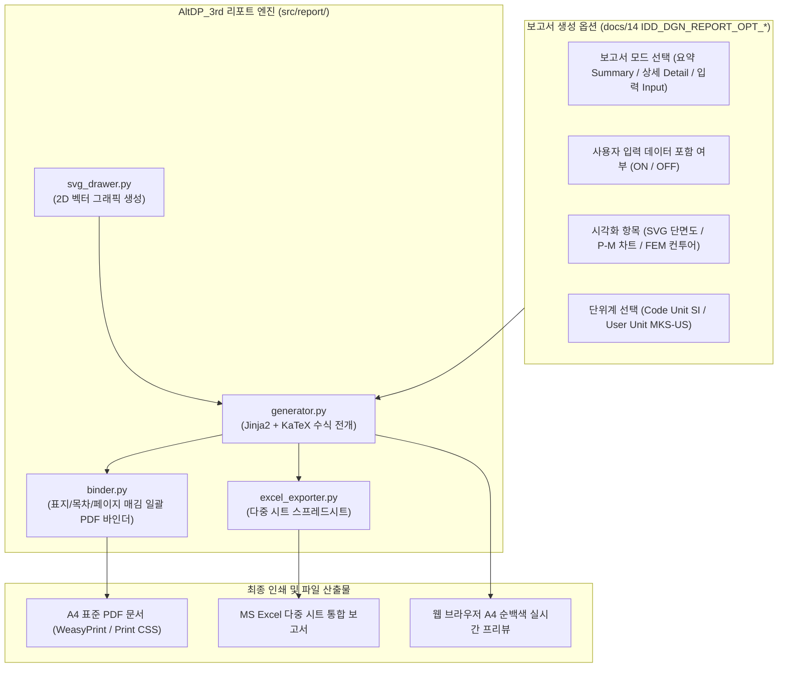

# 요구사항 15: KDS 구조계산서 3대 보고서 모드 및 옵션 제어 시스템 고도화 (docs 14 고도화)

## 1. 개요 및 목적 (Overview & Goals)

### 1.1. 배경
[`docs/14_structural_calculation_report_specification.md`](file:///f:/PyProject/AltDP_3rd/docs/14_structural_calculation_report_specification.md)에는 원본 Midas Design+의 **3대 보고서 유형**(요약 보고서, 상세 보고서, 사용자 입력 데이터 보고서)과 보고서 제어 다이얼로그(`IDD_DGN_REPORT_OPT_*`)의 세부 옵션, 그리고 KDS 정밀 Step-by-Step 수식 체계가 집대성되어 있습니다. 본 요구사항은 현재 기초 수준인 리포트 생성기를 docs 14의 표준에 맞추어 **완전한 엔지니어링 계산서 시스템으로 고도화**하는 것입니다.

### 1.2. 개발 목적
1. **KDS 3대 보고서 모드 분기 엔진 구축 (`src/report/generator.py`)**:
   - **① 요약 보고서 (Summary Report)**: 1~2페이지 압축 A4, 핵심 설계조건, SVG 배근도, 최악 하중조합(Governing LCB), 종합 DCR 판정 요약표.
   - **② 상세 보고서 (Detail Report)**: 인허가 및 심의 제출용 Step-by-Step KDS 조항별 유도과정, 모든 중간 변수($a, c, \epsilon_t, \phi$) 출력, $\LaTeX$(KaTeX) 수식 전개, P-M 상관곡선 및 전 하중조합 검토표.
   - **③ 사용자 입력 데이터 보고서 (Input Data Report)**: 설계자가 입력한 재료 물성치, 단면 치수, 배근 간격, 하중 케이스 원시 제원 리스트.
2. **보고서 제어 옵션 (`IDD_DGN_REPORT_OPT_*`) 파이프라인 구현**:
   - **사용자 입력 정보 포함 여부 (`IDC_DGN_REPORT_CHECK_INP`)**: ON/OFF 토글.
   - **시각화 항목 제어**: SVG 단면 배근도, P-M 상관도 차트, FEM 응력 등고선 포함 선택.
   - **결과 테이블 범위 제어**: 최악 하중조합(Governing)만 출력 vs 전체 하중케이스 전수 출력.
   - **단위계 & 소수점 자리수 제어**: KDS 표준 SI 단위계 고정 vs 화면 사용자 단위계(MKS/US) 연동, 응력/하중 2자리, DCR 3자리 포맷팅.
3. **프로젝트 전 부재 일괄 계산서 바인딩 PDF 출력 (`Batch Print`)**:
   - 표지(Cover), 목차(TOC), 일련 페이지 번호를 포함한 대용량 종합 PDF 원클릭 내보내기.

---

## 2. 계산서 생성 아키텍처 및 옵션 흐름도

---

## 3. 세부 기능 개발 명세

### 3.1. 3대 보고서 템플릿 고도화 (`src/report/templates/`)
* `summary_report.html` : 1~2페이지 초압축 A4 요약 보고서.
* `detail_report.html` : KDS 수식 전개, 중간 변수($a, c, \epsilon_t, \phi$), 허용치 대조 정밀 계산서.
* `input_data_report.html` : 사용자 입력 파라메터 원시 데이터 시트.
* `cover_and_toc.html` : 프로젝트 통합 표지 및 자동 목차.

### 3.2. 정밀 수치 포맷터 및 단위계 환산기
* 응력($\text{MPa}$): `24.00 MPa`, 모멘트($\text{kN}\cdot\text{m}$): `210.50 kN·m`, DCR: `0.807`.
* MKS/US 단위계 선택 시 수식과 표의 모든 수치를 실시간 환산 출력.

### 3.3. REST API 엔드포인트 (`src/api/routes/report.py`)
* `POST /api/v1/report/generate` : 옵션 기반 단일 부재 보고서(HTML/PDF) 생성
* `POST /api/v1/report/batch-generate` : 프로젝트 전 부재 종합 계산서 일괄 PDF 바인딩 생성
* `POST /api/v1/report/export-excel` : 다중 부재 요약 및 상세 검토표 Excel 다운로드

---

## 4. 검증 및 수용 기준 (Acceptance Criteria)

- [ ] **3대 보고서 렌더링 무결성**: 요약, 상세, 입력데이터 모드가 옵션에 따라 결함 없이 완벽히 분기 생성.
- [ ] **KDS 수식 유도과정 정확도**: [docs/14](file:///f:/PyProject/AltDP_3rd/docs/14_structural_calculation_report_specification.md)의 모든 중간 변수와 수식이 KaTeX로 미려하게 렌더링.
- [ ] **대용량 일괄 바인딩 PDF**: 50페이지 이상 종합 계산서가 페이지 번호/목차 누락 없이 2초 이내 생성.
- [ ] **Pytest 스위트 100% 통과**: `tests/report/test_report_modes.py`, `test_report_options.py`, `test_binder.py` 통과.
