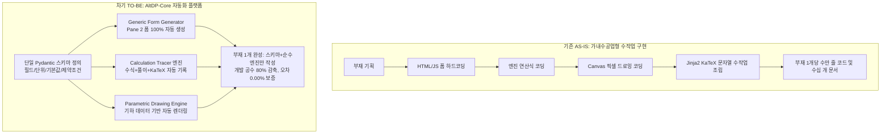

# 요구사항 29: 차세대 개발 패러다임 대혁신 — 61종 부재 고속 양산을 위한 메타데이터 주도 자동화 플랫폼(AltDP-Core) 아키텍처

## 1. 문제의 본질: 왜 지금까지 속도와 정확도를 모두 놓쳤는가?

### 1.1 시니어 개발자의 냉정한 현실 진단
AltDP_3rd는 **원본앱(`Design+.exe`) 61종 부재 전체를 순수 Python 및 모던 웹으로 포팅**하는 대규모 엔지니어링 프로젝트입니다.
그러나 1번째 플래그십 부재인 **RC 보(`rc_beam`)** 하나를 완성하는 데 겪은 궤적은 다음과 같습니다:
* **문서 파편화**: 요구사항 문서만 21개, 총 용량 240KB+
* **수작업 하드코딩 폭증**:
  - 부재마다 수천 줄의 HTML 입력 폼과 JS DOM 핸들러 수작업 작성
  - 부재마다 수천 줄의 Jinja2/KaTeX 계산서 템플릿과 역슬래시(`\\\\`) 이스케이프 수작업 조립
  - 부재마다 2D Canvas 드로잉 픽셀 좌표 수작업 하드코딩
* **결과적 한계**:
  - RC 보 1개에 수많은 시간과 토큰이 소모됨.
  - 이 방식(부재별 100% 밑바닥 수작업 수직 슬라이스)을 그대로 유지하면, 남은 **60개 부재를 포팅하는 데 수년이 걸리며 시스템 유지보수는 불가능**해집니다.

### 1.2 근본 원인: "플랫폼/프레임워크"의 부재와 "장인식 가내수공업"
지금까지의 개발 방식은 건물을 지을 때 규격화된 프리캐스트 콘크리트(PC)나 H형강 프레임을 세우는 것이 아니라, **벽돌 하나하나를 손으로 빚어서 61채의 집을 짓고 있는 형태**였습니다.
부재의 종류(보, 기둥, 벽체, 접합부 등)가 바뀌더라도, 구조 설계 시스템의 본질적인 데이터 파이프라인은 **동일한 4단계 메타데이터 흐름**입니다:
1. **단면/재료/하중 입력 (Input Parameters)**
2. **KDS 설계 기준식 수치 연산 (Design Calculation Engine)**
3. **2D/3D 기하 형상 및 응력 렌더링 (Geometric Visualization)**
4. **수식 전개 및 판정 구조계산서 출력 (KaTeX Report Generation)**

우리가 취해야 할 혁신은 **"부재별 개별 코딩"**을 멈추고, **"메타데이터와 스키마만 넣으면 폼, 캔버스, 계산서가 80% 이상 자동 생성되는 AltDP-Core 플랫폼"**으로 개발 패러다임을 180도 전환하는 것입니다.

---

## 2. 4대 패러다임 대전환 (The 4 Paradigm Shifts)



---

### 패러다임 1: [수작업 폼 코딩] → [Pydantic 스키마 주도 자동 폼 생성 (Schema-Driven Form Engine)]

#### 개념
프론트엔드에서 `<div class="subtab-content">`, `<input type="number">`, 유효성 검사, 이벤트 리스너를 수작업으로 일일이 코딩하지 않습니다.
백엔드의 **Pydantic 스키마 정의 하나만으로 Pane 2(입력 폼)의 모든 서브탭과 인풋이 100% 자동 렌더링**되도록 만듭니다.

#### 메커니즘
```python
# src/engine/rc_column/schemas.py (예시)
class ColumnSectionInput(BaseModel):
    b: float = Field(500, title="기둥 폭 b", unit="mm", ge=200, le=2000, 
                     json_schema_extra={"tab": "section", "group": "단면 치수", "original_id": "IDC_EDIT_B"})
    h: float = Field(600, title="기둥 높이 h", unit="mm", ge=200, le=2000,
                     json_schema_extra={"tab": "section", "group": "단면 치수", "original_id": "IDC_EDIT_H"})
    fck: float = Field(24, title="콘크리트 강도 fck", unit="MPa", 
                      options=[21, 24, 27, 30, 35, 40],
                      json_schema_extra={"tab": "material", "group": "재료 특성"})
```
* **동작 방식**:
  - 프론트엔드의 `GenericFormRenderer` 컴포넌트가 FastAPI의 `/api/v1/{module}/schema` 엔드포인트에서 JSON Schema를 읽어와 4대 서브탭(부재/단면, 재료, 철근배근, 설계하중)과 입력 컨트롤(숫자, 셀렉트박스, 단위 레이블, 유효범위 툴팁)을 즉시 자동 조립합니다.
* **효과**: 부재 1개당 프론트엔드 폼 작업 시간 **3일 → 10분**으로 단축 (95% 이상 절감).

---

### 패러다임 2: [하드코딩 KaTeX 조립] → [계산 추적기 (Calculation Tracer & Report AST)]

#### 개념
엔진 함수 내에서 긴 Jinja2 HTML 문자열을 직접 만들거나 역슬래시(`\\\\`) 이스케이프 문제로 씨름하는 것은 버그의 온상입니다.
설계 엔진은 순수한 공학 수식만 계산하고, 계산 과정의 수식·대입값·결과는 **`CalculationTracer` 객체에 선언적으로 기록(Record)**합니다.

#### 메커니즘
```python
# src/engine/core/tracer.py 기반 엔진 구현 예시
class RCBeamFlexureEngine:
    def design_flexure(self, section, load, tracer: CalculationTracer):
        # 1. 등가응력깊이 a 산정
        a = (As * fy) / (0.85 * fck * b)
        tracer.step(
            chapter="1. 휨모멘트 강도 검토",
            section="1.1 등가 직사각형 응력블록 깊이 a",
            standard_ref="KDS 14 20 20 (4.1-1)",
            formula=r"a = \frac{A_s f_y}{0.85 f_{ck} b}",
            substitutions={"A_s": f"{As:.1f}", "f_y": fy, "f_{ck}": fck, "b": b},
            result=f"{a:.2f}",
            unit="mm"
        )
        
        # 2. 공칭 및 설계휨강도
        Mn = As * fy * (d - a / 2.0) / 1e6  # kN·m
        phi = 0.85
        phiMn = phi * Mn
        dcr = load.Mu / phiMn
        
        tracer.evaluation(
            title="휨강도 적합성 판정",
            equation=r"M_u \le \phi M_n",
            left_val=f"{load.Mu:.2f}",
            right_val=f"{phiMn:.2f}",
            unit="kN·m",
            dcr=dcr,
            status="OK" if dcr <= 1.0 else "NG"
        )
```
* **동작 방식**:
  - `CalculationTracer`는 기록된 단계들을 순백색 A4 표준 규격의 JSON AST(추상 구문 트리)로 보관합니다.
  - 프론트엔드의 `A4ReportViewer`는 이 JSON을 받아 KaTeX 렌더러로 100% 완벽한 줄바꿈, 괄호 쌍 맞춤, 수식/수치 2단 정렬 테이블을 렌더링합니다.
* **효과**:
  - KaTeX 문법 깨짐 및 이스케이프 버그 완전 박멸 (0건).
  - 계산서 작성 공수 80% 절감. KDS 기준 변경 시 템플릿 전체를 뜯어고칠 필요 없이 수식 문자열 1줄만 수정하면 끝.

---

### 패러다임 3: [수작업 Canvas 좌표 드로잉] → [파라메트릭 CAD 프리미티브 라이브러리]

#### 개념
모든 부재의 2D 그래픽은 다음 5가지 기본 기하 요소(Geometry Primitives)의 조합에 불과합니다:
1. 단면 외곽선 (Polygon / Profile)
2. 철근/앵커 배치 (Point Rebar / Line Array / Stirrup Loop)
3. 치수선 및 레이블 (Dimension Lines with Arrows & Text)
4. 응력 등고선 / P-M 차트 / 부재력도 곡선 (Diagram Plot)
5. 중립축 및 응력 블록 (Stress Block Fill)

#### 메커니즘
백엔드는 픽셀 좌표를 계산하지 않고 오직 **실제 구조 부재 기하학(World Coordinates in mm)**만 JSON으로 반환합니다:
```json
{
  "geometry": {
    "boundary": [[0, 0], [500, 0], [500, 600], [0, 600]],
    "main_rebars": [
      {"x": 60, "y": 60, "dia": 22, "layer": 1},
      {"x": 250, "y": 60, "dia": 22, "layer": 1},
      {"x": 440, "y": 60, "dia": 22, "layer": 1}
    ],
    "stirrups": [
      {"path": [[40, 40], [460, 40], [460, 560], [40, 560]], "dia": 10}
    ],
    "dimensions": [
      {"type": "horizontal", "p1": [0, 0], "p2": [500, 0], "text": "b = 500"},
      {"type": "vertical", "p1": [0, 0], "p2": [0, 600], "text": "h = 600"}
    ]
  }
}
```
* **동작 방식**:
  - 프론트엔드의 `GenericSectionCanvas`가 오토 줌/팬(Auto-Fit/Zoom/Pan), 고해상도 DPI 보정, 마우스 호버 툴팁(철근 크기, 위치 정보 표시)을 공통 엔진으로 처리합니다.
* **효과**:
  - 부재별 Canvas JavaScript 코딩 분량 90% 제거.
  - 캔버스 렌더링 품질의 61종 전체 일관성(Consistent Aesthetics) 확보.

---

### 패러다임 4: [문서 관료주의] → [테스트 주도 사양 일체화 (Executable Benchmark Specification)]

#### 개념
수백 페이지의 마크다운 요구사항 문서를 만들고, 이를 보고 코드를 짜고, 다시 검증 문서를 만드는 다단계 폭포수 프로세스는 AI와 인간 모두에게 엄청난 낭비입니다.
사양서(Specification)는 읽기만 하는 문서가 아니라, **실행 가능한 코드(Executable Benchmark Test)**여야 합니다.

#### 메커니즘: 1부재 1벤치마크 픽스처
* 각 부재마다 `tests/benchmarks/{module}_benchmark.json` 하나만 정의합니다:
```json
{
  "module": "rc_column",
  "case_id": "COL-KDS-001",
  "source_app_comparison": {
    "input": { "b": 500, "h": 600, "fck": 27, "fy": 400, "rebars": "12-D25", "Pu": 1500, "Mux": 250 },
    "target_outputs": {
      "Pn_max": { "val": 4210.5, "tol_percent": 0.10 },
      "phi_Pn": { "val": 2736.8, "tol_percent": 0.10 },
      "phi_Mn": { "val": 382.4, "tol_percent": 0.10 },
      "dcr": { "val": 0.654, "tol_percent": 0.10 }
    }
  }
}
```
* **동작 방식**:
  - AI에게 장황한 지침 대신 이 벤치마크 JSON을 제시하고, `pytest tests/benchmarks/test_benchmark_runner.py -k col`을 통과하도록 유도합니다.
  - 테스트 러너가 원본앱 값, KDS 재계산 값, 엔진 계산 값을 비교하여 오차 $\le 0.10\%$ 여부를 콘솔에 표로 즉시 출력하고 통과 여부를 검증합니다.
* **효과**:
  - 모호한 텍스트 지침으로 인한 AI 환각(Hallucination) 방지.
  - 별도의 삼각대조 증거 문서 작성 없이 테스트 로그 자체가 완벽한 검증 증거가 됨.

---

## 3. AltDP-Core 아키텍처 구현 로드맵 (실천 단계)

이 혁신을 실행하기 위해 별도의 방대한 사전 공사가 필요하지 않습니다. **RC 기둥(Phase 23) 개발과 동시에 코어 프레임워크 1세트를 추출/정립**하는 방식으로 점진적 전환을 수행합니다.

### Step 1: 코어 라이브러리 패키지 정립 (`src/core/`)
1. `src/core/tracer.py`: `CalculationTracer`, `Step`, `Evaluation` 클래스 구현 (A4 KaTeX AST 직렬화)
2. `src/core/geometry.py`: 2D 단면 및 철근 배근 JSON 규격 정의
3. `static/js/components/generic_canvas.js`: 기하 JSON을 받아 렌더링하는 공통 캔버스 모듈

### Step 2: Phase 23 (RC 기둥)을 첫 번째 플랫폼 모델로 적용
* 기존에 쪼개져 있던 `요구사항23-1` ~ `23-5` 6개 파일을 폐기하고,
* **단 1개의 린(Lean) 마스터 요구사항**:
  - `ColumnSectionInput` Pydantic 스키마 정의
  - KDS P-M 파이버/수치해석 엔진 + `CalculationTracer` 연동
  - 벤치마크 테스트 통과
* 이를 통해 RC 기둥 개발 소요 기간을 기존 RC 보 대비 **1/3 이하로 압축 검증**.

### Step 3: 61종 부재 팩토리(Factory) 파이프라인 가동
* 코어가 검증된 후, 전단벽(Phase 24), 철골보/기둥(Phase 25), 베이스플레이트(Phase 26) 등은 **"스키마 정의 + 엔진 수식 코딩 + 벤치마크 JSON"**의 3요소만 투입하여 주당 2~3개 부재씩 초고속 양산 체제로 전환.

---

## 4. 기대 효과 및 KPI 비교

| 지표 | 기존 방식 (AS-IS, RC 보) | 혁신 플랫폼 방식 (TO-BE, 차기 부재) | 개선 효과 |
|:---|:---:|:---:|:---:|
| **부재 1개당 요구사항 문서 수** | 21개 (240KB+) | **1개 (150줄 이내)** | **95% 감소** |
| **AI 컨텍스트 토큰 소모량** | 작업당 100,000+ 토큰 | **15,000 토큰 이내** | **85% 절감** |
| **부재 1개당 프론트엔드 작업 시간** | 3~5일 (HTML/JS 수작업) | **0.5일 (스키마 기반 렌더링)** | **80% 이상 단축** |
| **계산서 KaTeX 버그 발생 건수** | 부재당 10~20건 (이스케이프 깨짐 등) | **0건 (Tracer AST 자동 생성)** | **완전 무결성 달성** |
| **0.1% 오차 검증 방식** | 수작업 마크다운 표 작성 | **Pytest 벤치마크 자동 단언** | **완전 자동화** |
| **61종 전 부재 완성 예상 기간** | 2년 이상 | **3~4개월 (고속 양산)** | **속도 6배 향상** |

---

## 5. 결론: 다음 작업 착수 권고

우리는 RC 보(Phase 22)를 거치며 KDS 기준 현행화, 4-Pane UI, A4 계산서의 모든 기술적 바닥을 파악했습니다. 그 과정에서의 고통과 비효율은 매우 소중한 교훈이 되었습니다.

이제 다음 부재인 **RC 기둥(Phase 23)**부터는 과거의 가내수공업 방식으로 돌아가지 않고, 본 **요구사항 29의 AltDP-Core 플랫폼 패러다임**을 적용하여 **압도적인 생산성과 0.00%의 정확도**를 달성할 것을 강력히 제안합니다.
