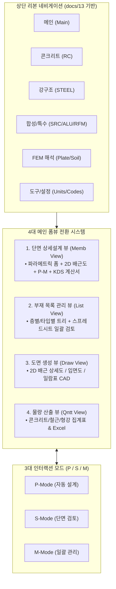

# 요구사항 14: Midas Design+ 원본 UI 역공학 기반 웹 UI/UX 고도화 및 프론트엔드 완성 (docs 13 $\rightarrow$ docs 07)

## 1. 개요 및 목적 (Overview & Goals)

### 1.1. 배경
[`docs/13_midas_design_plus_original_ui_specification.md`](file:///d:/PyProject/AltDP_3rd/docs/13_midas_design_plus_original_ui_specification.md)에는 원본 Midas Design+의 MFC 리본 바, **4대 메인 폼뷰**(`CMainFormViewMemb`, `CMainFormViewList`, `CMainFormViewDraw`, `CMainFormViewQntt`), **3대 인터랙션 모드**(`P-Mode`, `S-Mode`, `M-Mode`), 그리고 부재별 다이얼로그 폼(`DLG_*.ini`)이 정밀하게 역공학 분석되어 있습니다. 본 요구사항은 이를 웹 UI/UX 종합 명세서([`docs/07`](file:///d:/PyProject/AltDP_3rd/docs/07_web_application_ui_ux_specification.md))에 완전 융합/고도화하고, 이를 바탕으로 **AltDP_3rd의 실질적인 반응형 웹 프론트엔드를 완성**하는 것입니다.

### 1.2. 개발 목적
1. **[`docs/07_web_application_ui_ux_specification.md`](file:///d:/PyProject/AltDP_3rd/docs/07_web_application_ui_ux_specification.md) 명세서 고도화**:
   - docs 13의 원본 4대 폼뷰 및 3대 모드 워크플로우를 docs 07에 완전히 반영하여 모던 웹 규격으로 개정.
2. **모던 엔지니어링 리본 바 & 4대 폼뷰 탭 전환 시스템 구축**:
   - **Memb View (`CMainFormViewMemb`)**: 단일 부재 4분할 워크스페이스 (입력 폼 + 2D 배근도 + P-M 차트 + KDS 계산서).
   - **List View (`CMainFormViewList`)**: 전체 건물 부재 층별/타입별 계층 트리 및 다중 부재 스프레드시트 일괄 관리.
   - **Draw View (`CMainFormViewDraw`)**: 2D 배근 상세도, 입면도, 배근 일람표 CAD 렌더링 및 도면 뷰어.
   - **Qntt View (`CMainFormViewQntt`)**: 콘크리트($\text{m}^3$), 거푸집($\text{m}^2$), 철근 규격별 톤수(ton) 물량 집계 대시보드.
3. **원본 3대 인터랙션 모드 (`P-Mode` / `S-Mode` / `M-Mode`) 완전 지원**:
   - `P-Mode` (파라메트릭 자동 설계), `S-Mode` (단면 안전성 검토), `M-Mode` (다중 부재 일괄 관리).
4. **부재별 KS 표준 파라메트릭 입력 폼 컴포넌트 라이브러리 완성**:
   - RC 6대 부재(보, 기둥, 벽체, 슬래브, 기초, 옹벽) 및 철골 부재/접합부/베이스플레이트 전용 폼.

---

## 2. 웹 UI/UX 아키텍처 및 뷰 전환 매핑

---

## 3. 세부 기능 개발 명세

### 3.1. 웹 템플릿 및 레이아웃 구조 (`src/web/templates/`)
* `base.html` : 전역 리본 메뉴, 단위계 셀렉터, 테마 토글, 4대 폼뷰 스위처.
* `view_memb.html` : 4분할 단일 부재 설계기 (Memb View).
* `view_list.html` : 다중 부재 스프레드시트 그리드 (List View).
* `view_draw.html` : 2D 배근 상세도 및 일람표 CAD 뷰어 (Draw View).
* `view_qntt.html` : 물량 산출 및 집계 대시보드 (Qntt View).

### 3.2. 프론트엔드 스타일 & 디자인 시스템 (`src/web/static/css/`)
* `design_tokens.css` : Dark Slate / Clean Light 테마 CSS 변수, DCR 컬러 스펙트럼(Safe/Warn/Danger).
* `ribbon.css` : Midas Design+ 스타일 모던 리본 바 탭 및 패널 스타일링.
* `views.css` : 4대 폼뷰 레이아웃 및 4-Pane 드래그 리사이저 스타일.

### 3.3. 프론트엔드 스크립트 모듈 (`src/web/static/js/`)
* `app.js` : 전역 상태 관리(SSOT Store), 단위계 실시간 변환, 4대 폼뷰 전환 라우터.
* `renderer2d.js` : RC/Steel 2D Canvas 배근 단면도 및 치수선 인터랙티브 렌더러.
* `pm_chart.js` : 3D P-M 상관곡면 및 설계 하중점 DCR 시각화 차트.
* `batch_grid.js` : Handsontable/Tabulator 기반 다중 부재 고속 그리드 매니저.

---

## 4. 검증 및 수용 기준 (Acceptance Criteria)

- [ ] **docs 07 문서 고도화**: docs 13의 4대 폼뷰와 3대 모드가 docs 07에 완전히 통합 반영.
- [ ] **4대 폼뷰 전환 반응성**: Memb $\leftrightarrow$ List $\leftrightarrow$ Draw $\leftrightarrow$ Qntt 뷰 전환 시 0.05초 이내 즉시 렌더링.
- [ ] **P/S/M 모드 완벽 동작**: 자동설계(P), 단면검토(S), 일괄관리(M) 모드가 각 부재별로 정상 동작.
- [ ] **Pytest 및 브라우저 검증**: `tests/api/test_web_routes.py` 100% 통과 및 UI 결함 0건.
