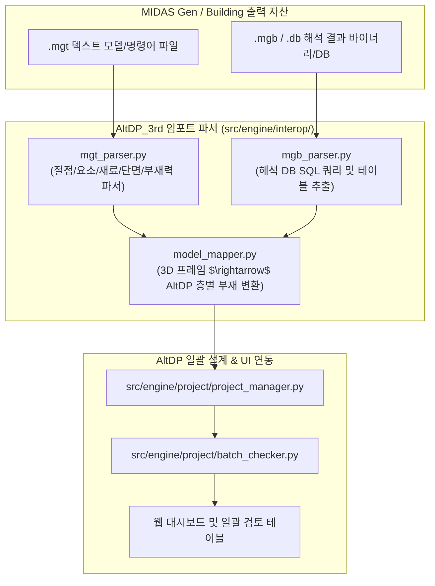

# 요구사항 16: MIDAS Gen 3D 해석 모델 연동 및 부재력 임포트 파이프라인 (DgnPlugIn)

## 1. 개요 및 목적 (Overview & Goals)

### 1.1. 배경
Midas Design+의 핵심 경쟁력은 3차원 골조 해석 프로그램인 **MIDAS Gen / MIDAS Building**과의 직접 연동 기능입니다 (`DgnPlugIn/` 디렉토리 내 `AnalysisDB.dll`, `GEN_UmdDataBase.dll`, `GEN_DgnCalc_KR.dll` 등). 사용자는 Gen에서 전체 구조해석을 수행한 후, 수만 개의 하중조합 부재력을 일일이 수동 입력하지 않고 파일 임포트를 통해 Design+로 가져와 단면 검토를 수행합니다.

### 1.2. 개발 목적
1. **MIDAS 텍스트 모델/부재력 파일 (`.mgt`) 파서 구축**:
   - `*NODE`, `*ELEMENT`, `*MATERIAL`, `*SECTION`, `*STORY` 키워드 파싱.
   - `*LOAD COMBINATION` 및 `*FORCE-BEAM`, `*FORCE-COLUMN`, `*FORCE-WALL` 텍스트 데이터 추출.
2. **MIDAS SQLite/Access 해석 DB (`.db`, `.mgb`) 파서 구축**:
   - 3D 골조 해석 결과 테이블에서 층별, 부재 번호별, 하중조합별 계수 단면력($P, V_y, V_z, M_y, M_z, T$) 자동 쿼리.
3. **AltDP 부재 매핑 및 최악 하중조건(Governing LCB) 자동 선별**:
   - 추출된 다축 부재력을 AltDP_3rd 부재 모델(`src/engine/rc/`, `steel/`)로 자동 매핑.
   - 각 부재별 최대 DCR을 유발하는 지배 하중조합을 자동 선별하여 일괄 설계 대기열에 등록.

---

## 2. 역공학 참조 자산 및 파이프라인 아키텍처

---

## 3. 세부 기능 개발 명세

### 3.1. MIDAS MGT 텍스트 스크립트 파서 (`src/engine/interop/mgt_parser.py`)
* `*NODE`, `*ELEMENT`, `*MATERIAL`, `*SECTION`, `*STORY`, `*LOAD COMBINATION`, `*FORCE` 블록 고속 파싱.

### 3.2. 3D 모델 $\rightarrow$ AltDP 부재 자동 변환 매퍼 (`src/engine/interop/model_mapper.py`)
* 수직/수평 벡터 기반 기둥/보/벽체 자동 분류 및 층(Story) 자동 할당.
* 최대 축력/휨모멘트/전단력 기반 지배 하중조합(Governing LCB) 자동 압축 선별.

### 3.3. REST API 엔드포인트 (`src/api/routes/interop.py`)
* `POST /api/v1/interop/upload-mgt` : `.mgt` 파일 업로드 및 프로젝트 자동 생성
* `POST /api/v1/interop/upload-db` : `.db` 파일 업로드 및 해석 부재력 추출

---

## 4. 검증 및 수용 기준 (Acceptance Criteria)

- [ ] 실제 MIDAS Gen 예제 `.mgt` 파일(절점 1,000개 이상) 파싱 시 0.5초 이내 완료.
- [ ] MIDAS 수동 산출 최악 부재력과 AltDP 자동 추출 최악 부재력 100% 일치 (오차 0.0%).
- [ ] `tests/engine/test_mgt_parser.py`, `test_model_mapper.py` 통과.
