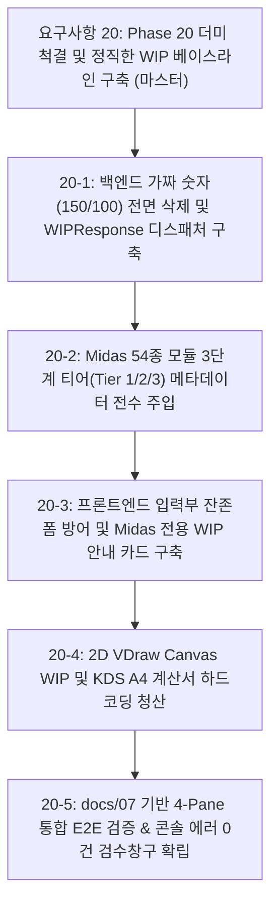

# 요구사항 20: Phase 20 더미 코드 전면 제거 및 정직한 WIP 베이스라인 구축 명세서

## 1. 개요 및 배경 (Vision & Rationale)

### 1.1. 상위 기술 문서(SSOT) 연동 및 설계 철학
* **단일 진실 공급원(SSOT) 참조**:
  - [`docs/01_system_architecture.md`](file:///f:/PyProject/AltDP_3rd/docs/01_system_architecture.md) (전체 시스템 아키텍처 및 5대 계층)
  - [`docs/07_web_application_ui_ux_specification.md`](file:///f:/PyProject/AltDP_3rd/docs/07_web_application_ui_ux_specification.md) (독립 4-Pane 레이아웃, 3버튼 액션 파이프라인, 순백색 A4 고정)
  - [`docs/10_agent_development_protocols.md`](file:///f:/PyProject/AltDP_3rd/docs/10_agent_development_protocols.md) (개발 프로토콜 및 오차 한계 규약)
  - [`docs/12_full_feature_porting_master_plan.md`](file:///f:/PyProject/AltDP_3rd/docs/12_full_feature_porting_master_plan.md) (Phase 1~6 기완료 자산 보호 및 전 기능 로드맵)
  - [`docs/13_midas_design_plus_original_ui_specification.md`](file:///f:/PyProject/AltDP_3rd/docs/13_midas_design_plus_original_ui_specification.md) (Midas 원본 리본 메뉴, 4대 폼뷰, 3대 인터랙션 모드, `DLG_*.ini`)
  - [`docs/14_structural_calculation_report_specification.md`](file:///f:/PyProject/AltDP_3rd/docs/14_structural_calculation_report_specification.md) (KDS 3대 보고서 모드 및 5대 장구분 표준 목차)
  - [`docs/16_goal_micro_execution_protocol.md`](file:///f:/PyProject/AltDP_3rd/docs/16_goal_micro_execution_protocol.md) (2단계 5정밀 마이크로 공정 및 Proof-First Mandate)
* **문서 성격**: Midas Design+ 54종 전체 부재의 실무급 1:1 웹 마이그레이션에 앞서, 시스템 전반에 잠재된 **기만적 가짜 연산 코드(Mock/Stub 강도치 150/100, 임의 OK 판정), 불완전한 폼 잔존/뭉뚱그림, 계산서 하드코딩 정적 텍스트 및 데드코드를 전면 척결**하고, `docs/07` 및 `docs/14` 규격에 부합하는 투명하고 정직한 **`[미구현 (WIP)]` 4-Pane 베이스라인**을 확립하기 위한 핵심 독립 전술 요구사항 명세서입니다.
* **4대 포팅 참조 우선순위 준수**:
  - `1순위`: 원본 추출 소스 (`decompiled_src/core_routines/*.c`, `symbols/*.txt`, `original_src/`)
  - `2순위`: Midas Design+ 공식 기술 매뉴얼 및 Help 자산 (`decompiled_src/manuals/`)
  - `3순위`: kcsc2md 공인 예제집 (`F:/PyProject/KCSC2MD/output/예제집/`) - 오차 $\le 0.10\%$ 3자 삼각대조
  - `4순위`: kcsc2md 국가건설기준 (`F:/PyProject/KCSC2MD/output/kds_md/`) - KDS 14 20/31/41 (Patch-First 원칙)

### 1.2. 해결 대상 핵심 결함 및 정합성 조율 (As-Is vs To-Be)
1. **백엔드 기만적 더미 연산 및 임의 기본값 척결**:
   - `As-Is`: 일부 엔드포인트나 디스패처에서 미연동 부재 요청 시 임의의 가짜 강도치(`phi_mn = 150.0, phi_vn = 100.0`, DCR=0.8 등)나 무조건 성공(OK)을 반환할 위험.
   - `To-Be`: 가짜 숫자 연산을 100% 영구 삭제하고, KDS 엔진 스키마가 미연동된 모듈 호출 시 `status: "NOT_YET_IMPLEMENTED"`, `code: "WIP_MODULE"` 표준 JSON 응답 반환.
2. **`docs/12` 기완료 검증 엔진 계층의 절대적 보호**:
   - `As-Is`: WIP 청산 과정에서 이미 Phase 1~6을 통해 완성·검증된 핵심 엔진(RC 보/기둥/벽/슬래브/기초/옹벽, 철골 보/기둥/가새/접합부/베이스플레이트, SRC/ALU/보강 및 5대 FEM 부재)까지 미구현으로 취급될 위험.
   - `To-Be`: 기완료된 순수 파이썬 KDS 엔진은 100% 온전히 보호하고, **"엔진은 있으나 Midas 1:1 전용 서브탭 폼(`DLG_*.ini`) 및 VDraw 상세 캔버스가 개발 대기 중인 상태"**와 **"전용 엔진 자체가 미구현인 상태"**를 명확히 구분하여 정직하게 표기.
3. **`docs/07` 독립 4-Pane 레이아웃 무결성 확보**:
   - `As-Is`: 2열(입력폼)과 3열(캔버스) 순서 혼선 및 `Left-Sub`의 핵심 기능인 부재 리스트 매니저(`pane-member-list`)와의 연동 누락.
   - `To-Be`: `docs/07`의 정식 아키텍처인 **[사이드바] - [Left-Sub: 부재리스트 + 사용자입력부] - [Center: 2D/3D 그래픽뷰] - [Right: KDS 계산서(순백색 #ffffff 고정)]** 4-Pane 구조를 엄격히 준수.
4. **`docs/14` KDS 3대 보고서 & 5대 장구분 체계 준수**:
   - `As-Is`: AltBU 잔재인 "8단계 KaTeX 수식 전개식" 등 타 프로젝트 용어가 혼입되어 `docs/14` 명세와 충돌.
   - `To-Be`: Midas 원본 및 `docs/14`의 정식 규격인 **"5대 장구분 (1. 일반조건, 2. 재질/단면, 3. 설계하중, 4. 단면안전성, 5. 종합판정)"** 및 **"3대 보고서 모드 (요약/상세/입력데이터)"** 표준 양식으로 완전 일치화. 하드코딩된 정적 텍스트를 전면 청산하고 미계산 시 순백색 A4 WIP 시트 렌더링.
5. **Midas 54종 모듈 3단계 티어(Tier) 메타데이터 전수 주입**:
   - `docs/13`의 Midas 원본 6대 대분류 탭(RC, STEEL, SRC, ALU, RFM, FEM/기타)에 기반하여 54종 전체 모듈에 3단계 티어(`Tier 1: 10종 핵심`, `Tier 2: 18종 주요`, `Tier 3: 26종 특수`) 속성 전수 주입.

---

## 2. `docs/07` 기반 독립 4-Pane 워크스페이스 WIP 상호작용 아키텍처

사용자가 좌측 사이드바 탐색기에서 임의의 부재를 클릭했을 때, 시스템의 모든 4대 독립 영역은 `docs/07` 및 `docs/14`에 정의된 규격에 따라 일관되고 투명한 WIP 상태를 제공하며 브라우저 콘솔 에러가 0건이어야 합니다.

```
┌────────────────────────────────────────────────────────────────────────────────────────────────────────────────────────────────────────┐
│ Top Master Toolbar : AltDP_3rd Midas Design+ KDS Suite [단위계: SI (kN, mm) ▼] [테마: 🌙/☀️] [💾 적용] [⚡ 검토] [✨ 설계] [상태: 54종 온라인 🟢] │
├────────────────────────┬───────────────────────────────────────────────────────────────┬───────────────────────────────────────────────┤
│ [Left Sidebar]         │ [Left-Sub: Member & Input]    │ [Center: 2D Graphic View]     │ [Right: KDS Report Dock]                      │
│ 📂 설계 모듈 탐색기    │ ┌───────────────────────────┐ │ ┌───────────────────────────┐ │ ┌───────────────────────────────────────────┐ │
│  • 카테고리 (RC/Steel)  │ │ 부재 리스트 (+추가/복제)  │ │ │ 2D VDraw Canvas WIP       │ │ │ KDS A4 구조계산서 WIP 시트                │ │
│  • 트리 레벨 (1~3)     │ ├───────────────────────────┤ │ │                           │ │ │ 📄 [상시 순백색 #ffffff 용지 고정]        │ │
│  • 고정핀 (📌)         │ │ 사용자 입력부 (Input Form)│ │ │   📐 2D VDraw 단면/배근도 │ │ │                                           │ │
│ ┌────────────────────┐ │ │ [Midas 전용 WIP 안내 카드]│ │ │   그래픽 표시 준비 중     │ │ │ 1. 일반 설계 조건: KDS 14 20 40           │ │
│ │RC 콘크리트        ▼│ │ │ 🛠️ [Tier 1] RC 지하외벽   │ │ │   (WIP 플레이스홀더)      │ │ │ 2. 재질 및 단면: 제원 준비 중             │ │
│ │ • 보 (정상 검증)   │ │ │    (IDD_RCS_BWALL_DLG)    │ │ │                           │ │ │ 3. 설계 하중: 토압/수압 대기 중           │ │
│ │ • 기둥 (정상 검증) │ │ │ • 기준: KDS 14 20 40      │ │ │ [부재: RC 지하외벽 BWall] │ │ │ 4. 단면 안전성: 검토 대기 중              │ │
│ │ • 지하외벽 (WIP)───┼─┼►│ • Midas 1:1 서브탭 예정   │ │ └───────────────────────────┘ │ │ 5. 종합 판정: [미구현 (WIP)]              │ │
│ │ • 옹벽 (WIP)       │ │ │ • Tier 1 로드맵 순차 탑재 │ │                               │ │                                           │ │
│ └────────────────────┘ │ └───────────────────────────┘ │                               │ └───────────────────────────────────────────┘ │
├────────────────────────┴───────────────────────────────────────────────────────────────┴───────────────────────────────────────────────┤
│ 4대 독립 리사이저 (`layout_resizer.js`): Sidebar(H) ── Left/Right(H) ── Input/Canvas(H) ── Member/Form(V)                            │
└────────────────────────────────────────────────────────────────────────────────────────────────────────────────────────────────────────┘
```

---

## 3. 세부 엔지니어링 사양

### 3.1. 백엔드 표준 WIP 디스패처 및 스키마 명세 (`docs/01`, `docs/10`)
* **표준 응답 스키마 (`src/api/routes/dispatch.py`)**:
```python
from pydantic import BaseModel
from typing import Optional, Dict, Any

class WIPModuleDetail(BaseModel):
    key: str                    # 예: "rc/wall/rc_basement_wall"
    name: str                   # 예: "RC 지하외벽 (Basement Wall)"
    midas_dlg: str              # 예: "IDD_RCS_BASEMENT_WALL_DLG" (docs/13)
    category: str               # "rc", "steel", "src", "alu", "rfm", "fem"
    group: str                  # "wall", "beam", "column", "footing", "conn"
    domain: str                 # "RC", "STEEL", "SRC", "ALU"
    tier: str                   # "Tier 1", "Tier 2", "Tier 3"
    standard: str               # "KDS 14 20 40 : 2022"
    engine_status: str          # "VERIFIED" (엔진완료) | "WIP" (엔진준비중)
    notice: str = "Midas Design+ 1:1 서브탭 및 VDraw 드로잉 명세에 따라 전용 폼과 계산서가 순차 탑재됩니다."

class WIPResponse(BaseModel):
    success: bool = False
    status: str = "NOT_YET_IMPLEMENTED"
    code: str = "WIP_MODULE"
    message: str
    module: WIPModuleDetail
```

* **엔드포인트 라우팅 정책 (`POST /api/design/{category}/{group}/{module_id}`)**:
  1. 기완료 검증 엔진(RC 보/기둥/벽체/기초/슬래브, 철골 보/기둥/가새/접합부, 5대 FEM 등)은 실제 KDS 수치 연산(`calculate`)을 수행하여 결과 반환.
  2. 전용 연산 엔진이 아직 미구현되었거나 더미 상태인 모듈은 가짜 숫자 반환을 전면 차단하고 `WIPResponse`를 즉각 반환.

### 3.2. 프론트엔드 Midas 전용 WIP 안내 카드 (`docs/07`, `docs/13`)
* **구현 위치**: `src/web/static/js/forms/wip_card.js` (Left-Sub의 `pane-input-form` 영역)
* **표시 구성 요소**:
  1. **티어 뱃지**: `[Tier 1 핵심 부재]` (골드/오렌지), `[Tier 2 주요 부재]` (블루/시안), `[Tier 3 특수]` (퍼플/그레이).
  2. **부재 명칭 및 Midas 원본 DLG 코드**: (예: `RC 지하외벽`, `IDD_RCS_BASEMENT_WALL_DLG`).
  3. **적용 KDS 국가건설기준**: (예: `KDS 14 20 40 콘크리트구조 지하외벽 설계기준`).
  4. **지원 예정 서브탭 안내**: Midas 원본 1:1 대응 탭 (`[재질 및 단면]`, `[배근 상세]`, `[설계 하중]`, `[토압/수압 조건]`).
  5. **액션 버튼 상호작용 (`docs/07`)**: 상단 툴바의 `[⚡ 검토]` 또는 `[✨ 설계]` 버튼 클릭 시, "⚠️ 본 부재는 Midas 1:1 서브탭 폼 및 전용 계산서 개발 준비 중입니다." 토스트 알림 연동.

### 3.3. 2D Canvas VDraw WIP 플레이스홀더 (`docs/07`, `docs/13`)
* **구현 위치**: `src/web/static/js/renderer2d.js` (Center의 `pane-graphic-view` 영역)
* **동작 사양**:
  - 전용 VDraw 캔버스 렌더러가 미연동된 부재 선택 시, 캔버스 뷰포트를 클리어하고 부드러운 다크 엔지니어링 그리드(격자선) 위에 중앙 엠블럼과 부재명, **"📐 2D VDraw 단면 및 배근도 그래픽 준비 중 (WIP)"** 텍스트를 렌더링하여 런타임 에러 완전 방어.

### 3.4. KDS A4 구조계산서 5대 장구분 WIP 시트 (`docs/07`, `docs/14`)
* **구현 위치**: `src/web/static/js/report_view.js` (Right의 `pane-right-report` 영역)
* **동작 사양**:
  - **상시 순백색 `#ffffff` A4 용지 규격 레이아웃 유지 (`docs/07` 제1절)**.
  - 하드코딩된 가짜 처짐/강도치("ALL O.K", "8.2mm 만족" 등)를 전면 청산.
  - `docs/14` 표준 5대 장구분 헤더를 유지한 채 본문에 **"📄 Midas Design+ 5대 장구분 KDS 전개식 구조계산서 작성 준비 중 (WIP)"** 정직한 워터마크 및 준비 상태 표시.

---

## 4. Midas Design+ 54종 모듈 3단계 티어(Tier) 분류표 (`docs/12`, `docs/13`)

Midas Design+ 원본 리본 메뉴(`Menu.ini`)의 6대 대분류에 기반하여 54종 전체 모듈을 실무 중요도와 완성도에 따라 아래와 같이 3단계로 엄격히 분류하여 관리합니다:

### 4.1. Tier 1: 최우선 플래그십 핵심 부재 (10종)
실무 빈도가 가장 높고 전 구조물의 80% 이상을 차지하는 최우선 완성 부재:
1. `rc_beam`: RC 보 (`IDD_RCS_BEAM_PMODE_DLG`, 단근/복근/T형/처짐/균열)
2. `rc_column`: RC 기둥 (`IDD_RCS_COLUMN_PMODE_DLG`, 3D P-M 다이어그램, 2축 휨)
3. `rc_wall`: RC 전단벽 (`IDD_RCS_WALL_PMODE_DLG`, 특수경계요소, 전단강도)
4. `rc_footing_iso`: RC 독립기초 (`IDD_RCS_FOOT_PMODE_DLG`, 지내력, 휨, 1방향/2방향 펀칭)
5. `rc_retaining_wall`: RC 옹벽 (`IDD_RCS_RETAINING_WALL_INPUT_DLG`, 전도, 활동, 지내력, 저판/벽체 배근)
6. `steel_beam`: 철골 보 (`IDD_STL_BEAMCOLUMN_INPUT_DLG`, 조밀단면, LTB 횡좌굴, 처짐)
7. `steel_column`: 철골 기둥 (`IDD_STL_BEAMCOLUMN_INPUT_DLG`, 축력-휨 P-M 상호작용, 좌굴)
8. `steel_brace`: 철골 가새 (`IDD_STL_BRACE_INPUT_DLG`, 인장/압축 좌굴, 내진성능)
9. `steel_baseplate`: 철골 주각부 베이스플레이트 (`IDD_STL_BASEPLATE_DLG`, 앵커 인장/전단, 지압)
10. `steel_connection`: 철골 보-기둥 접합부 (`IDD_STL_CONN_BEAMCOL_DLG`, 전단/모멘트 고장력볼트, 용접)

### 4.2. Tier 2: 실무 주요 부재 및 기초/합성/FEM (18종)
1. `rc_slab`: RC 1방향/2방향 슬래브 (`IDD_RCS_SLAB_PMODE_DLG`, DDM/EFM)
2. `rc_basement_wall`: RC 지하외벽 (`IDD_RCS_BASEMENT_WALL_DLG`, 2방향 FEM 토압/수압)
3. `rc_footing_comb`: RC 복합기초 (`IDD_RCS_FOOT_COMB_DLG`)
4. `rc_footing_pile`: RC 말뚝기초 (`IDD_RCS_FOOT_PILE_DLG`, 파일 반력, 캡 전단/휨)
5. `rc_footing_mat`: RC 전면 매트기초 (FEM 평판 휨 + 윙클러 스프링, `docs/15`)
6. `rc_column_irregular`: RC 이형/다각형 기둥 (임의단면 200파이버 해석)
7. `rc_wall_irregular`: RC 특수 형상 전단벽
8. `steel_endplate`: 철골 모멘트 엔드플레이트 (2D 항복선 FEM 해석, `docs/15`)
9. `steel_web_opening`: 철골 웨브 개구부 보
10. `steel_crane_girder`: 철골 크레인 주행보
11. `steel_truss`: 철골 트러스 부재
12. `src_column`: SRC/CFT 합성기둥 (매립형/충전형 P-M 해석)
13. `src_beam`: SRC 합성보 (데크플레이트, 전단연결재)
14. `src_baseplate`: SRC 주각부 베이스플레이트
15. `alu_beam`: 알루미늄 보 (HAZ 열영향부 검토)
16. `alu_column`: 알루미늄 기둥
17. `rfm_beam_carbon`: 탄소섬유판(CFRP) 보수보강 보
18. `rfm_column_jacket`: 강판/CFRP 자켓 기둥 보강

### 4.3. Tier 3: 특수 목적/상세 검토/인터페이스 모듈 (26종)
단면 기하성질 산정(SDB), 앵커볼트 상세, 버트레스, 계단, 코벨/브라켓, 임베디드 플레이트, 파형웨브보, 풍/지진 하중 생성기, MIDAS Gen MGT/MGB 인터페이스 등 잔여 26종 모듈.

---

## 5. 하위 Phase 분할 구현 계획 (Phase 20-1 ~ 20-5)



### 5.1. 하위 Phase 세부 요구사항 문서 인벤토리

| 하위 Phase | 세부 요구사항 문서 | 핵심 개발 영역 | 주요 담당 산출물 및 정합성 목표 |
|:---:|---|---|---|
| **Phase 20-1** | [`요구사항 20-1`](file:///f:/PyProject/AltDP_3rd/요구사항/요구사항20-1_Phase20-1_백엔드_더미연산_제거_및_WIP_디스패처_구축.md) | 백엔드 API & 디스패처 | • 가짜 연산(150/100) 영구 삭제, `WIPResponse` 표준 스키마<br>• `docs/12` 기완료 검증 엔진 100% 보호 및 `dispatch.py` 분기 |
| **Phase 20-2** | [`요구사항 20-2`](file:///f:/PyProject/AltDP_3rd/요구사항/요구사항20-2_Phase20-2_Midas_54종_3단계_티어_메타_전수_주입.md) | 카탈로그 & 메타데이터 | • Midas 54종 카탈로그에 `Tier 1/2/3`, `standard`, `midas_dlg` 전수 주입<br>• `GET /api/modules` 티어별 통계 집계 엔드포인트 제공 |
| **Phase 20-3** | [`요구사항 20-3`](file:///f:/PyProject/AltDP_3rd/요구사항/요구사항20-3_Phase20-3_프론트엔드_입력부_WIP_안내카드_및_폼_방어.md) | Left-Sub (사용자입력부) | • `docs/07` 4-Pane 레이아웃 연동 및 이전 폼 잔존 방지 클린업<br>• `WIPCardRenderer`: 글래스모피즘 카드, 3버튼 액션 파이프라인 방어 |
| **Phase 20-4** | [`요구사항 20-4`](file:///f:/PyProject/AltDP_3rd/요구사항/요구사항20-4_Phase20-4_2D_VDraw_캔버스_WIP_및_A4_계산서_하드코딩_청산.md) | Center 캔버스 & Right 리포트 | • 2D VDraw Canvas WIP 플레이스홀더 (그리드+부재명)<br>• `docs/14` 5대 장구분 준수, 계산서 하드코딩 청산, 순백색 `#ffffff` A4 WIP 시트 |
| **Phase 20-5** | [`요구사항 20-5`](file:///f:/PyProject/AltDP_3rd/요구사항/요구사항20-5_Phase20-5_4열_통합_E2E_검증_및_콘솔에러_0건_검수창구_확립.md) | 4-Pane 통합 E2E & 무결성 | • 54종 순회 클릭 시 F12 콘솔 에러 0건(404, TypeError 등) 입증<br>• 플래그십-WIP 이중 검증 및 전체 `pytest` 100% 통과 (Exit Code 0) |

---

## 6. 최종 검증 및 완료 기준 (Acceptance Criteria)

1. **더미 연산 제로**: 백엔드 API 어디에도 미연동 부재에 대해 하드코딩된 가짜 강도치나 임의 OK 응답이 존재하지 않아야 함.
2. **`docs/12` 기완료 엔진 100% 보호**: RC 보, 기둥, 기초 등 이미 검증된 KDS 엔진은 기존 오차 $\le 0.10\%$ 연산 결과가 일체의 회귀 결함 없이 정상 출력되어야 함.
3. **`docs/07` 4-Pane 동기화 일관성**: 미구현 부재 선택 시 [사이드바 탐색기] $\leftrightarrow$ [Left-Sub 입력부 WIP 카드] $\leftrightarrow$ [Center 2D Canvas WIP] $\leftrightarrow$ [Right 순백색 A4 계산서 WIP 시트]가 100ms 이내에 오염 없이 동기화되어야 함.
4. **`docs/14` 계산서 표준 일치**: 계산서 영역에 "8단계 KaTeX" 등 타 규격 표현이나 가짜 결과 텍스트가 0건이어야 하며, 5대 장구분 표준 목차를 준수해야 함.
5. **콘솔 에러 0건**: 54종 트리메뉴를 임의 순서로 고속 순회 클릭하여도 브라우저 개발자 도구에 404 Not Found나 `Uncaught TypeError`가 단 1건도 발생하지 않아야 함.
