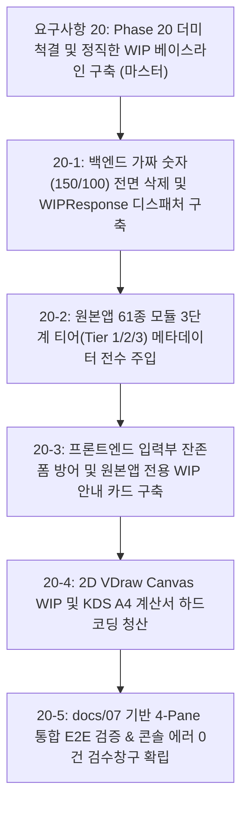

# 요구사항 20: Phase 20 더미 코드 전면 제거 및 정직한 WIP 베이스라인 구축 명세서

## 1. 개요 및 배경 (Vision & Rationale)

### 1.1. 상위 기술 문서(SSOT) 연동 및 설계 철학
* **단일 진실 공급원(SSOT) 참조**:
  - [`docs/01_system_architecture.md`](file:///f:/PyProject/AltDP_3rd/docs/01_system_architecture.md) (전체 시스템 아키텍처 및 5대 계층)
  - [`docs/07_web_application_ui_ux_specification.md`](file:///f:/PyProject/AltDP_3rd/docs/07_web_application_ui_ux_specification.md) (독립 4-Pane 레이아웃, 3버튼 액션 파이프라인, 원본앱 리본/폼뷰/다이얼로그 통합 명세)
  - [`docs/10_agent_development_protocols.md`](file:///f:/PyProject/AltDP_3rd/docs/10_agent_development_protocols.md) (개발 프로토콜 및 오차 한계 규약)
  - [`docs/12_full_feature_porting_master_plan.md`](file:///f:/PyProject/AltDP_3rd/docs/12_full_feature_porting_master_plan.md) (Phase 1~6 기완료 자산 보호 및 전 기능 로드맵)
  - [`docs/14_structural_calculation_report_specification.md`](file:///f:/PyProject/AltDP_3rd/docs/14_structural_calculation_report_specification.md) (KDS 3대 보고서 모드 및 5대 장구분 표준 목차)
  - [`docs/16_goal_micro_execution_protocol.md`](file:///f:/PyProject/AltDP_3rd/docs/16_goal_micro_execution_protocol.md) (2단계 5정밀 마이크로 공정 및 Proof-First Mandate)
* **문서 성격**: 원본앱 61종 전체 부재의 실무급 1:1 웹 마이그레이션에 앞서, 시스템 전반에 잠재된 **기만적 가짜 연산 코드(Mock/Stub 강도치 150/100, 임의 OK 판정), 불완전한 폼 잔존/뭉뚱그림, 계산서 하드코딩 정적 텍스트 및 데드코드를 전면 척결**하고, `docs/07` 및 `docs/14` 규격에 부합하는 투명하고 정직한 **`[미구현 (WIP)]` 4-Pane 베이스라인**을 확립하기 위한 핵심 독립 전술 요구사항 명세서입니다.
* **4대 포팅 참조 우선순위 준수**:
  - `1순위`: 원본 추출 소스 (`decompiled_src/core_routines/*.c`, `symbols/*.txt`, `original_src/`)
  - `2순위`: 원본앱 공식 기술 매뉴얼 및 Help 자산 (`decompiled_src/manuals/`)
  - `3순위`: kcsc2md 공인 예제집 (`F:/PyProject/KCSC2MD/output/예제집/`) - 오차 $\le 0.10\%$ 3자 삼각대조
  - `4순위`: kcsc2md 국가건설기준 (`F:/PyProject/KCSC2MD/output/kds_md/`) - KDS 14 20/31/41 (Patch-First 원칙)

### 1.2. 해결 대상 핵심 결함 및 정합성 조율 (As-Is vs To-Be)
1. **백엔드 기만적 더미 연산 및 임의 기본값 척결**:
   - `As-Is`: 일부 엔드포인트나 디스패처에서 미연동 부재 요청 시 임의의 가짜 강도치(`phi_mn = 150.0, phi_vn = 100.0`, DCR=0.8 등)나 무조건 성공(OK)을 반환할 위험.
   - `To-Be`: 가짜 숫자 연산을 100% 영구 삭제하고, KDS 엔진 스키마가 미연동된 모듈 호출 시 `status: "NOT_YET_IMPLEMENTED"`, `code: "WIP_MODULE"` 표준 JSON 응답 반환.
2. **`docs/12` 기완료 검증 엔진 계층의 절대적 보호**:
   - `As-Is`: WIP 청산 과정에서 이미 Phase 1~6을 통해 완성·검증된 핵심 엔진(RC 보/기둥/벽/슬래브/기초/옹벽, 철골 보/기둥/가새/접합부/베이스플레이트, SRC/ALU/보강 및 5대 FEM 부재)까지 미구현으로 취급될 위험.
   - `To-Be`: 기완료된 순수 파이썬 KDS 엔진은 100% 온전히 보호하고, **"엔진은 있으나 원본앱 1:1 전용 서브탭 폼(`DLG_*.ini`) 및 VDraw 상세 캔버스가 개발 대기 중인 상태"**와 **"전용 엔진 자체가 미구현인 상태"**를 명확히 구분하여 정직하게 표기.
3. **`docs/07` 독립 4-Pane 레이아웃 무결성 확보**:
   - `As-Is`: 2열(입력폼)과 3열(캔버스) 순서 혼선 및 `Left-Sub`의 핵심 기능인 부재 리스트 매니저(`pane-member-list`)와의 연동 누락.
   - `To-Be`: `docs/07`의 정식 아키텍처인 **[사이드바] - [Left-Sub: 부재리스트 + 사용자입력부] - [Center: 2D/3D 그래픽뷰] - [Right: KDS 계산서(순백색 #ffffff 고정)]** 4-Pane 구조를 엄격히 준수.
4. **`docs/14` KDS 3대 보고서 & 5대 장구분 체계 준수 및 레거시 임시 뷰어(`redcr_common_renderer.js`) 청산**:
   - `As-Is`: AltBU 잔재인 "8단계 KaTeX 수식 전개식" 등 타 프로젝트 용어가 혼입되어 `docs/14` 명세와 충돌하고, 전용 계산서가 없는 부재에 대해 AltDP_2nd 시절의 뭉뚱그림 4-Pillar 카드형 뷰어(`redcr_common_renderer.js`)가 호출되어 A4 용지 규격을 위반하고 가짜/임의 테이블을 조립할 위험.
   - `To-Be`: `redcr_common_renderer.js`의 기만적 카드 뷰 및 데드코드를 전면 청산/제거하고, 원본앱 및 `docs/14`의 정식 규격인 **"5대 장구분 (1. 일반조건, 2. 재질/단면, 3. 설계하중, 4. 단면안전성, 5. 종합판정)"** 및 **"3대 보고서 모드 (요약/상세/입력데이터)"** 표준 양식으로 완전 일치화. 하드코딩된 정적 텍스트를 전면 청산하고 미계산/미구현 시 순백색 A4 WIP 시트로 일원화.
5. **원본앱 61종 모듈 3단계 티어(Tier) 메타데이터 전수 주입 ([`docs/04`](file:///f:/PyProject/AltDP_3rd/docs/04_master_original_app_modules_comprehensive_catalog.md))**:
   - `docs/13`의 원본앱 6대 대분류 탭(RC, STEEL, SRC, ALU, RFM, FEM/기타)에 기반하여 61종 전체 모듈에 3단계 티어(`Tier 1: 9종 핵심`, `Tier 2: 26종 주요`, `Tier 3: 26종 특수`) 속성 전수 주입.

---

## 2. `docs/07` 기반 독립 4-Pane 워크스페이스 WIP 상호작용 아키텍처

사용자가 좌측 사이드바 탐색기에서 임의의 부재를 클릭했을 때, 시스템의 모든 4대 독립 영역은 `docs/07` 및 `docs/14`에 정의된 규격에 따라 일관되고 투명한 WIP 상태를 제공하며 브라우저 콘솔 에러가 0건이어야 합니다.

```
┌────────────────────────────────────────────────────────────────────────────────────────────────────────────────────────────────────────┐
│ Top Master Toolbar : AltDP_3rd 원본앱 KDS Suite [단위계: SI (kN, mm) ▼] [테마: 🌙/☀️] [💾 적용] [⚡ 검토] [✨ 설계] [상태: 61종 온라인 🟢] │
├────────────────────────┬───────────────────────────────────────────────────────────────┬───────────────────────────────────────────────┤
│ [Left Sidebar]         │ [Left-Sub: Member & Input]    │ [Center: 2D Graphic View]     │ [Right: KDS Report Dock]                      │
│ 📂 설계 모듈 탐색기    │ ┌───────────────────────────┐ │ ┌───────────────────────────┐ │ ┌───────────────────────────────────────────┐ │
│  • 카테고리 (RC/Steel)  │ │ 부재 리스트 (+추가/복제)  │ │ │ 2D VDraw Canvas WIP       │ │ │ KDS A4 구조계산서 WIP 시트                │ │
│  • 트리 레벨 (1~3)     │ ├───────────────────────────┤ │ │                           │ │ │ 📄 [상시 순백색 #ffffff 용지 고정]        │ │
│  • 고정핀 (📌)         │ │ 사용자 입력부 (Input Form)│ │ │   📐 2D VDraw 단면/배근도 │ │ │                                           │ │
│ ┌────────────────────┐ │ │ [원본앱 전용 WIP 안내 카드]│ │ │   그래픽 표시 준비 중     │ │ │ 1. 일반 설계 조건: KDS 14 20 40           │ │
│ │RC 콘크리트        ▼│ │ │ 🛠️ [Tier 1] RC 지하외벽   │ │ │   (WIP 플레이스홀더)      │ │ │ 2. 재질 및 단면: 제원 준비 중             │ │
│ │ • 보 (정상 검증)   │ │ │    (IDD_RCS_BWALL_DLG)    │ │ │                           │ │ │ 3. 설계 하중: 토압/수압 대기 중           │ │
│ │ • 기둥 (정상 검증) │ │ │ • 기준: KDS 14 20 40      │ │ │ [부재: RC 지하외벽 BWall] │ │ │ 4. 단면 안전성: 검토 대기 중              │ │
│ │ • 지하외벽 (WIP)───┼─┼►│ • 원본앱 1:1 서브탭 예정   │ │ └───────────────────────────┘ │ │ 5. 종합 판정: [미구현 (WIP)]              │ │
│ │ • 옹벽 (WIP)       │ │ │ • Tier 1 로드맵 순차 탑재 │ │                               │ │                                           │ │
│ └────────────────────┘ │ └───────────────────────────┘ │                               │ └───────────────────────────────────────────┘ │
├────────────────────────┴───────────────────────────────────────────────────────────────┴───────────────────────────────────────────────┤
│ 4대 독립 리사이저 (`layout_resizer.js`): Sidebar(H) ── Left/Right(H) ── Input/Canvas(H) ── Member/Form(V)                            │
└────────────────────────────────────────────────────────────────────────────────────────────────────────────────────────────────────────┘
```

---

## 3. 세부 엔지니어링 사양

### 3.1. 백엔드 표준 WIP 디스패처 및 스키마 명세 (`docs/01`, `docs/10`)
* **표준 응답 스키마 (`src/api/routes/dispatch.py`)**:
```python
from pydantic import BaseModel
from typing import Optional, Dict, Any

class WIPModuleDetail(BaseModel):
    key: str                    # 예: "rc/wall/rc_basement_wall"
    name: str                   # 예: "RC 지하외벽 (Basement Wall)"
    midas_dlg: str              # 예: "IDD_RCS_BASEMENT_WALL_DLG" (docs/13)
    category: str               # "rc", "steel", "src", "alu", "rfm", "fem"
    group: str                  # "wall", "beam", "column", "footing", "conn"
    domain: str                 # "RC", "STEEL", "SRC", "ALU"
    tier: str                   # "Tier 1", "Tier 2", "Tier 3"
    standard: str               # "KDS 14 20 40 : 2022"
    engine_status: str          # "VERIFIED" (엔진완료) | "WIP" (엔진준비중)
    notice: str = "원본앱 1:1 서브탭 및 VDraw 드로잉 명세에 따라 전용 폼과 계산서가 순차 탑재됩니다."

class WIPResponse(BaseModel):
    success: bool = False
    status: str = "NOT_YET_IMPLEMENTED"
    code: str = "WIP_MODULE"
    message: str
    module: WIPModuleDetail
```

* **엔드포인트 라우팅 정책 (`POST /api/design/{category}/{group}/{module_id}`)**:
  1. 기완료 검증 엔진(RC 보/기둥/벽체/기초/슬래브, 철골 보/기둥/가새/접합부, 5대 FEM 등)은 실제 KDS 수치 연산(`calculate`)을 수행하여 결과 반환.
  2. 전용 연산 엔진이 아직 미구현되었거나 더미 상태인 모듈은 가짜 숫자 반환을 전면 차단하고 `WIPResponse`를 즉각 반환.

### 3.2. 프론트엔드 원본앱 전용 WIP 안내 카드 (`docs/07`, `docs/13`)
* **구현 위치**: `src/web/static/js/forms/wip_card.js` (Left-Sub의 `pane-input-form` 영역)
* **표시 구성 요소**:
  1. **티어 뱃지**: `[Tier 1 핵심 부재]` (골드/오렌지), `[Tier 2 주요 부재]` (블루/시안), `[Tier 3 특수]` (퍼플/그레이).
  2. **부재 명칭 및 원본앱 DLG 코드**: (예: `RC 지하외벽`, `IDD_RCS_BASEMENT_WALL_DLG`).
  3. **적용 KDS 국가건설기준**: (예: `KDS 14 20 40 콘크리트구조 지하외벽 설계기준`).
  4. **지원 예정 서브탭 안내**: 원본앱 1:1 대응 탭 (`[재질 및 단면]`, `[배근 상세]`, `[설계 하중]`, `[토압/수압 조건]`).
  5. **액션 버튼 상호작용 (`docs/07`)**: 상단 툴바의 `[⚡ 검토]` 또는 `[✨ 설계]` 버튼 클릭 시, "⚠️ 본 부재는 원본앱 1:1 서브탭 폼 및 전용 계산서 개발 준비 중입니다." 토스트 알림 연동.

### 3.3. 2D Canvas VDraw WIP 플레이스홀더 (`docs/07`, `docs/13`)
* **구현 위치**: `src/web/static/js/renderer2d.js` (Center의 `pane-graphic-view` 영역)
* **동작 사양**:
  - 전용 VDraw 캔버스 렌더러가 미연동된 부재 선택 시, 캔버스 뷰포트를 클리어하고 부드러운 다크 엔지니어링 그리드(격자선) 위에 중앙 엠블럼과 부재명, **"📐 2D VDraw 단면 및 배근도 그래픽 준비 중 (WIP)"** 텍스트를 렌더링하여 런타임 에러 완전 방어.

### 3.4. KDS A4 구조계산서 5대 장구분 WIP 시트 및 `redcr_common_renderer.js` 청산 (`docs/07`, `docs/14`)
* **구현 위치**: `src/web/static/js/report_view.js` (또는 `result_renderer.js`, Right의 `pane-right-report` 영역)
* **레거시 범용 뷰어(`redcr_common_renderer.js`) 전면 청산**:
  - AltDP_2nd 시절 부재별 계산서 부재를 때우기 위해 도입된 뭉뚱그림 4-Pillar 카드형 레이아웃(`four-pillar-container`)과 자체 캔버스 임베딩(`pillar-section-canvas`), 키 탐색 기반 가짜 테이블 조립 로직을 전면 청산/제거.
  - `result_renderer.js`에서 부재별 전용 리포터 부재 시 `RedcrCommonRenderer`를 호출하던 폴백 분기를 `docs/14` 5대 장구분 기반 순백색 A4 WIP 시트로 완전 일원화.
* **동작 사양**:
  - **상시 순백색 `#ffffff` A4 용지 규격 레이아웃 유지 (`docs/07` 제1절)**.
  - 하드코딩된 가짜 처짐/강도치("ALL O.K", "8.2mm 만족" 등)를 전면 청산.
  - `docs/14` 표준 5대 장구분 헤더를 유지한 채 본문에 **"📄 원본앱 5대 장구분 KDS 전개식 구조계산서 작성 준비 중 (WIP)"** 정직한 워터마크 및 준비 상태 표시.

---

## 4. 원본앱 61종 전체 모듈 3단계 티어(Tier) 전수 분류표 ([`docs/04`](file:///f:/PyProject/AltDP_3rd/docs/04_master_original_app_modules_comprehensive_catalog.md))

원본앱 리본 메뉴(`Menu.ini`) 및 대화상자 리소스(`DLG_*.ini`), 외부 솔버(`docs/15`)에 기반하여 **총 61종 전체 모듈(RC 21종, Steel 16종, SRC 4종, ALU 2종, RFM 3종, FEM 5종, PBD 3종, CAD/물량/연동 3종, 글로벌 4종)**을 단 1종의 누락이나 축약("등 N종" 표현 전면 금지) 없이 3단계 티어로 전수 분류하여 엄격히 관리합니다:

### 4.1. Tier 1: 최우선 플래그십 핵심 부재 (9종)
실무 빈도가 가장 높고 구조설계의 근간을 이루는 최우선 부재 (현재 엔진 100% 검증 완료, `docs/07` 4-Pane UI 연동 대상):
1. `rc_beam`: RC 보 (`IDD_RCS_BEAM_PMODE_DLG`, KDS 14 20 10/22, `src/engine/rc/beam.py`)
2. `rc_column`: RC 기둥 (`IDD_RCS_COLUMN_PMODE_DLG`, KDS 14 20 10, 200 파이버 P-M, `src/engine/rc/column.py`)
3. `rc_shear_wall`: RC 전단벽 (`IDD_RCS_WALL_PMODE_DLG`, KDS 14 20 40, 면내전단/경계요소, `src/engine/rc/wall.py`)
4. `rc_retaining_wall`: RC 옹벽 (`IDD_RCS_RETAINING_WALL_INPUT_DLG`, KDS 14 20 40 / KDS 11 80 05, `src/engine/rc/retaining_wall.py`)
5. `rc_slab`: RC 슬래브 (`IDD_RCS_SLAB_PMODE_DLG`, KDS 14 20 40, 1방향/2방향 DDM/EFM, `src/engine/rc/slab.py`)
6. `rc_iso_footing`: RC 독립기초 (`IDD_RCS_FOOT_PMODE_DLG`, KDS 14 20 50, 지내력/펀칭/휨, `src/engine/rc/footing.py`)
7. `steel_beam_column`: 철골 보/기둥 (`IDD_STL_BEAMCOLUMN_INPUT_DLG`, KDS 14 31 10, LTB/좌굴/P-M, `src/engine/steel/beam.py`, `column.py`)
8. `steel_baseplate`: 철골 주각부 베이스플레이트 (`IDD_STL_USBP_PMODE_DLG`, KDS 14 31 25, 지압/소요두께, `src/engine/steel/baseplate.py`)
9. `steel_bolt_conn`: 철골 볼트 접합부 (`IDD_STL_BOLTCONNECTION_INPUT_DLG`, KDS 14 31 25, 마찰/지압/블록전단, `src/engine/steel/connection.py`)

### 4.2. Tier 2: 실무 주요 부재 및 기초/합성/FEM 연동군 (26종)
실무 다빈도 확장 부재 및 외부 2D FEM 해석 솔버 연동 부재:
10. `rc_gencolumn`: RC 임의형상 기둥 (`IDD_RCS_URGC_PMODE_DLG`, KDS 14 20 10, 다각형 파이버 P-M)
11. `rc_comb_wall`: RC 이형 코어벽체 (`IDD_RCS_COMBINED_WALL_*`, KDS 14 20 40, L/T/ㄷ형 3차원 P-M)
12. `rc_basement_wall`: RC 지하외벽 (`IDD_RCS_BASEWALL_INPUT_DLG`, KDS 14 20 40, 토압/수압 1way/2way 휨)
13. `rc_comb_footing`: RC 복합기초 (`IDD_RCS_COMBINED_FOOTING_*`, KDS 14 20 50, 2주 이상 복합기초 평형)
14. `rc_strip_footing`: RC 줄기초 (`IDD_RCS_STRIPFOOT_INPUT_DLG`, KDS 14 20 50, 벽체 하부 단위폭 휨/전단)
15. `rc_pile_footing`: RC 말뚝기초 (`IDD_RCS_FOUNDATION_INPUT_*`, KDS 14 20 50, 말뚝반력 분배/캡 설계)
16. `rc_anchor_bolt`: 콘크리트용 앵커볼트 (`IDD_DGN_ANCH_BOLT_DLG`, KDS 14 20 54, 인장파열/콘파괴/전단)
17. `steel_brace`: 철골 가새 (`IDD_STL_BEAMCOL_SMODE_*`, KDS 14 31 10, 인장 순단면 파단/압축 좌굴)
18. `steel_endplate`: 철골 모멘트 엔드플레이트 (`IDD_STL_FORCE_INPUT_FINEND_DLG`, KDS 14 31 25, 항복선 판두께)
19. `steel_welding`: 철골 용접 접합부 (`IDD_STL_WELDING_INPUT_DLG`, KDS 14 31 25, 필릿/그루브 유효목두께)
20. `steel_crane_girder`: 철골 크레인 주행보 (`IDD_STL_CRANEGIRDER_INPUT_DLG`, KDS 14 31 10, 휠하중/충격/피로)
21. `steel_purlin_girt`: 철골 중도리/띠장 (`IDD_STL_USPG_PMODE_DLG`, KDS 14 31 10, 냉간성형 C/Z 2축휨)
22. `steel_web_opening`: 철골 웨브 개공보 (`IDD_STL_WEBOPEN_PMODE_DLG`, KDS 14 31 10, Vierendeel 휨-전단)
23. `steel_embedplate`: 철골 매립판 (`IDD_STL_EMBPLATE_INPUT_DLG`, KDS 14 31 25, 스터드 앵커 콘파괴)
24. `src_composite_beam`: SRC 합성보 (`IDD_SRC_COMP_BEAM_PMODE_DLG`, KDS 14 31 35, 슬래브 완전/부분 합성)
25. `src_baseplate`: SRC 주각부 베이스플레이트 (`IDD_SRC_BASE_PLATE`, KDS 14 31 35, 매립/노출 지압)
26. `src_column`: 매립형 SRC 기둥 (`IDD_SRC_COLUMN_INPUT_DLG`, KDS 14 31 35, 형강 매립 P-M 곡선)
27. `src_cft_column`: 충전형 CFT 기둥 (`IDD_SRC_UCFT_PMODE_DLG`, KDS 14 31 35, 강관 충전 구속효과 P-M)
28. `alu_beam_col`: 알루미늄 보/기둥 (`IDD_GUAAG_PMODE_MAIN_DLG`, KDS 14 31 40, 압출형재 휨/좌굴/HAZ)
29. `foundation_fem`: RC 매트기초 FEM (`docs/15`, KDS 14 20 50, DKMQ 후판휨 + 윙클러 지반스프링 인장분리)
30. `wall_2way_fem`: RC 지하외벽 2방향 FEM (`docs/15`, KDS 14 20 40, 토압/수압 2방향 판휨 및 다층 지지)
31. `baseplate_fem`: 주각부 접촉 FEM (`docs/15`, KDS 14 31 25, 콘크리트 압축-앵커 인장 비선형 접촉)
32. `endplate_fem`: 엔드플레이트 항복선 FEM (`docs/15`, KDS 14 31 25, 2D 볼트 배치별 소성 항복선 수치해석)
33. `slab_fem`: 이형/개구부 슬래브 FEM (`docs/15`, KDS 14 20 40, 비정형 단면 판휨 및 응력집중)
34. `cad_draw_dxf`: 2D 배근 CAD 도면 생성 (`DPLUS_VDraw.dll`, KDS 14 20 52, ezdxf 기반 DXF CAD 파일)
35. `quantity_excel`: KDS 표준 물량산출 (`DGN_lib.dll`, KDS 14 20 00, 콘크리트/거푸집/철근 톤수 Excel)

### 4.3. Tier 3: 특수 목적 / 상세 검토 / 일괄 관리 / 글로벌 어댑터군 (26종)
특수 구조상세, 일괄 설계 툴, 성능기반설계(PBD), 3D 모델 연동 및 해외 규준 모듈:
36. `rc_buttress`: RC 버트레스 지주 (`IDD_RCS_BUTTRESS_SMODE_*`, KDS 14 20 40, 부벽식 지주 휨/전단)
37. `rc_stair`: RC 계단 (`IDD_RCS_URST_PMODE_DLG`, KDS 14 20 40, 계단실 경사 슬래브 휨/전단)
38. `rc_corbel`: RC 코벨/브라켓 (`IDD_RCS_CORBEL_*`, KDS 14 20 22, 기둥 돌출부 전단마찰 및 인장타이)
39. `rc_beam_table`: RC 보 강도 테이블 (`IDD_RCS_BEAM_MLIST_DLG`, KDS 14 20 10, 단면/배근 일괄표)
40. `rc_slab_table`: RC 슬래브 강도 테이블 (`IDD_RCS_SLAB_LIST`, KDS 14 20 40, 영역별 두께/배근 일괄표)
41. `rc_batch_beam`: RC 보 일괄설계 (`IDD_RCS_BATCH_BEAM_BUILD_*`, KDS 14 20 10, 프로젝트 전 부재 일괄)
42. `rc_batch_column`: RC 기둥 일괄설계 (`IDD_RCS_BATCH_COLM_BUILD_*`, KDS 14 20 10, 건물 전체 다축 일괄)
43. `rc_batch_wall`: RC 벽체 일괄설계 (`IDD_RCS_BATCHWALL_INPUT_DLG`, KDS 14 20 40, 시공성 고려 일괄)
44. `steel_stair`: 철골 계단 (`IDD_STL_STAIR_INPUT_DLG`, KDS 14 31 10, 스트링거 거더 및 디딤판)
45. `steel_corweb_beam`: 철골 파형웨브보 (`IDD_STL_BEAMCOL_*`, KDS 14 31 10, 파형웨브 전단좌굴/휨)
46. `steel_tool_unbrace`: 비지지길이 산정 툴 (`IDD_STL_TOOL_UNBRACE_*`, KDS 14 31 10, 가새점 자동 산정)
47. `steel_tool_brace_str`: 브레이스 소요강도 툴 (`IDD_STL_TOOL_BRACE_*`, KDS 14 31 10, 좌굴방지 강도/강성)
48. `steel_tool_link_stiff`: 전단링크 스티프너 툴 (`IDD_STL_TOOL_STIFF_*`, KDS 14 31 10, EBF 링크 보강)
49. `steel_tool_vbrace_str`: V브레이스 보강도 툴 (`IDD_STL_TOOL_VBRACE_*`, KDS 14 31 10, 불평형 하중)
50. `alu_beam_col_gen`: 알루미늄 임의형상 보/기둥 (`IDD_GUAMT_PMODE_MAIN_DLG`, KDS 14 31 40, 비정형 다축)
51. `rfm_slab`: RC 슬래브 보수보강 (`IDD_UFSL_PMODE_DLG`, KDS 14 20 90, 하부 CFRP/강판 휨보강)
52. `rfm_beam`: RC 보 보수보강 (`IDD_UFBE_PMODE_DLG`, KDS 14 20 90, CFRP 휨/전단 U-재킷팅)
53. `rfm_column`: RC 기둥 보수보강 (`IDD_UFCO_PMODE_DLG`, KDS 14 20 90, 강판/CFRP 구속압축도 증진)
54. `pbd_rc_beam`: RC 보 성능기반설계 (`IDS_RIBBON_MENU_PBD_RCS_BEAM`, KDS 41 17 00, $M-\theta$ 소성힌지)
55. `pbd_rc_column`: RC 기둥 성능기반설계 (`IDS_RIBBON_MENU_PBD_RCS_COLUMN`, KDS 41 17 00, P-M-M 소성힌지)
56. `pbd_rc_wall`: RC 전단벽 성능기반설계 (`IDS_RIBBON_MENU_PBD_RCS_WALL`, KDS 41 17 00, 전단 소성 백본)
57. `gen_mgt_interop`: MIDAS Gen 3D 모델 연동 (`DgnPlugIn/`, KDS 41 10 15, .mgt 파서 & Governing LCB)
58. `ec_rc_member`: Eurocode 콘크리트 부재 (`DPLUS_EC.dll`, EN 1992-1-1, 부분안전계수 기반 휨/압축)
59. `ec_steel_member`: Eurocode 강구조 부재 (`DPLUS_EC.dll`, EN 1993-1-1, Class 1~4 단면 및 부재강도)
60. `is_rc_member`: 인도 IS 456 콘크리트 부재 (`DPLUS_IS.dll`, IS 456:2000, 한계상태설계법 LSM)
61. `us_member`: 미국 ACI/AISC 부재 (`GEN_DgnCalc_US.dll`, ACI 318-19 / AISC 360-16, imperial 단위계)

---

## 5. 하위 Phase 분할 구현 계획 (Phase 20-1 ~ 20-5)



### 5.1. 하위 Phase 세부 요구사항 문서 인벤토리

| 하위 Phase | 세부 요구사항 문서 | 핵심 개발 영역 | 주요 담당 산출물 및 정합성 목표 |
|:---:|---|---|---|
| **Phase 20-1** | [`요구사항 20-1`](file:///f:/PyProject/AltDP_3rd/요구사항/요구사항20-1_Phase20-1_백엔드_더미연산_제거_및_WIP_디스패처_구축.md) | 백엔드 API & 디스패처 | • 가짜 연산(150/100) 영구 삭제, `WIPResponse` 표준 스키마<br>• `docs/12` 기완료 검증 엔진 100% 보호 및 `dispatch.py` 분기 |
| **Phase 20-2** | [`요구사항 20-2`](file:///f:/PyProject/AltDP_3rd/요구사항/요구사항20-2_Phase20-2_원본앱_61종_3단계_티어_메타_전수_주입.md) | 카탈로그 & 메타데이터 | • 원본앱 61종 카탈로그에 `Tier 1/2/3`, `standard`, `midas_dlg` 전수 주입<br>• `GET /api/modules` 티어별 통계 집계 엔드포인트 제공 |
| **Phase 20-3** | [`요구사항 20-3`](file:///f:/PyProject/AltDP_3rd/요구사항/요구사항20-3_Phase20-3_프론트엔드_입력부_WIP_안내카드_및_폼_방어.md) | Left-Sub (사용자입력부) | • `docs/07` 4-Pane 레이아웃 연동 및 이전 폼 잔존 방지 클린업<br>• `WIPCardRenderer`: 글래스모피즘 카드, 3버튼 액션 파이프라인 방어 |
| **Phase 20-4** | [`요구사항 20-4`](file:///f:/PyProject/AltDP_3rd/요구사항/요구사항20-4_Phase20-4_2D_VDraw_캔버스_WIP_및_A4_계산서_하드코딩_청산.md) | Center 캔버스 & Right 리포트 | • 2D VDraw Canvas WIP 플레이스홀더 (그리드+부재명)<br>• `docs/14` 5대 장구분 준수, 계산서 하드코딩 청산, 순백색 `#ffffff` A4 WIP 시트<br>• 레거시 4-Pillar 카드형 `redcr_common_renderer.js` 청산 및 폴백 일원화 |
| **Phase 20-5** | [`요구사항 20-5`](file:///f:/PyProject/AltDP_3rd/요구사항/요구사항20-5_Phase20-5_4열_통합_E2E_검증_및_콘솔에러_0건_검수창구_확립.md) | 4-Pane 통합 E2E & 무결성 | • 61종 순회 클릭 시 F12 콘솔 에러 0건(404, TypeError 등) 입증<br>• 플래그십-WIP 이중 검증 및 전체 `pytest` 100% 통과 (Exit Code 0) |

---

## 6. 최종 검증 및 완료 기준 (Acceptance Criteria)

1. **더미 연산 제로**: 백엔드 API 어디에도 미연동 부재에 대해 하드코딩된 가짜 강도치나 임의 OK 응답이 존재하지 않아야 함.
2. **`docs/12` 기완료 엔진 100% 보호**: RC 보, 기둥, 기초 등 이미 검증된 KDS 엔진은 기존 오차 $\le 0.10\%$ 연산 결과가 일체의 회귀 결함 없이 정상 출력되어야 함.
3. **`docs/07` 4-Pane 동기화 일관성**: 미구현 부재 선택 시 [사이드바 탐색기] $\leftrightarrow$ [Left-Sub 입력부 WIP 카드] $\leftrightarrow$ [Center 2D Canvas WIP] $\leftrightarrow$ [Right 순백색 A4 계산서 WIP 시트]가 100ms 이내에 오염 없이 동기화되어야 함.
4. **`docs/14` 계산서 표준 일치 & 레거시 청산**: 계산서 영역에 "8단계 KaTeX" 등 타 규격 표현, 가짜 결과 텍스트 및 `redcr_common_renderer.js` 기반 4-Pillar 카드형 레이아웃이 0건이어야 하며, 5대 장구분 표준 목차 및 순백색 A4 규격을 100% 준수해야 함.
5. **콘솔 에러 0건**: 61종 트리메뉴를 임의 순서로 고속 순회 클릭하여도 브라우저 개발자 도구에 404 Not Found나 `Uncaught TypeError`가 단 1건도 발생하지 않아야 함.
