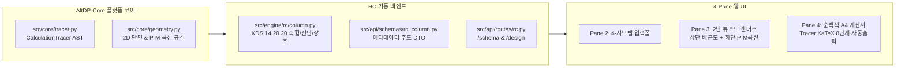

# 요구사항 23: Phase V1-02 RC 기둥 (rc_column) 자동화 플랫폼 수직 관통 명세서

## 1. 개요 및 목적
본 문서는 **[요구사항 29](@@OLD/요구사항29_차세대_개발_패러다임_대혁신_61종_부재_고속양산_자동화_플랫폼.md)**에서 수립된 **AltDP-Core 자동화 플랫폼 아키텍처**를 최초 적용하여, Tier 1 플래그십 핵심 부재인 **RC 기둥 (`rc_column`)**을 4-Pane 웹 워크스페이스에 100% 가동 가능한 상용 수준으로 수직 관통(Vertical Slice) 구현하기 위한 **단일 마스터 실행 명세서**입니다.

* **모듈 식별자**: `rc_column` (카탈로그 번호 No. 2, Tier 1 플래그십)
* **적용 패러다임**: 
  1. `CalculationTracer` 기반 KaTeX AST 자동 직렬화 (계산서 하드코딩 완전 배제)
  2. 파라메트릭 CAD 기하 규격 (`Point2D`, `Polygon`, `PointRebar[]`, `PMCurveData`)
  3. Pydantic 스키마 메타데이터 기반 4-서브탭 폼 자동화
  4. 학회 예제집 2020 (예제 5.1, 5.2, 5.3) 벤치마크 TDD (오차 $\le 0.10\%$)

---

## 2. 시스템 아키텍처 및 데이터 흐름

---

## 3. 공정별 세부 구현 과제

### Step 1: AltDP-Core 플랫폼 라이브러리 구축 (`src/core/`)
- [ ] **`src/core/tracer.py`**:
  - `CalculationStep`, `EvaluationStep`, `CalculationTracer` 클래스 구현.
  - KDS 기준 조항(`standard_ref`), 수식 원형(`formula`), 변수 대입값(`substitutions`), 산출 결과(`result`), 단위(`unit`), DCR 및 OK/NG 판정(`evaluation`)을 관리하고 JSON AST로 직렬화.
- [ ] **`src/core/geometry.py`**:
  - 단면 외곽선(`PolygonGeometry`), 주철근 좌표(`RebarPoint[]`), 띠철근 루프(`StirrupLoop[]`), 치수선(`DimensionLine[]`), 200 파이버 P-M 상관곡선(`PMCurveData`)의 표준 DTO 정의.
- [ ] **`src/web/static/js/report/tracer_report_renderer.js`**:
  - Tracer JSON AST를 전달받아 순백색(`#ffffff`) A4 규격의 5대 장구분 8단계 KaTeX 수식 테이블로 자동 렌더링하는 공통 뷰어 컴포넌트 구현.

### Step 2: RC 기둥 KDS 엔진 & Pydantic 스키마 고도화
- [ ] **`src/engine/rc/column.py`**:
  - `design_rc_column(inp, tracer=None)`에 `CalculationTracer` 주입 지원.
  - 휨-압축 P-M 수치해석, 장주 모멘트확대($\delta_{ns}, \delta_s$), Bresler 이축휨, 전단강도($V_c, V_s, V_n$)의 전 과정을 Step-by-Step으로 자동 기록.
  - 실제 mm 단위의 단면 기하 형상 및 파이버 P-M 곡선 데이터를 `geometry.py` 규격으로 패키징 반환.
- [ ] **`src/api/schemas/rc_column.py`**:
  - `RCColumnDesignRequest`에 4대 서브탭(`tab`, `group`, `unit`, `ge`, `le`) 메타데이터 반영.
- [ ] **`src/api/routes/rc.py`**:
  - `/api/rc/column/design`: 계산 결과, Tracer AST, 기하 데이터를 일괄 응답하는 엔드포인트 연동.
  - `/api/rc/column/schema`: 프론트엔드 폼 자동 구성을 위한 스키마 제공 엔드포인트 연동.

### Step 3: 벤치마크 TDD (3자 삼각 대조 오차 ≤ 0.10% 자동 검증)
- [ ] **`tests/benchmarks/rc_column_benchmark.json`**:
  - 한국콘크리트학회 2020 콘크리트구조 예제집 3대 벤치마크 수록:
    * **예제 5.1**: 단축 휨-압축 직사각형 기둥 ($b=400, h=500, f_{ck}=24, f_y=400, 8\text{-D25}$)
    * **예제 5.2**: 횡구속/비구속 장주 기둥 모멘트 확대 ($\delta_{ns}, P_c, M_c$)
    * **예제 5.3**: 이축 휨을 받는 정사각형 기둥 ($P_u, M_{ux}, M_{uy}$, Bresler 역수식)
- [ ] **`tests/benchmarks/test_rc_column_benchmark.py`**:
  - 예제집 재계산 값 및 원본앱 결과와 엔진 계산값의 오차 $\le 0.10\%$ 자동 단언.
  - Tracer AST 직렬화 및 필수 5대 장구분 수식 전개 누락 0건 검증.

### Step 4: 프론트엔드 RC 기둥 4-Pane 연동 및 온라인 오픈
- [ ] **`src/web/static/js/modules/rc_column/rc_column_module.js`**:
  - **Pane 2 (입력 폼)**: 스키마 주도 4대 서브탭(단면/재료, 철근배근, 설계하중, 장주/옵션) 및 3대 액션 버튼(`[💾 적용] [⚡ 검토] [✨ 자동설계]`) 바인딩.
  - **Pane 3 (캔버스)**: 2단 세로 적층형 뷰포트 연동
    * 1단: 실측 단면 배근도 (외곽선, 주철근 12개 좌표, 135° 절곡 띠철근, 치수선)
    * 2단: 200 파이버 P-M 상관곡선 ($\phi P_n-\phi M_n$) 및 설계하중점($M_u, P_u$) 플롯, 마우스 휠 줌/팬/Fit 지원
  - **Pane 4 (A4 계산서)**: `[⚡ 검토]` 클릭 시 100ms 이내 Tracer AST 기반 순백색 A4 KaTeX 계산서 즉시 출력.
- [ ] **`src/web/static/js/catalog.js`**:
  - `rc_column`의 `is_wip: false` 전환 및 실사용 온라인 오픈.

---

## 4. 수용 기준 (Acceptance Criteria)

1. **[수치 정확도]**: `pytest tests/benchmarks/test_rc_column_benchmark.py` 100% 통과 (학회 예제 5.1/5.2/5.3 대비 오차 $\le 0.10\%$).
2. **[계산서 무결성]**: Tracer AST로 생성된 순백색 A4 계산서에서 KaTeX 수식 깨짐/줄바꿈 오류 0건, 인쇄 및 Excel 내보내기 정상 동작.
3. **[캔버스 인터랙션]**: 단면 치수나 철근 입력 변경 시 캔버스 상단(단면) 및 하단(P-M 곡선)이 100ms 이내 실시간 동기화.
4. **[E2E 및 콘솔 무결성]**: 브라우저 4-Pane 조작 시 콘솔 에러 0건, `pytest` 전체 회귀 테스트 100% 통과.
